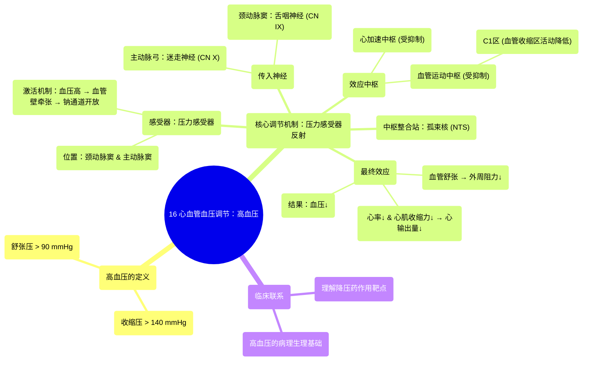

# 16 Cardiovascular Blood Pressure Regulation Hypertension

  <video controls preload="metadata" playsinline>
    <source src="https://helly.s3.bitiful.net/心血管学科/%E4%B8%93%E8%BE%91%2003%EF%BC%9A%E5%BF%83%E8%A1%80%E7%AE%A1%E7%94%9F%E7%90%86%E5%AD%A6%E6%B7%B1%E5%BA%A6%E7%B2%BE%E8%AE%B2%20%28Cardiovascular%20Physiology%29/16%20Cardiovascular%20Blood%20Pressure%20Regulation%20Hypertension.mp4" type="video/mp4">
    
您的浏览器不支持播放，请升级。

  </video>

::: tip ⚡️ 核心考点 (30s速读)
*   **核心考点**：当血压过高（高血压）时，位于颈动脉窦和主动脉弓的**压力感受器**被激活，通过舌咽神经（CN IX）和迷走神经（CN X）将信号传至延髓的**孤束核**，进而抑制交感神经兴奋性，降低心率和外周阻力，使血压恢复正常。
*   **临床意义**：理解此负反馈调节机制是理解降压药（如β受体阻滞剂、ACEI类药物）作用原理的基础，也是高血压病理生理学的核心。
:::

## 🧠 深度精讲

*   **高血压的定义**：视频中明确指出，临床上通常将**收缩压 > 140 mmHg** 和/或 **舒张压 > 90 mmHg** 定义为高血压。这为我们判断血压状态提供了明确的量化标准。
*   **压力感受器反射（降压反射）**：这是身体对抗高血压最主要的快速调节机制。
    1.  **传感器**：位于**颈动脉窦**（颈总动脉分叉处）和**主动脉弓**的**压力感受器**。
    2.  **刺激与激活**：血压升高时，血管壁被过度牵张，激活压力感受器上的机械敏感性钠通道，导致钠离子内流，产生去极化和动作电位。
    3.  **传入通路**：颈动脉窦的信号通过**舌咽神经（CN IX）** 传入；主动脉弓的信号通过**迷走神经（CN X）** 传入。两者均投射至延髓的**孤束核**。
    4.  **中枢整合**：孤束核接收信号后，主要向延髓的**心加速中枢**和**血管运动中枢**发送抑制性信号。
    5.  **效应与结果**：
        *   抑制**心加速中枢** → 降低交感神经对心脏的兴奋 → **心率减慢、心肌收缩力减弱** → 心输出量下降。
        *   抑制**血管运动中枢**（特别是其促进血管收缩的C1区） → 降低交感缩血管神经张力 → **外周血管舒张** → 总外周阻力下降。
        *   最终，通过降低心输出量和外周阻力，使**血压回降至正常水平**。

*   **血管运动中枢的细分**：视频特别指出，血管运动中枢内包含功能不同的区域，如**C1区**主要负责促进血管**收缩**。在高血压状态下，来自孤束核的信号会抑制C1区的活动，从而促成血管舒张。

## 📚 双语术语表 (Terminology)
| 英文术语 | 中文翻译 | 定义/解释 |
| :--- | :--- | :--- |
| Hypertension | 高血压 | 收缩压持续高于140 mmHg和/或舒张压持续高于90 mmHg的状态。 |
| Baroreceptor | 压力感受器 | 位于颈动脉窦和主动脉弓，能感知血压变化（血管壁牵张）的特殊神经感受器。 |
| Carotid Sinus | 颈动脉窦 | 颈总动脉末端和颈内动脉起始部的膨大部分，是压力感受器的主要聚集区。 |
| Aortic Sinus | 主动脉窦 | 主动脉弓上的膨大区域，同样富含压力感受器。 |
| Glossopharyngeal Nerve (CN IX) | 舌咽神经（第IX对脑神经） | 负责将颈动脉窦压力感受器的信号传入延髓的颅神经。 |
| Vagus Nerve (CN X) | 迷走神经（第X对脑神经） | 负责将主动脉弓压力感受器的信号传入延髓的颅神经。 |
| Nucleus of Tractus Solitarius (NTS) | 孤束核 | 位于延髓，是心血管、呼吸等内脏感觉传入的主要中继站。 |
| Cardiac Acceleratory Center | 心加速中枢 | 延髓中负责增强心脏活动（增快心率、增强收缩力）的交感神经中枢。 |
| Vasomotor Center (VM) | 血管运动中枢 | 延髓中调节血管平滑肌张力（收缩或舒张）的中枢。 |
| C1 Area | C1区 | 血管运动中枢内一个特定的区域，主要功能是促进血管收缩。 |
| Depolarization | 去极化 | 细胞膜电位由静息状态（内负外正）向正值方向变化的过程，是产生动作电位的关键步骤。 |

## 🗺️ 知识图谱

