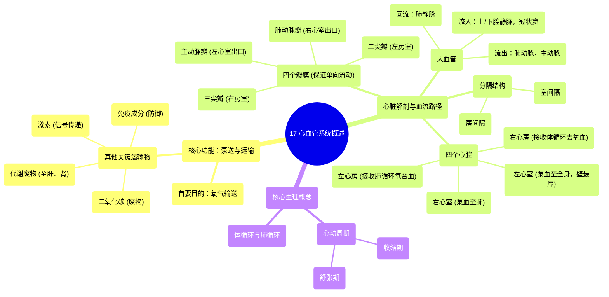

# 17 The Cardiovascular System An Overview

  <video controls preload="metadata" playsinline>
    <source src="https://helly.s3.bitiful.net/心血管学科/%E4%B8%93%E8%BE%91%2003%EF%BC%9A%E5%BF%83%E8%A1%80%E7%AE%A1%E7%94%9F%E7%90%86%E5%AD%A6%E6%B7%B1%E5%BA%A6%E7%B2%BE%E8%AE%B2%20%28Cardiovascular%20Physiology%29/17%20The%20Cardiovascular%20System%20An%20Overview.mp4" type="video/mp4">
    
您的浏览器不支持播放，请升级。

  </video>

::: tip ⚡️ 核心考点 (30s速读)
*   **核心考点**：心血管系统的核心功能是泵送血液，其首要目的是输送氧气，但也负责运输二氧化碳、代谢废物、激素、免疫细胞等多种物质。心脏解剖是理解其功能的基础，包括四个心腔、四个瓣膜、大血管及冠状循环。
*   **临床意义**：理解心脏的泵血路径（体循环与肺循环）和瓣膜的单向血流功能，是诊断和治疗心力衰竭、瓣膜病、冠心病等心血管疾病的基础。左心室壁厚于右心室，反映了其对抗更高体循环压力的生理需求。
:::

## 🧠 深度精讲

*   **心血管系统的功能**：视频强调，虽然输送氧气是心脏“最重要”的功能，但血液运输的物质远不止于此。它是一个综合运输系统，负责：
    *   **气体交换**：输送氧气至全身，并将二氧化碳运回肺部排出。
    *   **废物清除**：将代谢废物（如尿素、胆红素、乳酸）运至肝脏、肾脏等器官进行处理和排泄。
    *   **物质分配**：运输营养物质（葡萄糖、脂肪酸、电解质）、激素（如胰岛素、皮质醇）以协调全身功能。
    *   **免疫防御**：运输白细胞、抗体、细胞因子等免疫成分。

*   **心脏的大体解剖与血流路径**：心脏是一个立体的肌性器官，其基本结构包括四个心腔、四个瓣膜和连接的大血管。血液遵循特定路径循环：
    1.  **体循环回流（去氧血）**：身体各处的去氧血通过上腔静脉、下腔静脉和冠状窦汇入**右心房**。
    2.  **右心系统**：血液经**三尖瓣**进入**右心室**，再通过**肺动脉瓣**泵入**肺动脉**，流向肺部。
    3.  **肺循环（气体交换）**：在肺部，血液释放二氧化碳，摄取氧气，变为氧合血。
    4.  **左心系统**：氧合血经四条**肺静脉**返回**左心房**，通过**二尖瓣**进入**左心室**。
    5.  **体循环射出（氧合血）**：左心室收缩，血液经**主动脉瓣**泵入**主动脉**，分布至全身。
    *   **关键点**：右心（心房、心室）容纳去氧血，左心容纳氧合血，两者被**房间隔**和**室间隔**分隔。**左心室壁最厚**，因为它需要产生更高的压力以将血液泵入体循环。

*   **心脏瓣膜**：瓣膜确保血液单向流动，防止反流。通常有三个瓣叶（尖端），但**二尖瓣**例外，通常有两个。它们分为房室瓣（三尖瓣、二尖瓣）和半月瓣（肺动脉瓣、主动脉瓣）。

## 📚 双语术语表 (Terminology)
| 英文术语 | 中文翻译 | 定义/解释 |
| :--- | :--- | :--- |
| Cardiovascular System | 心血管系统 | 由心脏和血管组成的循环系统，负责泵送和运输血液。 |
| Right Atrium | 右心房 | 接收来自体循环去氧血的心脏腔室。 |
| Right Ventricle | 右心室 | 将去氧血泵入肺动脉的心脏腔室。 |
| Left Atrium | 左心房 | 接收来自肺循环氧合血的心脏腔室。 |
| Left Ventricle | 左心室 | 将氧合血泵入主动脉的心脏腔室，心肌壁最厚。 |
| Tricuspid Valve | 三尖瓣 | 位于右心房与右心室之间的房室瓣，通常有三个瓣叶。 |
| Pulmonary Valve | 肺动脉瓣 | 位于右心室与肺动脉之间的半月瓣。 |
| Mitral Valve | 二尖瓣 | 位于左心房与左心室之间的房室瓣，通常有两个瓣叶。 |
| Aortic Valve | 主动脉瓣 | 位于左心室与主动脉之间的半月瓣。 |
| Superior Vena Cava | 上腔静脉 | 将头部、颈部、上肢和胸部的血液引流入右心房的大静脉。 |
| Inferior Vena Cava | 下腔静脉 | 将腹部、盆腔和下肢的血液引流入右心房的大静脉。 |
| Pulmonary Artery | 肺动脉 | 将右心室的去氧血输送至肺部的动脉。 |
| Pulmonary Vein | 肺静脉 | 将肺部的氧合血输送至左心房的静脉。 |
| Aorta | 主动脉 | 将左心室的氧合血输送至全身的大动脉。 |
| Interatrial Septum | 房间隔 | 分隔右心房与左心房的隔膜。 |
| Interventricular Septum | 室间隔 | 分隔右心室与左心室的肌性隔膜。 |
| Systole | 收缩期 | 心脏（心室）收缩，泵出血液的时期。 |
| Diastole | 舒张期 | 心脏（心室）舒张，充盈血液的时期。 |
| Coronary Sinus | 冠状窦 | 收集心脏大部分静脉血并汇入右心房的血管。 |

## 🗺️ 知识图谱

