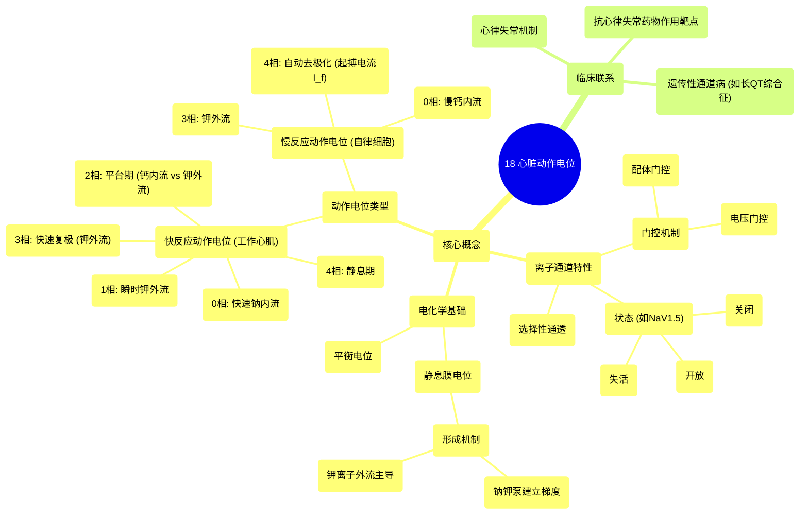

# 18 The Cardiac Action Potential

  <video controls preload="metadata" playsinline>
    <source src="https://helly.s3.bitiful.net/心血管学科/%E4%B8%93%E8%BE%91%2003%EF%BC%9A%E5%BF%83%E8%A1%80%E7%AE%A1%E7%94%9F%E7%90%86%E5%AD%A6%E6%B7%B1%E5%BA%A6%E7%B2%BE%E8%AE%B2%20%28Cardiovascular%20Physiology%29/18%20The%20Cardiac%20Action%20Potential.mp4" type="video/mp4">
    
您的浏览器不支持播放，请升级。

  </video>

::: tip ⚡️ 核心考点 (30s速读)
*   **核心考点**：心脏动作电位是心肌细胞电活动的基础，其产生依赖于多种离子通道的协同作用。理解快反应与慢反应动作电位的各时相、对应的离子流及其门控特性，是掌握心律失常机制和抗心律失常药物作用原理的关键。
*   **临床意义**：离子通道功能障碍是多种遗传性心律失常（如长QT综合征、Brugada综合征）的病理基础。抗心律失常药物（如I-IV类）主要通过影响特定离子通道（钠、钾、钙）的活性来发挥作用。
:::

## 🧠 深度精讲

*   **离子通道的一般特性**：离子通道是贯穿细胞膜的蛋白质，具有**选择性通透性**，能根据离子的大小和电荷进行区分。它们通过**门控**机制开放或关闭，主要分为**电压门控通道**（响应膜电位变化）和**配体门控通道**（响应化学物质结合）。例如，心脏钠通道（NaV1.5）具有**激活门（M门）**和**失活门（H门）**，使其存在关闭、开放和失活三种状态。
*   **平衡电位与静息膜电位**：
    *   **平衡电位**：指恰好抵消某种离子因浓度梯度而产生的扩散力所需的跨膜电压。此时，该离子的净电化学梯度为零，无净流动。对于钾离子（K⁺），其平衡电位（E_K）约为-90mV，是形成静息膜电位的主要驱动力。
    *   **静息膜电位**：主要由**钠钾泵（Na⁺/K⁺-ATP酶）**的活动建立。该泵每消耗1分子ATP，将3个Na⁺泵出细胞，同时将2个K⁺泵入细胞，直接造成膜外正电荷略多（膜内相对为负），并建立了Na⁺（外高内低）和K⁺（内高外低）的浓度梯度。静息时，细胞膜对K⁺的通透性远高于Na⁺，K⁺顺浓度梯度外流是形成**负值静息膜电位**（约-85mV至-90mV）的主要离子基础。
*   **快反应与慢反应动作电位**：
    *   **快反应动作电位**：见于心房肌、心室肌和浦肯野纤维。其特点是去极化迅速，由**快速钠内流（I_Na）** 介导。时相包括：
        *   **0相（快速去极化期）**：膜电位达到阈值，电压门控钠通道快速激活开放，大量Na⁺内流。
        *   **1相（快速复极初期）**：钠通道失活，同时瞬时外向钾电流（I_to）激活，K⁺外流。
        *   **2相（平台期）**：内向的L型钙电流（I_Ca-L）与外向的延迟整流钾电流（I_K）形成平衡，膜电位维持相对稳定。这是心肌动作电位时程长的关键。
        *   **3相（快速复极末期）**：钙电流失活，而延迟整流钾电流（尤其是I_Kr）进一步增强，K⁺外流加速，膜电位迅速复极。
        *   **4相（静息期）**：膜电位恢复并稳定在静息水平，钠钾泵和钠钙交换体活动恢复离子平衡。
    *   **慢反应动作电位**：见于窦房结和房室结细胞。其特点是去极化缓慢，幅度低，由**L型钙内流（I_Ca-L）** 介导。4期存在**自动去极化**，是自律性的基础，主要由**起搏电流（I_f，一种由Na⁺和K⁺携带的混合电流）** 和衰减的钾外流等共同作用。

## 📚 双语术语表 (Terminology)
| 英文术语 | 中文翻译 | 定义/解释 |
| :--- | :--- | :--- |
| Cardiac Action Potential | 心脏动作电位 | 心肌细胞膜电位发生的一系列快速、有序的波动，是心脏电兴奋的基础。 |
| Ion Channel | 离子通道 | 细胞膜上允许特定离子被动通过的蛋白质孔道，具有选择性和门控特性。 |
| Selectively Permeable | 选择性通透 | 离子通道根据离子的大小和电荷区分并允许特定离子通过的特性。 |
| Gating | 门控 | 离子通道在特定刺激（如电压变化、配体结合）下开放或关闭的特性。 |
| Voltage-gated Channel | 电压门控通道 | 其开放或关闭受膜电位变化调控的离子通道。 |
| Ligand-gated Channel | 配体门控通道 | 其开放或关闭受特定化学物质（配体）结合调控的离子通道。 |
| Equilibrium Potential | 平衡电位 | 某种离子净电化学驱动力为零时的膜电位，由该离子的跨膜浓度梯度决定。 |
| Resting Membrane Potential | 静息膜电位 | 细胞未受刺激时，细胞膜内外两侧存在的稳定电位差，通常内负外正。 |
| Sodium-Potassium Pump (Na⁺/K⁺-ATPase) | 钠钾泵（钠钾ATP酶） | 一种消耗ATP的膜蛋白，主动将3个Na⁺泵出细胞，2个K⁺泵入细胞，建立离子浓度梯度。 |
| Fast Response Action Potential | 快反应动作电位 | 由快速钠电流介导的、去极化速率快、幅度高的动作电位，见于工作心肌细胞。 |
| Slow Response Action Potential | 慢反应动作电位 | 由L型钙电流介导的、去极化速率慢、幅度低的动作电位，见于窦房结、房室结细胞。 |
| Depolarization | 去极化 | 膜电位绝对值减小（如从-90mV变为-70mV）的过程。 |
| Repolarization | 复极化 | 膜电位从去极化状态恢复至静息电位水平的过程。 |
| Inactivation | 失活 | 离子通道在开放后进入的一种不应期状态，此时即使刺激存在，通道也无法开放，需复极化后才能恢复。 |

## 🗺️ 知识图谱

