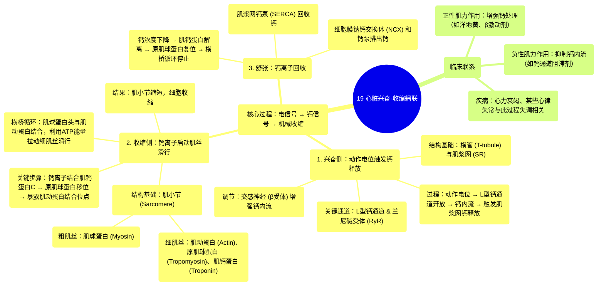

# 19 Cardiac Excitation-Contraction Coupling

  <video controls preload="metadata" playsinline>
    <source src="https://helly.s3.bitiful.net/心血管学科/%E4%B8%93%E8%BE%91%2003%EF%BC%9A%E5%BF%83%E8%A1%80%E7%AE%A1%E7%94%9F%E7%90%86%E5%AD%A6%E6%B7%B1%E5%BA%A6%E7%B2%BE%E8%AE%B2%20%28Cardiovascular%20Physiology%29/19%20Cardiac%20Excitation-Contraction%20Coupling.mp4" type="video/mp4">
    
您的浏览器不支持播放，请升级。

  </video>

::: tip ⚡️ 核心考点 (30s速读)
*   **核心考点**：心肌细胞如何将电信号（动作电位）转化为机械收缩。关键在于动作电位触发钙离子内流，进而引发肌浆网释放大量钙离子，钙离子与肌钙蛋白C结合，解除肌动蛋白上的肌球蛋白结合位点，启动横桥循环，导致肌丝滑行和细胞收缩。
*   **临床意义**：理解此过程是掌握正性肌力药物（如洋地黄、β受体激动剂）和负性肌力药物（如钙通道阻滞剂）作用机制的基础。心力衰竭、心律失常等疾病常涉及此耦联过程的异常。
:::

## 🧠 深度精讲

*   **概念1：兴奋-收缩耦联的定义与意义**
    兴奋-收缩耦联是连接心肌细胞电活动（兴奋）与机械收缩（收缩）的关键生理过程。它解释了心脏如何将窦房结发出的电脉冲，最终转化为整个心脏的泵血动作。这个过程的核心媒介是**钙离子**。

*   **概念2：兴奋侧——从动作电位到钙离子释放**
    1.  **结构基础**：心肌细胞膜（肌膜）内陷形成**横管**，使动作电位能快速传入细胞深处。横管膜上富含**L型钙通道**。细胞内存在**肌浆网**，是储存钙离子的细胞器，其膜上有**兰尼碱受体**通道。
    2.  **过程**：动作电位到达横管，激活L型钙通道，少量钙离子内流（钙火花）。这少量钙离子作为“触发钙”，结合并激活肌浆网上的兰尼碱受体，导致肌浆网内储存的大量钙离子瞬间释放到胞质中，引起胞质钙浓度急剧升高（钙瞬变）。**交感神经兴奋（通过β受体）可增强L型钙通道的电导，从而增强钙内流和收缩力**。

*   **概念3：收缩侧——从钙离子升高到肌丝滑行**
    1.  **结构基础**：收缩的基本单位是**肌小节**，由粗肌丝（**肌球蛋白**）和细肌丝（**肌动蛋白**、**原肌球蛋白**、**肌钙蛋白复合体**）按特定模式排列，形成明暗相间的横纹。肌钙蛋白复合体包含三个亚基：**肌钙蛋白C**（结合钙离子）、**肌钙蛋白I**（抑制肌动蛋白-肌球蛋白相互作用）、**肌钙蛋白T**（结合原肌球蛋白）。
    2.  **过程**：胞质内钙离子浓度升高后，钙离子与细肌丝上的**肌钙蛋白C**结合。这引起肌钙蛋白复合体构象改变，导致**原肌球蛋白**移位，从而暴露出肌动蛋白上被其阻挡的**肌球蛋白结合位点**。
    3.  **横桥循环**：肌球蛋白头部与暴露的肌动蛋白位点结合，利用水解ATP产生的能量，发生构象改变，拉动细肌丝向肌小节中央（M线）滑行，导致肌小节缩短，即细胞收缩。只要钙离子浓度维持，这个循环就持续进行。

*   **概念4：舒张——过程的终止**
    收缩完成后，胞质内的钙离子需要被迅速回收，以终止横桥循环，实现舒张。主要通过：
    1.  **肌浆网钙泵**：将大部分钙离子主动泵回肌浆网储存。
    2.  **细胞膜钠钙交换体**和**钙泵**：将少量钙离子排出细胞外。
    当胞质钙离子浓度下降，钙离子与肌钙蛋白C解离，原肌球蛋白复位，重新阻断肌动蛋白结合位点，横桥循环停止，肌丝滑回原位，细胞舒张。

## 📚 双语术语表 (Terminology)
| 英文术语 | 中文翻译 | 定义/解释 |
| :--- | :--- | :--- |
| Excitation-Contraction Coupling | 兴奋-收缩耦联 | 连接心肌细胞电兴奋与机械收缩的一系列事件。 |
| Sarcolemma | 肌膜 | 心肌细胞的细胞膜，包括横管系统。 |
| T-tubule (Transverse tubule) | 横管 | 肌膜的内陷，使动作电位能快速传播至细胞内部。 |
| Sarcoplasmic Reticulum (SR) | 肌浆网 | 细胞内的膜结构，主要功能是储存和释放钙离子。 |
| L-type calcium channel | L型钙通道 | 电压门控钙通道，动作电位时开放，引起钙内流。 |
| Ryanodine receptor (RyR) | 兰尼碱受体 | 位于肌浆网膜上的钙释放通道，被胞质钙触发后开放。 |
| Sarcomere | 肌小节 | 肌原纤维的基本收缩单位，位于两个Z盘之间。 |
| Actin | 肌动蛋白 | 构成细肌丝的主要蛋白，与肌球蛋白相互作用产生力。 |
| Myosin | 肌球蛋白 | 构成粗肌丝的主要蛋白，其头部具有ATP酶活性和肌动蛋白结合位点。 |
| Tropomyosin | 原肌球蛋白 | 调节蛋白，缠绕在肌动蛋白丝上，在静息时阻挡肌球蛋白结合位点。 |
| Troponin | 肌钙蛋白 | 由TnC、TnI、TnT组成的复合体，钙离子感受器，调节原肌球蛋白的位置。 |
| Troponin C (TnC) | 肌钙蛋白C | 肌钙蛋白的亚基，结合钙离子。 |
| Troponin I (TnI) | 肌钙蛋白I | 肌钙蛋白的亚基，抑制肌动蛋白-肌球蛋白相互作用。 |
| Troponin T (TnT) | 肌钙蛋白T | 肌钙蛋白的亚基，与原肌球蛋白结合。 |
| Cross-bridge cycling | 横桥循环 | 肌球蛋白头部与肌动蛋白结合、解离、再结合的周期性过程，导致肌丝滑行。 |
| Sliding filament model | 肌丝滑行学说 | 解释肌肉收缩机制的模型，即粗、细肌丝相互滑行导致肌小节缩短。 |
| A-band | A带 | 肌小节中粗肌丝所在的区域，呈暗带。 |
| I-band | I带 | 肌小节中仅含细肌丝的区域，位于两个相邻A带之间，呈明带。 |
| Z-disc (Z-line) | Z盘（Z线） | 肌小节的边界，细肌丝锚定于此。 |
| M-line | M线 | 肌小节中央，粗肌丝锚定于此。 |

## 🗺️ 知识图谱

