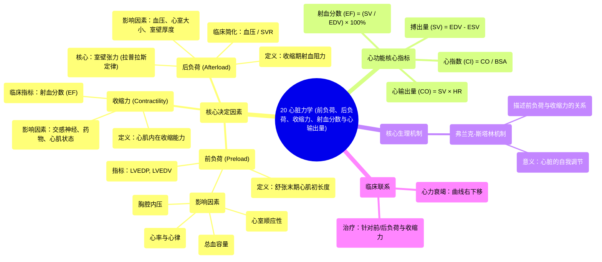

# 20 Cardiac Mechanics (preload, afterload, contractility, ejection fraction, and cardiac output)

  <video controls preload="metadata" playsinline>
    <source src="https://helly.s3.bitiful.net/心血管学科/%E4%B8%93%E8%BE%91%2003%EF%BC%9A%E5%BF%83%E8%A1%80%E7%AE%A1%E7%94%9F%E7%90%86%E5%AD%A6%E6%B7%B1%E5%BA%A6%E7%B2%BE%E8%AE%B2%20%28Cardiovascular%20Physiology%29/20%20Cardiac%20Mechanics%20%28preload%2C%20afterload%2C%20contractility%2C%20ejection%20fraction%2C%20and%20cardiac%20output%29.mp4" type="video/mp4">
    
您的浏览器不支持播放，请升级。

  </video>

::: tip ⚡️ 核心考点 (30s速读)
*   **核心考点**：理解心脏力学三大核心决定因素——前负荷、后负荷、收缩力——的定义、影响因素及其临床意义，并掌握心输出量相关指标的计算。
*   **临床意义**：这些概念是理解心力衰竭、休克、高血压等心血管疾病病理生理及制定治疗方案（如补液、使用血管活性药物）的理论基础。例如，前负荷过高可致肺水肿，后负荷过高增加心脏做功，收缩力减弱导致泵血不足。
:::

## 🧠 深度精讲

*   **前负荷 (Preload)**：
    *   **定义**：指左心室在收缩开始前（舒张末期）心肌纤维被拉伸的程度。临床上常用**左心室舒张末期压力 (LVEDP)** 或**左心室舒张末期容积 (LVEDV)** 作为替代指标。
    *   **影响因素**：
        1.  **总血容量**：血容量增加，回心血量增多，前负荷增加。
        2.  **心室顺应性**：心肌或心包僵硬（如心肌肥厚、淀粉样变性、心包积液、心包纤维化）会降低顺应性，导致在相同容积下压力更高，易出现充血症状。
        3.  **心率与心律**：心率过快缩短舒张期充盈时间；心房颤动等失去心房“kick”作用，均减少心室充盈，降低前负荷。
        4.  **胸腔内压**：正压通气时，胸腔内压升高，减少静脉回心血量，从而降低前负荷。

*   **后负荷 (Afterload)**：
    *   **定义**：指心室在收缩射血期必须克服的阻力。更精确的定义是收缩期心室壁所承受的**张力 (Wall Stress/Tension)**。
    *   **临床简化与局限**：常被简化为**血压**或**全身血管阻力 (SVR)**。但这是一种过度简化，因为根据**拉普拉斯定律 (Law of Laplace)**，室壁张力不仅取决于心室内压，还与心室半径和室壁厚度有关。因此，在心室扩张（半径增大）或室壁变薄时，即使血压不变，室壁实际承受的张力（后负荷）也会增加。

*   **收缩力 (Contractility)**：
    *   **定义**：指心肌细胞在不依赖于前负荷和后负荷的情况下，其内在的收缩能力和速度。反映了心肌的“变力状态”。
    *   **影响因素与指标**：受交感神经活性、循环儿茶酚胺、正性肌力药物（如多巴胺、多巴酚丁胺）增强；受心肌缺血、坏死、负性肌力药物（如β受体阻滞剂）减弱。**射血分数 (EF)** 是临床最常用的评估整体收缩力的指标，但受前、后负荷影响。

*   **心输出量相关指标**：
    *   **搏出量 (Stroke Volume, SV)**：一次心跳一侧心室射出的血量。**SV = LVEDV - LVESV (左心室收缩末期容积)**。
    *   **射血分数 (Ejection Fraction, EF)**：搏出量占舒张末期容积的百分比。**EF = (SV / LVEDV) × 100%**。是评估心室泵血效率的核心指标。
    *   **心输出量 (Cardiac Output, CO)**：每分钟一侧心室射出的总血量。**CO = SV × 心率 (HR)**。
    *   **心指数 (Cardiac Index, CI)**：为消除个体大小差异，将心输出量除以体表面积 (BSA)。**CI = CO / BSA**。是更精确的评估组织灌注指标。

*   **Frank-Starling 机制**：
    *   描述了心肌收缩力与前负荷（肌小节初长度）之间的关系。在一定范围内，增加前负荷（如增加回心血量）可使心肌收缩力增强，搏出量增加。该曲线解释了心脏如何自动调节以适应回心血量的变化。心力衰竭时，曲线向右下移位，意味着在相同前负荷下，心脏泵血能力下降。

## 📚 双语术语表 (Terminology)
| 英文术语 | 中文翻译 | 定义/解释 |
| :--- | :--- | :--- |
| Preload | 前负荷 | 心室收缩前（舒张末期）心肌纤维的初始拉伸程度，常用LVEDP或LVEDV表示。 |
| Afterload | 后负荷 | 心室在收缩射血期必须克服的阻力，精确表示为收缩期室壁张力。 |
| Contractility | 收缩力 | 心肌细胞内在的收缩能力和速度，独立于前、后负荷。 |
| Stroke Volume (SV) | 搏出量 | 一次心跳单侧心室射出的血液体积。 |
| Ejection Fraction (EF) | 射血分数 | 搏出量占心室舒张末期容积的百分比，反映心室泵血效率。 |
| Cardiac Output (CO) | 心输出量 | 每分钟单侧心室射出的血液总量，CO = SV × HR。 |
| Cardiac Index (CI) | 心指数 | 心输出量除以体表面积，用于标准化比较。 |
| End-Diastolic Volume (EDV) | 舒张末期容积 | 心室在舒张期结束、收缩开始前的容积。 |
| End-Systolic Volume (ESV) | 收缩末期容积 | 心室在收缩期结束时的最小容积。 |
| Frank-Starling Mechanism | 弗兰克-斯塔林机制 | 描述心肌收缩力随前负荷（初长度）增加而增强的生理规律。 |
| Law of Laplace | 拉普拉斯定律 | 描述球形或圆柱形结构中，壁张力与腔内压力和半径成正比，与壁厚度成反比。 |
| Systemic Vascular Resistance (SVR) | 全身血管阻力 | 体循环对血流的总体阻力，是后负荷的主要决定因素之一。 |
| Compliance | 顺应性 | 描述腔室（如心室）在压力变化下容积扩张的难易程度，顺应性 = ΔV/ΔP。 |

## 🗺️ 知识图谱

