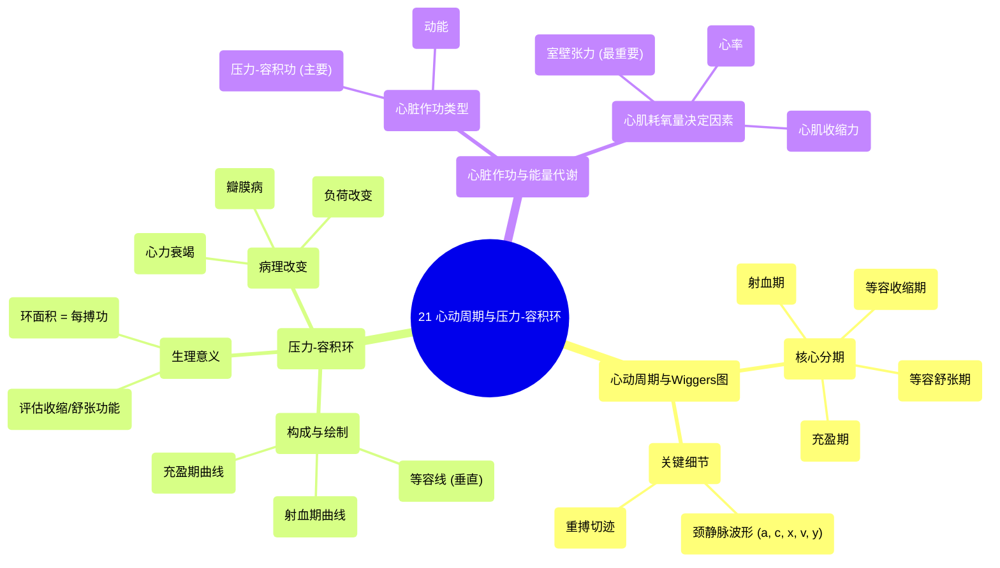

# 21 The Cardiac Cycle and PV Loops

  <video controls preload="metadata" playsinline>
    <source src="https://helly.s3.bitiful.net/心血管学科/%E4%B8%93%E8%BE%91%2003%EF%BC%9A%E5%BF%83%E8%A1%80%E7%AE%A1%E7%94%9F%E7%90%86%E5%AD%A6%E6%B7%B1%E5%BA%A6%E7%B2%BE%E8%AE%B2%20%28Cardiovascular%20Physiology%29/21%20The%20Cardiac%20Cycle%20and%20PV%20Loops.mp4" type="video/mp4">
    
您的浏览器不支持播放，请升级。

  </video>

::: tip ⚡️ 核心考点 (30s速读)
*   **核心考点**：理解心动周期中压力与容积变化的时序关系，掌握压力-容积环的构成、正常形态及其在病理状态下的变化，并能定性分析心脏作功与心肌耗氧量。
*   **临床意义**：Wiggers图是理解心脏生理的基石；压力-容积环是评估心脏收缩功能、舒张功能及心肌能量消耗的“金标准”工具；颈静脉波形为床旁评估右心血流动力学提供了重要窗口。
:::

## 🧠 深度精讲

*   **概念1：心动周期与Wiggers图**
    *   **定义**：心动周期是心脏一次收缩和舒张的完整过程。Wiggers图通过时间轴，同步展示心脏各腔室（左心房、左心室、主动脉）的压力、心室容积、心音、心电图等随时间变化的经典图表。
    *   **关键分期与机制**：
        1.  **等容收缩期**：二尖瓣关闭后，主动脉瓣尚未打开。此期心室肌强烈收缩，室内压急剧上升，但心室容积不变（等容）。
        2.  **快速射血期**：主动脉瓣开放，血液快速射入主动脉，心室容积迅速减小。
        3.  **减慢射血期**：射血速度减慢，心室容积缓慢减少至最低（收缩末期容积）。
        4.  **等容舒张期**：主动脉瓣关闭后，二尖瓣尚未打开。此期心室肌舒张，室内压急剧下降，心室容积不变。
        5.  **快速充盈期**：二尖瓣开放，血液快速从心房流入心室。
        6.  **减慢充盈期**：血液流入速度减慢。
        7.  **心房收缩期**：心房收缩，将最后一部分血液挤入心室，完成充盈。
    *   **临床细节**：
        *   **重搏切迹**：主动脉压力波形在舒张早期的一个小切迹，标志主动脉瓣关闭，可在动脉导管描记中观察到。
        *   **颈静脉波形**：反映右心房压力变化，是重要的床旁体征。
            *   **a波**：心房收缩所致。
            *   **c波**：心室收缩早期三尖瓣关闭上凸所致（临床意义小）。
            *   **x降支**：心房舒张和心室收缩下拉所致。
            *   **v波**：收缩晚期心房被动充盈所致。
            *   **y降支**：心室舒张、房室瓣开放后心房排空所致。

*   **概念2：压力-容积环**
    *   **定义**：以左心室容积为横轴，左心室压力为纵轴，描绘一个心动周期内压力与容积变化关系的闭合环形图。它是一种与时间无关的、用于分析心脏泵血功能和心肌力学特性的强大工具。
    *   **绘制与解读（正常环）**：
        1.  **起点（舒张末期）**：环开始于舒张末期，此时心室容积最大（舒张末期容积），压力为舒张末压。
        2.  **等容收缩期**：压力急剧上升，容积不变，形成一条**垂直向上的线**。
        3.  **射血期**：主动脉瓣开放后，心室射血，容积减小，压力先升后降，形成一条**向右下倾斜的弧线**。弧线顶端为收缩压。
        4.  **等容舒张期**：压力急剧下降，容积不变，形成一条**垂直向下的线**。
        5.  **充盈期**：二尖瓣开放后，心室充盈，容积增加，压力缓慢上升，形成一条**向右上倾斜的弧线**，回到起点。
    *   **环内面积的意义**：**压力-容积环所包围的面积，即代表每搏功**（Stroke Work）。面积越大，心脏每搏作功越多。
    *   **病理改变**：
        *   **收缩功能障碍**（如心力衰竭）：环的高度（收缩压）降低，宽度（每搏量）变窄，环面积缩小。
        *   **舒张功能障碍**（如心肌肥厚、限制型心肌病）：舒张期压力-容积曲线（环的底部）上移、变陡，表示心室顺应性下降，在相同容积下压力更高。
        *   **瓣膜病变**：例如主动脉瓣狭窄，等容收缩期延长，射血期压力异常增高，环形变高、变窄。
        *   **前负荷/后负荷改变**：前负荷增加（如容量过多）使环右移、变宽；后负荷增加（如高血压）使环变高、变窄。

*   **概念3：心脏作功与心肌耗氧量**
    *   **心脏作功**：主要包括压力-容积功（外部机械功，即PV环面积）和动能（加速血液的功，通常很小）。**后负荷是决定心肌耗氧量的主要因素**，因为克服压力（张力）作功比产生流量（缩短）消耗更多氧气。
    *   **心肌耗氧量**：主要决定因素包括：
        1.  **室壁张力**（后负荷、心室半径）：最重要的因素。张力越大，耗氧越多。
        2.  **心肌收缩力**：收缩力增强，耗氧增加。
        3.  **心率**：心率加快，单位时间内收缩次数增加，耗氧增加。
        4.  **基础代谢**。
    *   **临床联系**：治疗心绞痛（心肌缺血）的原则就是降低心肌耗氧量，常用方法包括使用β受体阻滞剂（降低心率、收缩力）、硝酸酯类药物（降低前负荷，从而减小室壁张力）等。

## 📚 双语术语表 (Terminology)
| 英文术语 | 中文翻译 | 定义/解释 |
| :--- | :--- | :--- |
| Cardiac Cycle | 心动周期 | 心脏一次完整的收缩和舒张过程。 |
| Wiggers Diagram | 维格特斯图/维格图 | 同步显示心动周期中心脏压力、容积、心电活动等随时间变化的经典坐标图。 |
| Systole | 收缩期 | 心动周期中心室收缩的时期。 |
| Diastole | 舒张期 | 心动周期中心室舒张的时期。 |
| Isovolumetric Contraction | 等容收缩期 | 心室收缩开始，房室瓣已关、动脉瓣未开，心室容积不变的时期。 |
| Isovolumetric Relaxation | 等容舒张期 | 心室舒张开始，动脉瓣已关、房室瓣未开，心室容积不变的时期。 |
| Dicrotic Notch | 重搏切迹 | 主动脉压力波形在舒张早期因主动脉瓣关闭产生的小切迹。 |
| Pressure-Volume Loop (PV Loop) | 压力-容积环 | 描绘一个心动周期内心室压力与容积变化关系的闭合环形图，用于分析心脏功能。 |
| Stroke Work | 每搏功 | 心脏一次搏动所做的功，数值上等于压力-容积环的面积。 |
| Preload | 前负荷 | 心脏收缩前（舒张末期）心肌的初长度或负荷，通常用舒张末期容积或压力来反映。 |
| Afterload | 后负荷 | 心室射血时需要克服的阻力，主要取决于主动脉压力。 |
| Myocardial Oxygen Consumption (MVO2) | 心肌耗氧量 | 心肌细胞代谢所消耗的氧气量，主要受室壁张力、心率、收缩力影响。 |
| A wave | a波 | 颈静脉波形中，由心房收缩引起的正向波。 |
| V wave | v波 | 颈静脉波形中，由收缩晚期心房被动充盈引起的正向波。 |

## 🗺️ 知识图谱

