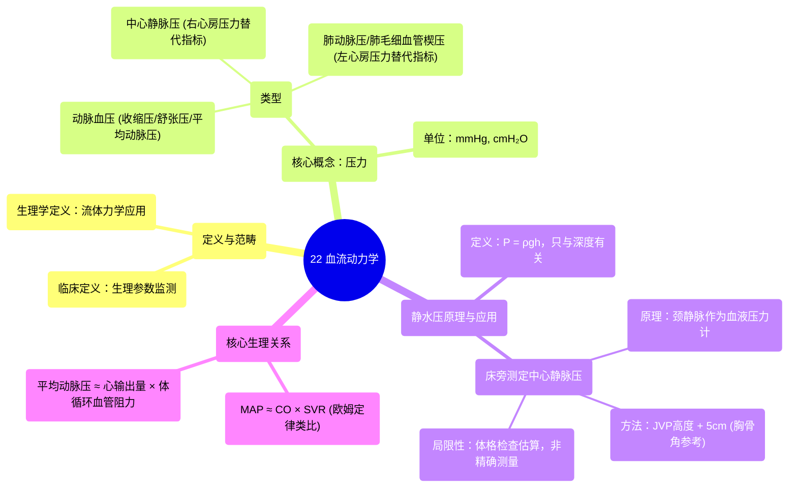

# 22 Hemodynamics

  <video controls preload="metadata" playsinline>
    <source src="https://helly.s3.bitiful.net/心血管学科/%E4%B8%93%E8%BE%91%2003%EF%BC%9A%E5%BF%83%E8%A1%80%E7%AE%A1%E7%94%9F%E7%90%86%E5%AD%A6%E6%B7%B1%E5%BA%A6%E7%B2%BE%E8%AE%B2%20%28Cardiovascular%20Physiology%29/22%20Hemodynamics.mp4" type="video/mp4">
    
您的浏览器不支持播放，请升级。

  </video>

::: tip ⚡️ 核心考点 (30s速读)
*   **核心考点**：血流动力学是应用流体力学原理研究心血管系统的学科。核心在于理解压力、流量和阻力之间的关系，特别是平均动脉压、心输出量和体循环血管阻力之间的定量关系（MAP = CO × SVR）。同时，掌握利用颈静脉压力（JVP）估算中心静脉压（CVP）的床旁体格检查方法及其原理。
*   **临床意义**：理解这些关系是解读血压、评估心功能、诊断休克类型（如心源性休克 vs. 分布性休克）以及指导血管活性药物使用的生理学基础。床旁JVP评估是快速判断右心前负荷和容量状态的重要无创工具。
:::

## 🧠 深度精讲

*   **血流动力学的定义与范畴**
    *   **临床定义**：通常指患者生理参数的监测，如血压、心率、心输出量等。
    *   **生理学定义**：更广泛，指将**流体力学**的物理原理应用于心血管系统。因此，它既是生理学，也是物理学。

*   **压力**
    *   **定义**：垂直作用于单位面积上的力。
    *   **心血管系统中的压力类型**：
        *   **动脉血压**：包括收缩压、舒张压和**平均动脉压**。
        *   **中心静脉压**：远端上、下腔静脉的压力，反映**右心房压力**。
        *   **肺动脉压/肺毛细血管楔压**：反映**左心房压力**。
    *   **单位**：毫米汞柱（mmHg），或厘米水柱（cmH₂O，用于颈静脉检查）。

*   **静水压及其临床应用**
    *   **定义**：由于重力作用，静止流体中存在的压力。压力差（ΔP） = 流体密度 × 重力加速度 × 高度差（ΔP = ρgh）。**关键点**：压力只取决于垂直深度，与容器的形状或方向无关。
    *   **床旁测定中心静脉压**：
        *   **原理**：颈内静脉顺应性高，直接与右心房相连，其充盈高度反映了右心房压力。我们将其视为一个“血液压力计”。
        *   **方法**：
            1.  找到体表标志：**胸骨角**。
            2.  测量颈静脉搏动最高点（JVP顶点）**垂直**高于胸骨角的距离（厘米）。
            3.  **CVP (cmH₂O) = JVP高于胸骨角的高度 + 5 cm**。其中5cm是估计的胸骨角到右心房的垂直距离。
        *   **注意事项**：患者体位（半卧或直立）不影响原理，只需测量**垂直距离**。但该方法受限于检查者辨别静脉搏动的能力以及患者颈部解剖等因素，是估算而非精确测量。

*   **核心关系：欧姆定律类比**
    *   心血管系统遵循类似电路欧姆定律（电压=电流×电阻）的关系：
        *   **平均动脉压** ≈ **心输出量** × **体循环血管阻力**
        *   **MAP ≈ CO × SVR**
    *   **理解**：平均动脉压（驱动血液流动的“压力差”）由心脏泵出的血量（CO）和血管对血流的阻碍程度（SVR）共同决定。这个公式是理解血压调节、心力衰竭和休克病理生理的核心。

## 📚 双语术语表 (Terminology)
| 英文术语 | 中文翻译 | 定义/解释 |
| :--- | :--- | :--- |
| Hemodynamics | 血流动力学 | 将流体力学原理应用于心血管系统的研究。 |
| Mean Arterial Pressure (MAP) | 平均动脉压 | 一个心动周期中动脉血压的平均值，是组织灌注的主要驱动压力。 |
| Central Venous Pressure (CVP) | 中心静脉压 | 上、下腔静脉与右心房连接处的压力，反映右心前负荷。 |
| Cardiac Output (CO) | 心输出量 | 每分钟一侧心室泵出的血液总量（心率×每搏输出量）。 |
| Systemic Vascular Resistance (SVR) | 体循环血管阻力 | 体循环动脉系统对血流的总体阻力。 |
| Hydrostatic Pressure | 静水压 | 流体因重力作用而产生的压力。 |
| Jugular Venous Pressure (JVP) | 颈静脉压力 | 颈内静脉的血压和搏动，用于床旁评估CVP。 |
| Sternal Angle (Angle of Louis) | 胸骨角 | 胸骨柄与胸骨体连接处的骨性标志，是测量JVP的参考点。 |

## 🗺️ 知识图谱

