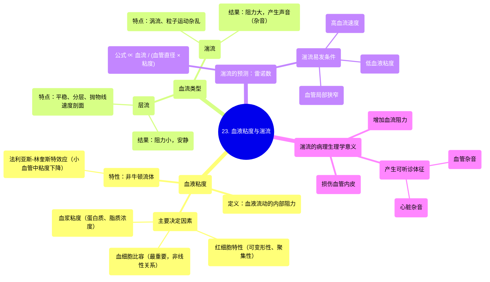

# 23 Viscosity and Turbulence

  <video controls preload="metadata" playsinline>
    <source src="https://helly.s3.bitiful.net/心血管学科/%E4%B8%93%E8%BE%91%2003%EF%BC%9A%E5%BF%83%E8%A1%80%E7%AE%A1%E7%94%9F%E7%90%86%E5%AD%A6%E6%B7%B1%E5%BA%A6%E7%B2%BE%E8%AE%B2%20%28Cardiovascular%20Physiology%29/23%20Viscosity%20and%20Turbulence.mp4" type="video/mp4">
    
您的浏览器不支持播放，请升级。

  </video>

::: tip ⚡️ 核心考点 (30s速读)
*   **核心考点**：血液粘度是血液流动的内部阻力，主要受血细胞比容影响，且呈非线性关系。血流分为层流（平稳、阻力小）和湍流（紊乱、阻力大），后者是产生心脏杂音和血管杂音的根本原因。
*   **临床意义**：理解粘度与湍流是诊断贫血、红细胞增多症、瓣膜病等心血管疾病的基础。通过听诊杂音，可间接判断血流状态及潜在病变。
:::

## 🧠 深度精讲

*   **血液粘度**
    *   **定义**：血液流动的内部阻力，源于血液成分（如红细胞、血浆蛋白）之间的内摩擦。它不是恒定的，属于**非牛顿流体**。
    *   **主要决定因素**：
        1.  **血细胞比容**：最重要的因素。粘度随血细胞比容增加而非线性急剧上升（如红细胞增多症）。
        2.  **红细胞特性**：可变形性降低（如镰状细胞贫血）或聚集性增加（如炎症状态）会升高粘度。
        3.  **血浆粘度**：受血浆中蛋白质（如免疫球蛋白、纤维蛋白原）、脂质浓度影响。病理性升高见于多发性骨髓瘤等。
        4.  **法利亚斯-林奎斯特效应**：在小血管（直径<300微米）中，血液粘度会降低。

*   **血流类型：层流 vs. 湍流**
    *   **层流**：血液分层平稳流动，中心流速最快，管壁处最慢，形成抛物线形速度剖面。血流阻力小，安静。
    *   **湍流**：血液形成涡流，粒子运动方向杂乱。会产生更大的摩擦和血流阻力，并产生可听的声音（杂音）。

*   **雷诺数与湍流预测**
    *   用于预测流动状态。在心血管系统中，**雷诺数 ∝ (血流 / (血管直径 × 血液粘度))**。
    *   **湍流更易发生在**：高血流速度、血管局部狭窄、血液粘度降低的情况下。

*   **湍流的病理生理学意义**
    1.  **增加血流阻力**：消耗更多能量，影响器官灌注。
    2.  **损伤血管内皮**：长期湍流冲击可导致内皮损伤，促进动脉粥样硬化。
    3.  **产生可听诊的体征**：
        *   **心脏杂音**：心脏内或大血管根部湍流产生，听诊部位在心脏周围。
        *   **血管杂音**：外周动脉（如颈动脉、肾动脉）狭窄处湍流产生，在相应体表部位听诊。

## 📚 双语术语表 (Terminology)
| 英文术语 | 中文翻译 | 定义/解释 |
| :--- | :--- | :--- |
| Viscosity | 粘度 | 流体抵抗流动的内在特性，源于内部分子或颗粒间的摩擦。 |
| Blood Viscosity | 血液粘度 | 血液流动的内部阻力，受血细胞比容、血浆成分、红细胞特性等多因素影响。 |
| Hematocrit | 血细胞比容 | 全血中红细胞所占的体积百分比。 |
| Laminar Flow | 层流 | 流体分层平稳流动的状态，各层不相混合，速度剖面呈抛物线形。 |
| Turbulent Flow | 湍流 | 流体粒子作不规则运动、相互混掺的流动状态，会产生涡流和噪音。 |
| Reynolds Number | 雷诺数 | 一个无量纲数，用于预测流体流动是层流还是湍流。值越高，越可能发生湍流。 |
| Heart Murmur | 心脏杂音 | 由于心脏或大血管内血流紊乱（湍流）产生的、能用听诊器听到的异常声音。 |
| Bruise | 血管杂音 | 在心脏以外的血管（如动脉）因狭窄或异常连接导致湍流而产生的杂音。 |
| Non-Newtonian Fluid | 非牛顿流体 | 粘度会随剪切速率（或流动条件）而改变的流体，血液是典型例子。 |
| Polycythemia | 红细胞增多症 | 血细胞比容异常升高的病理状态，导致血液粘度显著增加。 |

## 🗺️ 知识图谱

