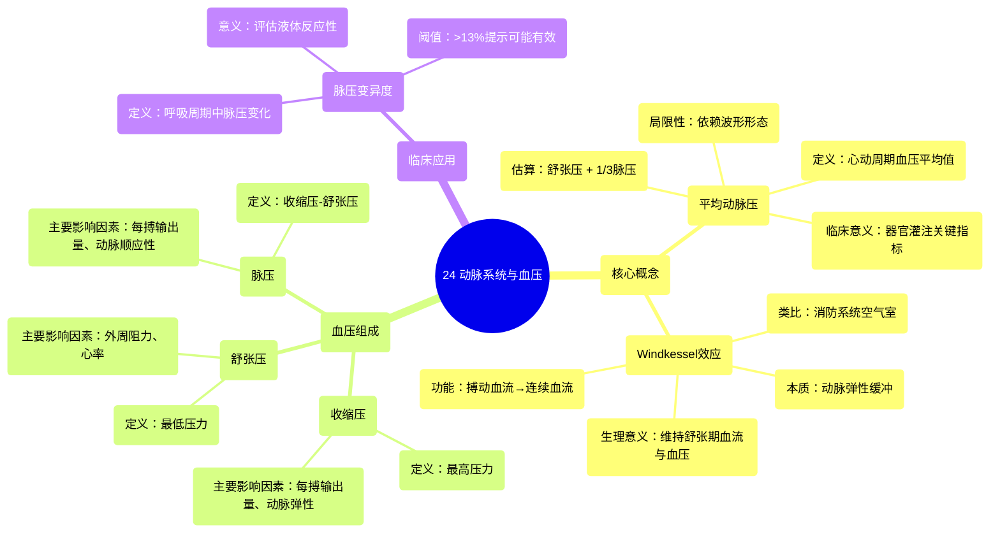

# 24 The Arterial System and Blood Pressure

  <video controls preload="metadata" playsinline>
    <source src="https://helly.s3.bitiful.net/心血管学科/%E4%B8%93%E8%BE%91%2003%EF%BC%9A%E5%BF%83%E8%A1%80%E7%AE%A1%E7%94%9F%E7%90%86%E5%AD%A6%E6%B7%B1%E5%BA%A6%E7%B2%BE%E8%AE%B2%20%28Cardiovascular%20Physiology%29/24%20The%20Arterial%20System%20and%20Blood%20Pressure.mp4" type="video/mp4">
    
您的浏览器不支持播放，请升级。

  </video>

::: tip ⚡️ 核心考点 (30s速读)
*   **核心考点**：理解平均动脉压（MAP）的定义与估算方法、Windkessel效应（弹性腔效应）如何将心脏的搏动性射血转化为相对连续的血流，以及影响收缩压、舒张压和脉压的关键生理参数。
*   **临床意义**：掌握脉压变异度（PPV）可用于评估危重患者的液体反应性；了解估算MAP的公式（舒张压 + 1/3脉压）的局限性，因其依赖于血压波形形态。
:::

## 🧠 深度精讲

*   **平均动脉压**：定义为整个心动周期中动脉血压的平均值，即血压曲线下的面积除以心动周期长度。临床常用估算公式为：**MAP ≈ 舒张压 + 1/3脉压**。例如，血压120/90 mmHg时，脉压为30 mmHg，估算MAP为100 mmHg。但需注意，此公式假设血压波形形态正常，若波形异常增宽或变窄，估算值会不准确。
*   **Windkessel效应**：也称为“弹性腔效应”或“压力缓冲效应”。该效应解释了为何在心脏舒张期，动脉血压不会瞬间降至舒张压水平。其原理是：大动脉（尤其是主动脉）具有弹性。心脏收缩射血时，动脉扩张，暂时储存一部分血液和势能；心脏舒张时，弹性动脉壁回缩，推动储存的血液继续向前流动，从而将心脏的间歇性、搏动性射血转化为相对连续的血流。这类似于老式消防系统中，在手动泵和出水口之间加装一个充满空气的腔室（Windkessel）来平滑水流。
*   **血压组成与影响因素**：
    *   **收缩压**：心动周期中的最高压力，主要受**每搏输出量**和**大动脉弹性**影响。每搏输出量增加或动脉硬化（弹性下降）会使收缩压升高。
    *   **舒张压**：心动周期中的最低压力，主要受**外周血管阻力**和**心率**影响。外周阻力增加或心率加快会使舒张压升高。
    *   **脉压**：收缩压与舒张压之差。主要受**每搏输出量**和**动脉顺应性（弹性）** 影响。每搏输出量增加或动脉硬化（顺应性下降）会使脉压增大。
*   **脉压变异度**：指在机械通气过程中，脉压随呼吸周期发生的规律性变化。PPV增大（通常>13%）提示患者可能存在血容量不足，对液体治疗有反应的可能性高（即“液体反应性”阳性），是指导危重患者液体复苏的重要动态指标。

## 📚 双语术语表 (Terminology)
| 英文术语 | 中文翻译 | 定义/解释 |
| :--- | :--- | :--- |
| Mean Arterial Pressure (MAP) | 平均动脉压 | 整个心动周期中动脉血压的平均值，是反映器官灌注压的关键指标。 |
| Systolic Blood Pressure | 收缩压 | 心室收缩射血时，动脉血压达到的最高值。 |
| Diastolic Blood Pressure | 舒张压 | 心室舒张时，动脉血压降至的最低值。 |
| Pulse Pressure | 脉压 | 收缩压与舒张压的差值。 |
| Windkessel Effect | 弹性腔效应 / Windkessel效应 | 大动脉的弹性扩张和回缩，将心脏的搏动性射血转化为相对连续血流，并缓冲血压波动的现象。 |
| Pulse Pressure Variation (PPV) | 脉压变异度 | 在机械通气周期中，脉压发生的规律性变化幅度，用于评估患者的液体反应性。 |
| Fluid Responsiveness | 液体反应性 | 指患者的心脏功能是否处于Starling曲线的上升支，即增加前负荷（补液）能否显著提高心输出量。 |

## 🗺️ 知识图谱

