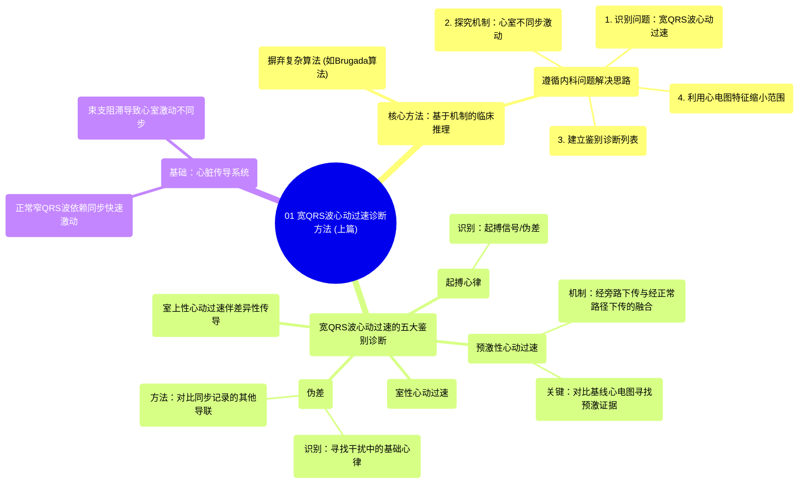

# 01 Wide Complex Tachycardia (Part 1 of 2) INTERMEDIATE ADVANCED

  <video controls preload="metadata" playsinline>
    <source src="https://helly.s3.bitiful.net/心血管学科/%E4%B8%93%E8%BE%91%2004%EF%BC%9A%E6%8A%97%E5%BF%83%E5%BE%8B%E5%A4%B1%E5%B8%B8%E8%8D%AF%E7%89%A9%E8%AF%A6%E8%A7%A3%20%28Antiarrhythmics%29/01%20Wide%20Complex%20Tachycardia%20%28Part%201%20of%202%29%20INTERMEDIATE%20ADVANCED.mp4" type="video/mp4">
    
您的浏览器不支持播放，请升级。

  </video>

::: tip ⚡️ 核心考点 (30s速读)
*   **核心考点**：诊断宽QRS波心动过速（WCT）时，应摒弃依赖复杂算法，转而采用基于心律失常机制的临床推理方法。其核心是理解导致QRS波增宽（心室不同步激动）的生理原因。
*   **临床意义**：快速、准确地鉴别WCT至关重要，因为室性心动过速（VT）与室上性心动过速伴差异性传导（SVT with aberrancy）的治疗和预后截然不同。掌握此方法有助于避免误诊，尤其是在紧急情况下。
:::

## 🧠 深度精讲

*   **传统方法的局限性**：传统上使用Brugada等算法诊断WCT，需要记忆规则和精确测量，在临床实践中（尤其是紧急阅图时）难以应用和记忆。
*   **新方法的核心理念**：采用与处理其他内科问题相同的思路：
    1.  **识别问题**：宽QRS波心动过速。
    2.  **探究机制**：QRS波增宽的本质是心室肌未能通过希-浦系统同步、快速地激动，而是部分依赖缓慢的细胞间传导。
    3.  **建立鉴别诊断**：基于上述机制，列出所有可能导致QRS波增宽的心律失常类型。
    4.  **利用心电图特征**：分析心电图的形态、节律等特征，逐一排除或支持列表中的诊断。
*   **传导系统回顾**：正常窄QRS波依赖于窦房结、房室结、希氏束、左右束支及浦肯野纤维这个高效同步的传导系统。任何一个环节（如束支阻滞）导致传导延迟或改变路径，都会引起心室不同步激动和QRS波增宽。
*   **宽QRS波心动过速的五大鉴别诊断**：
    1.  **室性心动过速**：起源于心室的快速心律，必然导致心室激动不同步。
    2.  **室上性心动过速伴差异性传导**：起源于心房或房室交界区的快速心律，但下传时遇到束支不应期，导致功能性束支阻滞，QRS波增宽。
    3.  **预激性心动过速**：激动通过房室旁路（附加传导通路）下传心室。旁路直接插入心肌，激动缓慢，产生预激波（δ波），导致QRS波增宽和顿挫。
    4.  **起搏心律**：心室起搏点位于右心室心尖部，激动顺序异常，产生宽大畸形的QRS波。
    5.  **伪差**：由电极接触不良、患者活动等非心脏电活动引起的干扰，可能被误判为心动过速。识别关键在于寻找干扰中隐藏的规律性基础心律，并对比同步记录的其他导联。

## 📚 双语术语表 (Terminology)
| 英文术语 | 中文翻译 | 定义/解释 |
| :--- | :--- | :--- |
| Wide-Complex Tachycardia (WCT) | 宽QRS波心动过速 | 心率>100次/分且QRS波时限≥120ms的心动过速。 |
| Ventricular Tachycardia (VT) | 室性心动过速 | 起源于心室的心动过速。 |
| SVT with Aberrancy | 室上性心动过速伴差异性传导 | 室上性心动过速下传心室时，因遇到束支生理性不应期而产生的功能性束支阻滞图形。 |
| Pre-excitation | 预激 | 心房激动通过房室旁路提前激动部分心室肌，心电图表现为PR间期缩短和δ波。 |
| Accessory Pathway | 旁路 / 附加传导通路 | 连接心房和心室的异常肌束，绕过了房室结，是预激综合征的解剖基础。 |
| Pacing Rhythm | 起搏心律 | 由心脏起搏器发出电脉冲带动的心律。 |
| Artifact | 伪差 | 心电图记录中非心脏电活动引起的干扰波形。 |
| Brugada Algorithm | Brugada算法 | 一种通过一系列心电图标准来鉴别室速与室上速伴差传的诊断流程。 |
| Bundle Branch Block (BBB) | 束支传导阻滞 | 希氏束以下的左或右束支发生传导延迟或中断，导致心室激动不同步。 |
| His-Purkinje System | 希-浦系统 | 包括希氏束、束支和浦肯野纤维，负责将电冲动快速、同步地传递至整个心室。 |

## 🗺️ 知识图谱

