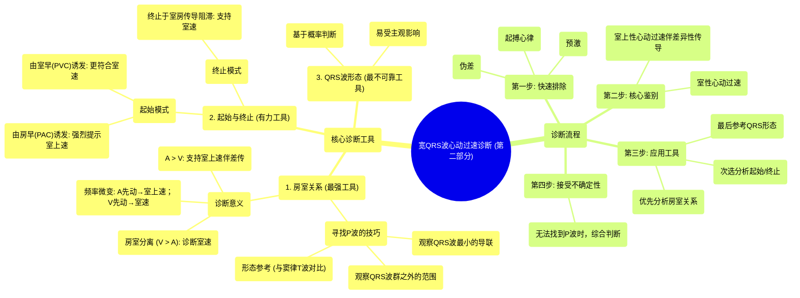

# 02 Wide Complex Tachycardia (Part 2 of 2) INTERMEDIATE ADVANCED

  <video controls preload="metadata" playsinline>
    <source src="https://helly.s3.bitiful.net/心血管学科/%E4%B8%93%E8%BE%91%2004%EF%BC%9A%E6%8A%97%E5%BF%83%E5%BE%8B%E5%A4%B1%E5%B8%B8%E8%8D%AF%E7%89%A9%E8%AF%A6%E8%A7%A3%20%28Antiarrhythmics%29/02%20Wide%20Complex%20Tachycardia%20%28Part%202%20of%202%29%20INTERMEDIATE%20ADVANCED.mp4" type="video/mp4">
    
您的浏览器不支持播放，请升级。

  </video>

::: tip ⚡️ 核心考点 (30s速读)
*   **核心考点**：掌握诊断宽QRS波心动过速的三大工具：房室关系、心动过速的起始与终止、QRS波形态。其中，**房室关系（尤其是房室分离）是诊断室性心动过速最有力的工具**。
*   **临床意义**：快速准确地区分室性心动过速与室上性心动过速伴差异性传导，是决定紧急处理策略（如抗心律失常药物选择、电复律）的关键，直接影响患者预后。
:::

## 🧠 深度精讲

*   **概念1：诊断宽QRS波心动过速的三大工具**
    1.  **房室关系 (AV Relationship)**：这是**最强有力的工具**。关键在于寻找P波。
        *   **寻找P波的技巧**：
            *   观察**QRS波最小的导联**，P波更易显现。
            *   观察**QRS波群之外的范围**：在所有同步导联上画垂直线，确定QRS波的起始和结束。**绝不要在QRS波范围内判定P波**，因为QRS波本身可能包含类似P波的偏转。
            *   **形态参考 (Templating)**：与已知的窦性心律T波形态对比，识别其中隐藏的P波。
        *   **房室关系的诊断意义**：
            *   **房室分离 (AV Dissociation)**：心室波 (V) 多于心房波 (A)，或存在室房传导阻滞（如逆行P波脱落）。**这是诊断室性心动过速的可靠依据**。
            *   **A波多于V波**：提示心室活动由心房驱动，支持室上性心动过速伴差异性传导。
            *   **频率微变 (Wobble)**：若心率有变化，观察谁先动。心房波先动并领先于心室波，支持室上速；心室波先动，则更符合室速。
    2.  **心动过速的起始与终止 (Initiation and Termination)**：是非常有力的辅助工具，但常因记录不完整而无法使用。
        *   **起始**：
            *   由**房性期前收缩 (PAC)** 诱发 → **高度提示室上性心动过速**。
            *   由**室性期前收缩 (PVC)** 诱发 → **更符合室性心动过速**（概率上）。
        *   **终止**：
            *   终止于一个心室波后心房波脱落（室房传导阻滞）→ 支持室性心动过速。
    3.  **QRS波形态 (QRS Morphology)**：这是**最不可靠的工具**，因为它基于概率判断（QRS形态是否符合某类束支传导阻滞形态），容易受主观影响。

*   **概念2：诊断流程示例**
    1.  **第一步：快速排除**：首先排除起搏心律、伪差和预激（预激综合征）等可能性。
    2.  **第二步：核心鉴别**：将鉴别诊断缩小至**室性心动过速**与**室上性心动过速伴差异性传导**。
    3.  **第三步：应用工具**：
        *   优先尝试寻找P波，分析**房室关系**。若发现房室分离，即可诊断室速。
        *   若有记录，分析**起始与终止**模式。
        *   最后，谨慎参考QRS波形态。
    4.  **第四步：接受不确定性**：如果找不到有说服力的P波，意味着无法使用最强工具。这时应基于现有信息（如起始方式、形态学概率）做出最可能的判断，并意识到诊断存在不确定性，必要时进行电生理检查。

## 📚 双语术语表 (Terminology)

| 英文术语 | 中文翻译 | 定义/解释 |
| :--- | :--- | :--- |
| Wide Complex Tachycardia (WCT) | 宽QRS波心动过速 | QRS波时限 > 120ms 的心动过速。 |
| Ventricular Tachycardia (VT) | 室性心动过速 | 起源于心室的心动过速。 |
| Supraventricular Tachycardia (SVT) with Aberrancy | 室上性心动过速伴差异性传导 | 起源于心房或房室结的心动过速，但心室激动通过异常路径（如束支传导阻滞）下传，导致QRS波增宽。 |
| AV Dissociation | 房室分离 | 心房和心室各自独立激动，互不相关。是诊断室速的关键征象。 |
| AV Relationship | 房室关系 | 分析心电图中心房波 (P波) 与心室波 (QRS波) 之间的传导关系（如1:1、2:1、分离等）。 |
| Initiation/Termination | 起始/终止 | 心动过速开始和结束时刻的心电图特征，对鉴别诊断有重要价值。 |
| PAC (Premature Atrial Contraction) | 房性期前收缩（房早） | 提前出现的、起源于心房的心搏。 |
| PVC (Premature Ventricular Contraction) | 室性期前收缩（室早） | 提前出现的、起源于心室的心搏。 |
| Retrograde Conduction | 逆向传导 | 电激动从心室向心房方向的传导。 |
| VA Block | 室房传导阻滞 | 心室激动向心房逆向传导过程中发生阻滞。 |
| Bundle Branch Block (BBB) | 束支传导阻滞 | 希氏束以下左或右束支的传导延迟或中断，导致QRS波增宽变形。 |
| Pre-excitation | 预激 | 心房激动通过房室旁路提前激动部分心室肌，如WPW综合征。 |
| Artifact | 伪差 | 心电图记录中非心脏电活动引起的干扰波形（如肌电干扰、电极接触不良）。 |
| Templating | 形态参考/模板比对 | 将未知的心电图波形与已知的、明确诊断的波形（如窦性心律）进行对比分析。 |

## 🗺️ 知识图谱

