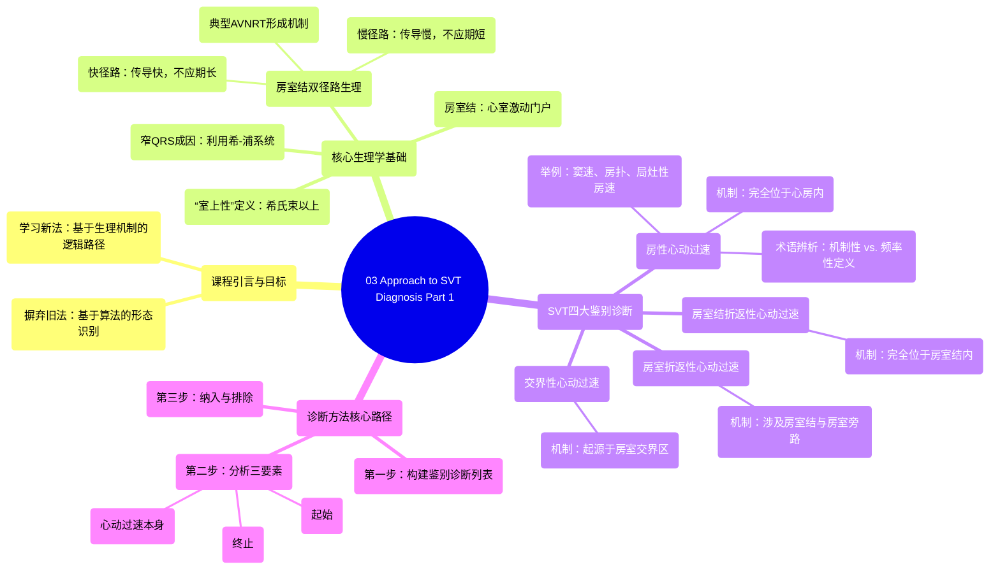

# 03 Approach to SVT Diagnosis Part 1

  <video controls preload="metadata" playsinline>
    <source src="https://helly.s3.bitiful.net/心血管学科/%E4%B8%93%E8%BE%91%2004%EF%BC%9A%E6%8A%97%E5%BF%83%E5%BE%8B%E5%A4%B1%E5%B8%B8%E8%8D%AF%E7%89%A9%E8%AF%A6%E8%A7%A3%20%28Antiarrhythmics%29/03%20Approach%20to%20SVT%20Diagnosis%20Part%201.mp4" type="video/mp4">
    
您的浏览器不支持播放，请升级。

  </video>

::: tip ⚡️ 核心考点 (30s速读)
*   **核心考点**：掌握一种基于传导系统生理机制的、逻辑清晰的室上性心动过速诊断方法，摒弃单纯依赖形态识别的旧有算法。
*   **临床意义**：通过构建鉴别诊断列表并分析心动过速的起始、持续和终止特征，系统性地在房性心动过速、房室结折返性心动过速、房室折返性心动过速和交界性心动过速四大类别中做出判断，提升心电图判读的准确性和信心。
:::

## 🧠 深度精讲

*   **课程目标与方法论**：本课程旨在教授一种诊断室上性心动过速的可靠方法。讲师强调，需要摒弃过去基于已发表算法和形态识别的技术，转而学习一种基于电生理机制的、直接且合乎逻辑的路径。这种方法将使心电图判读变得有趣且高效。
*   **“室上性”的定义与传导基础**：“室上性”指的是心律失常的关键机制位于希氏束以上。这类心动过速利用希-浦系统快速激动心室，因此其QRS波形态在大多数情况下与基线（窦性心律时）的QRS波相似。如果基线QRS波是窄的，那么室上性心动过速通常表现为窄QRS波心动过速，除非出现与心率相关的束支传导阻滞。
*   **房室结双径路与典型房室结折返性心动过速**：房室结是心室激动的“门户”。相当一部分人群存在房室结双径路（快径路和慢径路）。快径路传导快但不应期长，慢径路传导慢但不应期短。在窦性心律时，传导通常经由快径路。当一个房性早搏过早激动心房时，快径路可能因其较长的不应期而发生阻滞，而冲动可经慢径路缓慢下传，到达共同通路后，快径路已恢复，冲动可经快径路逆传，再次激动慢径路，从而形成一个完全包含在致密房室结内的大折返环路，即典型的房室结折返性心动过速。
*   **室上性心动过速的四大鉴别诊断类别**：电生理学家通常将室上性心动过速分为四个主要类别，它们具有不同的特性：
    1.  **房性心动过速**：机制完全位于心房内。包括窦性心动过速、心房扑动（涉及三尖瓣环-下腔静脉峡部的大折返）、局灶性房性心动过速和窦房结折返性心动过速。讲师指出，从机制上讲，所有折返环完全局限于心房内的心律失常都可归为此类，但临床中常基于频率（如>250次/分称“扑动”）进行粗略区分。本课程采用机制性定义。
    2.  **房室结折返性心动过速**：机制完全位于房室结内，即上文所述的典型房室结折返。
    3.  **房室折返性心动过速**：机制涉及房室结和一条额外的房室旁路（如预激综合征中的旁路）。
    4.  **交界性心动过速**：机制起源于房室交界区。
*   **诊断路径的核心**：评估一份室上性心动过速心电图时，关键是**制定一份鉴别诊断列表**。然后，通过分析心动过速的**起始**、**心动过速本身**的特征以及**终止**方式，来逐一纳入或排除列表中的项目。

## 📚 双语术语表 (Terminology)
| 英文术语 | 中文翻译 | 定义/解释 |
| :--- | :--- | :--- |
| SVT (Supraventricular Tachycardia) | 室上性心动过速 | 起源于希氏束分叉以上的快速性心律失常。 |
| AV Node (Atrioventricular Node) | 房室结 | 心脏传导系统中的关键结构，负责将心房电冲动延迟后传向心室。 |
| Dual AV Nodal Physiology | 房室结双径路 | 房室结内存在功能特性（传导速度、不应期）不同的两条路径。 |
| Typical AVNRT (Atrioventricular Nodal Reentrant Tachycardia) | 典型房室结折返性心动过速 | 最常见的阵发性室上速类型，由房室结内快、慢径路形成的折返引起。 |
| Macro re-entry circuit | 大折返环路 | 一种心律失常机制，电冲动围绕一个大的解剖或功能屏障（如三尖瓣环）循环传导。 |
| Atrial Tachycardia | 房性心动过速 | 起源点位于心房的心动过速。 |
| Atrial Flutter | 心房扑动 | 通常指围绕三尖瓣环-下腔静脉峡部的大折返性房性心动过速，心房率常>250次/分。 |
| Cavotricuspid Isthmus (CTI) | 三尖瓣环-下腔静脉峡部 | 右心房内三尖瓣环与下腔静脉开口之间的区域，是典型心房扑动折返环的关键部位。 |
| Focal Atrial Tachycardia | 局灶性房性心动过速 | 由心房内一个局灶点异常快速放电引起的心动过速。 |
| Accessory Pathway | 房室旁路 | 连接心房和心室的异常肌束，绕过了房室结，是预激综合征和房室折返性心动过速的解剖基础。 |

## 🗺️ 知识图谱

