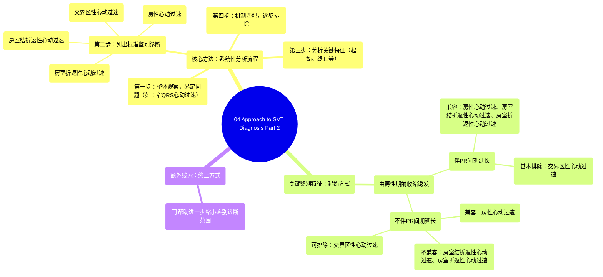

# 04 Approach to SVT Diagnosis Part 2

  <video controls preload="metadata" playsinline>
    <source src="https://helly.s3.bitiful.net/心血管学科/%E4%B8%93%E8%BE%91%2004%EF%BC%9A%E6%8A%97%E5%BF%83%E5%BE%8B%E5%A4%B1%E5%B8%B8%E8%8D%AF%E7%89%A9%E8%AF%A6%E8%A7%A3%20%28Antiarrhythmics%29/04%20Approach%20to%20SVT%20Diagnosis%20Part%202.mp4" type="video/mp4">
    
您的浏览器不支持播放，请升级。

  </video>

::: tip ⚡️ 核心考点 (30s速读)
*   **核心考点**：掌握窄QRS波心动过速（SVT）的系统诊断流程，即“观察-鉴别-分析”，而非直接下诊断。重点学习如何利用心动过速的起始和终止特征来排除或支持特定的鉴别诊断。
*   **临床意义**：通过分析心动过速的起始（如是否由房性期前收缩/PAC诱发、是否伴有PR间期延长）和终止方式，可以有效地将鉴别诊断范围从房性心动过速（AT）、房室结折返性心动过速（AVNRT）、房室折返性心动过速（AVRT）和交界区性心动过速（JT）中逐步缩小，提高诊断准确性。
:::

## 🧠 深度精讲

本视频是《室上性心动过速诊断实用方法》系列的第二部分，旨在通过具体的心电图案例，应用第一部分所学的系统分析方法。

*   **核心方法：系统性分析流程**
    视频强调，分析心电图时，**切勿直接跳至某个特定诊断**。应遵循以下步骤：
    1.  **整体观察**：界定问题（例如：这是窄QRS波心动过速）。
    2.  **列出鉴别诊断**：对于窄QRS波心动过速，常规鉴别诊断包括：房性心动过速（AT）、房室结折返性心动过速（AVNRT）、房室折返性心动过速（AVRT）和交界区性心动过速（JT）。
    3.  **分析特征**：仔细寻找心动过速的起始、终止等关键特征。
    4.  **机制匹配**：将观察到的特征与每种心律失常的可能发生机制进行比对，判断其是否“兼容”，从而逐步排除或保留诊断选项。

*   **案例分析：利用起始特征进行鉴别**
    视频通过两个案例演示了如何利用**起始特征**来缩小鉴别诊断范围：
    *   **案例一：由PAC诱发，伴PR间期延长**
        *   **分析**：逐一比对四种机制。
        *   **AT**：PAC可诱发，房室结的生理性递减传导可导致PR延长。**兼容**。
        *   **AVNRT**：PAC在快径路阻滞，经慢径路下传（表现为PR延长）是常见启动方式。**兼容**。
        *   **AVRT**：PAC在旁路阻滞，经房室结下传时出现生理性延迟（PR延长）为旁路恢复提供时间，是常见启动方式。**兼容**。
        *   **JT**：由PAC诱发极为罕见，且第一个心搏同时存在心室传导阻滞的可能性极低。**基本可排除**。
        *   **结论**：此起始特征无法区分AT、AVNRT和AVRT，但可基本排除JT。

    *   **案例二：由PAC诱发，不伴PR间期延长**
        *   **分析**：再次进行机制匹配。
        *   **AT**：机制局限于心房，无需房室结延迟即可启动。**兼容**。
        *   **AVNRT**：通常需要慢径路传导延迟（PR延长）来保证快径路恢复，以完成折返。**不兼容**。
        *   **AVRT**：需要房室结传导延迟（PR延长）来保证旁路恢复，以完成折返。**不兼容**。
        *   **JT**：通常不由PAC诱发，且第一个心搏的形态难以解释。**可排除**。
        *   **结论**：此起始特征强烈提示**房性心动过速（AT）**，因为它与AVNRT和AVRT的必需启动条件相矛盾。

*   **额外线索：终止方式**
    视频最后提到，心动过速的**终止方式**也能提供重要线索，帮助进一步排除某些诊断，但未在本段字幕中展开详细案例。

## 📚 双语术语表 (Terminology)
| 英文术语 | 中文翻译 | 定义/解释 |
| :--- | :--- | :--- |
| SVT (Supraventricular Tachycardia) | 室上性心动过速 | 起源于希氏束分叉以上的快速性心律失常，通常表现为窄QRS波。 |
| Narrow Complex Tachycardia | 窄QRS波心动过速 | QRS波时限正常（通常<120ms）的心动过速，提示心室激动经由希浦系统正常下传。 |
| PAC (Premature Atrial Contraction) | 房性期前收缩（房早） | 起源于心房异位起搏点的提前心搏。 |
| AT (Atrial Tachycardia) | 房性心动过速 | 起源于心房内局部病灶的快速性心律失常，折返或自律性增高均可导致。 |
| AVNRT (Atrioventricular Nodal Reentrant Tachycardia) | 房室结折返性心动过速 | 最常见的SVT类型，折返环路位于房室结及其周围区域，涉及功能性的快径路和慢径路。 |
| AVRT (Atrioventricular Reentrant Tachycardia) | 房室折返性心动过速 | 折返环路涉及心房、房室结、心室和一条额外的连接心房与心室的通路（旁路）。 |
| JT (Junctional Tachycardia) | 交界区性心动过速 | 起源于房室交界区（希氏束附近）的快速性心律失常。 |
| Decremental Conduction | 递减传导 | 心脏组织（如房室结）的一种生理特性，表现为传导速度随刺激频率增加或提前而减慢。 |
| Macro Reentry Circuit | 大折返环路 | 折返性心动过速的一种机制，其折返环路由解剖或功能上的屏障形成，环路较大。 |
| Orthodromic AVRT | 顺向型房室折返性心动过速 | AVRT的一种常见类型，前传经由房室结，逆传经由旁路。 |
| Accessory Pathway | 旁路（附加传导通路） | 连接心房和心室的异常肌束，是预激综合征和AVRT的解剖基础。 |

## 🗺️ 知识图谱

