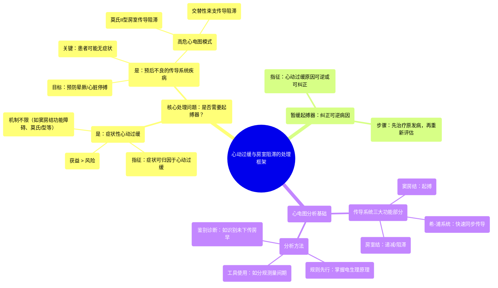

# 05 AV blocks & Bradycardia Part 13 (INTERMEDIATE ADVANCED ECGs)

  <video controls preload="metadata" playsinline>
    <source src="https://helly.s3.bitiful.net/心血管学科/%E4%B8%93%E8%BE%91%2004%EF%BC%9A%E6%8A%97%E5%BF%83%E5%BE%8B%E5%A4%B1%E5%B8%B8%E8%8D%AF%E7%89%A9%E8%AF%A6%E8%A7%A3%20%28Antiarrhythmics%29/05%20AV%20blocks%20%26%20Bradycardia%20Part%2013%20%28INTERMEDIATE%20ADVANCED%20ECGs%29.mp4" type="video/mp4">
    
您的浏览器不支持播放，请升级。

  </video>

::: tip ⚡️ 核心考点 (30s速读)
*   **核心考点**：心动过缓与房室传导阻滞的处理核心在于判断患者是否需要植入起搏器，主要依据两点：1）症状是否由心动过缓引起；2）是否存在预后不良的传导系统疾病。
*   **临床意义**：对于无症状但心电图提示高危传导阻滞（如莫氏II型、交替性束支传导阻滞）的患者，需警惕其发生晕厥、心脏停搏的风险，并考虑预防性起搏器植入。
:::

## 🧠 深度精讲
*   **心脏传导系统功能**：视频将心脏传导系统分为三个关键部分。**窦房结**是心脏的“总司令”，负责以固定节律发放冲动驱动心房。**房室结**是“安全阀”，其核心功能是**递减和阻滞**过快的心房信号（如房颤、房扑时），防止心室被过快激动。**希氏束下（希-浦）系统**是“高速公路”，其功能是**快速、同步地传导**信号至心室，形成窄QRS波；任何此处的传导减慢或不同步都会导致宽QRS波。
*   **起搏器植入两大指征**：
    1.  **症状性心动过缓**：无论心动过缓的机制如何（如莫氏I型、窦房结功能障碍等），只要患者的症状（如头晕、乏力、晕厥）可明确归因于心动过缓，且植入起搏器的症状改善获益大于手术风险，就应考虑植入。
    2.  **预后不良的传导系统疾病**：这部分是临床识别的重点。患者可能**没有症状**，但心电图提示存在高风险的传导阻滞，预示着未来发生晕厥、心脏停搏等严重事件的风险高。**需要紧急识别的高危模式**包括：**莫氏II型房室传导阻滞**和**交替性束支传导阻滞**。这类患者需要预防性植入起搏器以避免不良结局。
*   **分析方法与实例**：视频强调分析心电图（如动态心电图中的长间歇）应像“下棋”，先掌握规则（电生理原理）。例如，面对一个长间歇，应使用分规测量窦性节律（A-A间期），逐搏比对，寻找缺失的P波或隐藏在T波中的未下传房性期前收缩（房早），从而准确判断阻滞发生的部位（如房室结），而非误判为窦性停搏。

## 📚 双语术语表 (Terminology)
| 英文术语 | 中文翻译 | 定义/解释 |
| :--- | :--- | :--- |
| SA node | 窦房结 | 位于右心房上腔静脉入口处，是心脏正常的起搏点，自律性最高。 |
| AV node | 房室结 | 位于房间隔下部，主要功能是延缓并过滤心房传来的过快电信号，保护心室。 |
| Infra-HIS (HIS-Purkinje) system | 希氏束下（希-浦）系统 | 包括希氏束、左右束支及浦肯野纤维，负责将电信号快速、同步地传导至心室肌。 |
| Symptomatic bradycardia | 症状性心动过缓 | 心率过慢并直接导致临床症状（如头晕、晕厥、乏力）。 |
| MOBITZ Type II (MOBITZ-2) | 莫氏II型房室传导阻滞 | 一种高危的房室传导阻滞，表现为P波突然不能下传，但下传的PR间期恒定，通常提示阻滞部位在希氏束或以下。 |
| Alternating bundle branch block | 交替性束支传导阻滞 | 心电图上交替出现左、右束支传导阻滞图形，是严重希氏束下病变的标志，预后不良。 |
| Non-conducted PAC | 未下传的房性期前收缩 | 提前出现的心房激动（房早）在房室结被阻滞，未能下传激动心室，在心电图上表现为一个提前的P波后无QRS波群，常隐藏在T波中。 |

## 🗺️ 知识图谱

