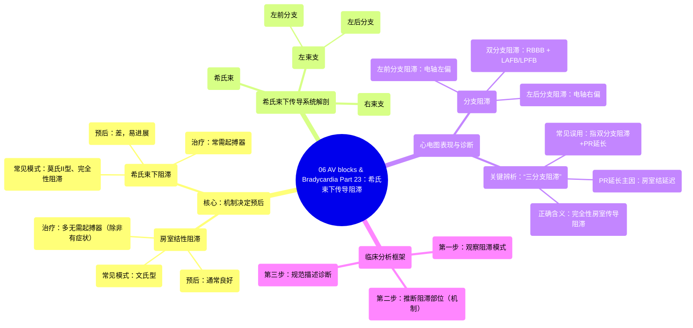

# 06 AV blocks & Bradycardia Part 23 (INTERMEDIATE ADVANCED ECGs)

  <video controls preload="metadata" playsinline>
    <source src="https://helly.s3.bitiful.net/心血管学科/%E4%B8%93%E8%BE%91%2004%EF%BC%9A%E6%8A%97%E5%BF%83%E5%BE%8B%E5%A4%B1%E5%B8%B8%E8%8D%AF%E7%89%A9%E8%AF%A6%E8%A7%A3%20%28Antiarrhythmics%29/06%20AV%20blocks%20%26%20Bradycardia%20Part%2023%20%28INTERMEDIATE%20ADVANCED%20ECGs%29.mp4" type="video/mp4">
    
您的浏览器不支持播放，请升级。

  </video>

::: tip ⚡️ 核心考点 (30s速读)
*   **核心考点**：区分房室传导阻滞的机制（房室结 vs. 希氏束下）是评估预后和决定治疗（如是否需要起搏器）的关键。房室结阻滞通常预后良好，而希氏束下阻滞易进展为完全性房室传导阻滞，预后较差。
*   **临床意义**：心电图分析应遵循“模式→机制→诊断”的流程。避免使用“三分支阻滞”等易混淆术语，应直接描述心电图所见（如：右束支传导阻滞合并左前分支阻滞及一度房室传导阻滞）。
:::

## 🧠 深度精讲

本视频是心动过缓与房室传导阻滞系列的第二部分，重点讲解**希氏束下传导系统**的病理生理及心电图表现。

*   **希氏束下传导系统解剖回顾**：该系统指房室结以下的部分，包括：
    *   **希氏束**：进入心室的共同通路。
    *   **右束支**：传导至右心室。
    *   **左束支**：分为**左前分支**和**左后分支**。
*   **分支阻滞的心电图影响**：
    *   单一分支（左前或左后）阻滞：主要引起**电轴偏移**（左前分支阻滞致电轴左偏，左后分支阻滞致电轴右偏），QRS波群可能轻微增宽。
    *   **双分支阻滞**：通常指**右束支传导阻滞**合并**左前分支阻滞**（电轴左偏）或**左后分支阻滞**（电轴右偏）。
    *   **左束支传导阻滞**：可由左束支主干阻滞或左前、左后分支同时阻滞引起。
*   **关键概念辨析：“三分支阻滞”**：
    *   **生理学定义**：指右束支、左前分支、左后分支三者全部阻滞，其结果是**三度（完全性）房室传导阻滞**。
    *   **临床误用**：临床上常被误用于描述“双分支阻滞 + PR间期延长”。但需注意，PR间期延长主要反映**房室结传导延迟**，而非希氏束下传导延迟。希氏束下传导系统具有“全或无”的特性，一般不引起显著传导延迟。
*   **心电图分析框架与临床意义**：
    1.  **观察模式**：识别房室传导阻滞的具体模式（如文氏型、莫氏II型、2:1阻滞、完全性阻滞）。
    2.  **推断机制**：
        *   **房室结性阻滞**：预后通常较好，除非症状明显，一般不需要起搏器。
        *   **希氏束下阻滞**：易进展为完全性房室传导阻滞，预后较差，可能发生心脏骤停，常需起搏器治疗。
    3.  **规范诊断描述**：建议避免使用“三分支阻滞”这一易产生歧义的术语，应直接、精确地描述心电图发现（例如：“右束支传导阻滞，左前分支阻滞，一度房室传导阻滞”）。

## 📚 双语术语表 (Terminology)
| 英文术语 | 中文翻译 | 定义/解释 |
| :--- | :--- | :--- |
| Infra-Hisian conduction system | 希氏束下传导系统 | 指希氏束以下的心室传导系统，包括束支和浦肯野纤维。 |
| His bundle | 希氏束 | 房室结的延续，是激动从心房传入心室的共同通路。 |
| Right bundle branch block (RBBB) | 右束支传导阻滞 | 右束支传导延迟或中断，导致右心室除极延迟。 |
| Left bundle branch block (LBBB) | 左束支传导阻滞 | 左束支传导延迟或中断，导致左心室除极延迟。 |
| Left anterior fascicular block (LAFB) | 左前分支阻滞 | 左束支前上分支阻滞，导致电轴左偏。 |
| Left posterior fascicular block (LPFB) | 左后分支阻滞 | 左束支后下分支阻滞，导致电轴右偏。 |
| Bifascicular block | 双分支阻滞 | 通常指右束支传导阻滞合并左前分支或左后分支阻滞。 |
| Trifascicular block | 三分支阻滞 | **生理学上**指右束支及左束支两个分支均阻滞，即完全性房室传导阻滞。**临床上常被误用**。 |
| Complete (Third-degree) AV block | 三度（完全性）房室传导阻滞 | 心房激动完全不能下传至心室，房室分离。 |
| Wenckebach phenomenon (Mobitz type I) | 文氏现象（莫氏I型） | PR间期进行性延长，直至一个P波后QRS波群脱落，常见于房室结。 |
| Mobitz type II AV block | 莫氏II型房室传导阻滞 | PR间期恒定，突然出现P波后QRS波群脱落，常提示希氏束或以下部位病变。 |

## 🗺️ 知识图谱

