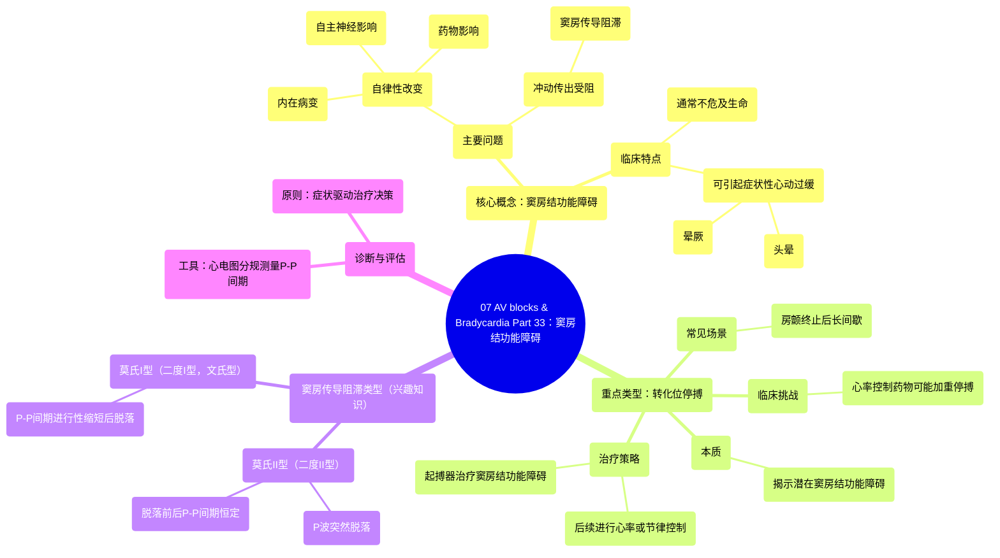

# 07 AV blocks & Bradycardia Part 33 (INTERMEDIATE ADVANCED ECGs)

  <video controls preload="metadata" playsinline>
    <source src="https://helly.s3.bitiful.net/心血管学科/%E4%B8%93%E8%BE%91%2004%EF%BC%9A%E6%8A%97%E5%BF%83%E5%BE%8B%E5%A4%B1%E5%B8%B8%E8%8D%AF%E7%89%A9%E8%AF%A6%E8%A7%A3%20%28Antiarrhythmics%29/07%20AV%20blocks%20%26%20Bradycardia%20Part%2033%20%28INTERMEDIATE%20ADVANCED%20ECGs%29.mp4" type="video/mp4">
    
您的浏览器不支持播放，请升级。

  </video>

::: tip ⚡️ 核心考点 (30s速读)
*   **核心考点**：窦房结功能障碍通常不危及生命，但可引起症状性心动过缓（如头晕、晕厥）。其核心问题在于窦房结自律性改变或冲动传出受阻（窦房传导阻滞）。快-慢综合征（如房颤终止后长间歇）的本质是窦房结功能障碍。
*   **临床意义**：治疗决策（如是否植入起搏器）取决于症状的严重程度，需权衡获益与风险。处理时需注意，控制快速性心律失常的药物可能加重窦房结抑制。
:::

## 🧠 深度精讲

*   **窦房结功能障碍概述**：窦房结是位于上腔静脉基底部的新月形结构，是心脏的正常起搏点。其功能障碍主要包括两类问题：1) 细胞自律性改变（内在病变、自主神经影响或药物所致）；2) 冲动传出受阻，即**窦房传导阻滞**。总体而言，这类问题猝死风险低，但可导致明显症状。
*   **转化位停搏与“快-慢综合征”**：这是临床常见情况。例如，心房颤动（一种快速性心律失常）终止后，窦房结未能及时恢复起搏，导致长间歇（停搏），然后窦性心律恢复。这揭示了潜在的**窦房结功能障碍**。教授强调应避免使用“快-慢综合征”这一笼统术语，而应准确描述为“**心房颤动转化位停搏**”，以明确根本问题。
*   **窦房传导阻滞的类型（兴趣知识）**：
    *   **莫氏II型（二度II型）**：窦性P波突然脱落一次，其前后的P-P间期保持恒定（为基本窦性周期的倍数）。提示窦房结规律发放冲动，但其中一次未能传出。
    *   **莫氏I型（二度I型，文氏型）**：P-P间期进行性缩短，直至一次P波脱落，出现长间歇；脱落后的第一个P-P间期最长，然后周期重复。此类型临床意义与II型相似。
    *   **诊断工具**：使用心电图分规测量P-P间期并向前推移，是判断窦房传导阻滞类型的实用方法。
*   **临床处理原则**：
    1.  **评估症状**：治疗（尤其是起搏器植入）主要针对有症状（如晕厥、头晕）的患者。
    2.  **治疗矛盾**：控制房颤等快速心律失常的药物（如β受体阻滞剂）可能抑制窦房结，加重停搏；而停用这些药物又可能使心动过速恶化。
    3.  **治疗策略**：
        *   对于有症状的转化位停搏，常需植入**起搏器**治疗窦房结功能障碍，之后可安全地进行心房颤动的**心率控制**。
        *   另一种策略是进行**节律控制**，努力维持患者为窦性心律，避免心房颤动发生。

## 📚 双语术语表 (Terminology)
| 英文术语 | 中文翻译 | 定义/解释 |
| :--- | :--- | :--- |
| Sinus Node Dysfunction | 窦房结功能障碍 | 窦房结起搏和/或冲动传出功能异常。 |
| Sinoatrial (SA) Exit Block | 窦房传导阻滞 | 窦房结产生的冲动未能传出至周围心房肌。 |
| Conversion Pause | 转化位停搏 | 快速性心律失常（如房颤）终止后，窦房结未能及时起搏而出现的长间歇。 |
| Tachy-Brady Syndrome | 快-慢综合征 | 描述快速性心律失常（如房颤）与心动过缓（如窦性停搏）交替出现的临床情况。但建议更精确描述。 |
| Pacemaker | 起搏器 | 一种植入式医疗设备，通过发放电脉冲刺激心脏，治疗严重的心动过缓。 |
| Atrial Fibrillation (AFib) | 心房颤动 | 一种常见的心律失常，心房快速、无序地电激动，导致心跳绝对不齐。 |
| Rate Control | 心率控制 | 治疗策略，使用药物控制心房颤动时的心室率，而不试图转复窦律。 |
| Rhythm Control | 节律控制 | 治疗策略，通过药物或电复律等方法，试图转复并维持窦性心律。 |
| Mobitz Type I (Wenckebach) | 莫氏I型（文氏型） | 一种传导阻滞类型，传导时间进行性延长直至一次冲动完全被阻滞。 |
| Mobitz Type II | 莫氏II型 | 一种传导阻滞类型，传导时间恒定，突然发生一次冲动完全被阻滞。 |

## 🗺️ 知识图谱

