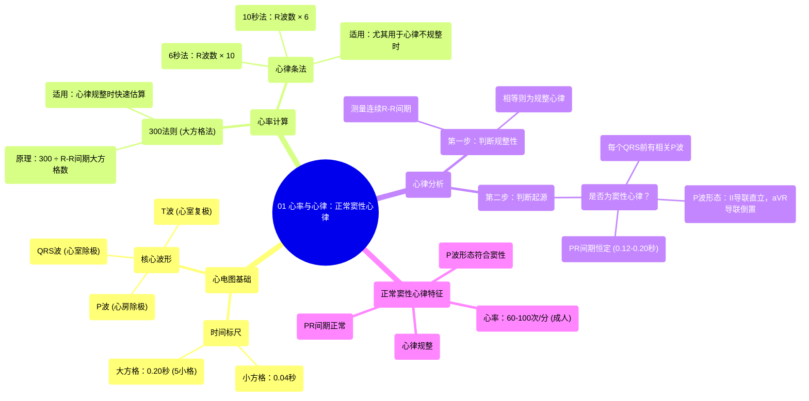

# 01 Rate and Rhythm Normal Sinus Rhythm

  <video controls preload="metadata" playsinline>
    <source src="https://helly.s3.bitiful.net/心血管学科/%E4%B8%93%E8%BE%91%2005%EF%BC%9A%E5%BF%83%E7%94%B5%E5%9B%BE%E5%9F%BA%E7%A1%80%E5%85%A5%E9%97%A8%20%28ECG%20Basics%29/01%20Rate%20and%20Rhythm%20Normal%20Sinus%20Rhythm.mp4" type="video/mp4">
    
您的浏览器不支持播放，请升级。

  </video>

::: tip ⚡️ 核心考点 (30s速读)
*   **核心考点**：掌握利用心电图大方格（300法则）和心律条（6秒法）快速估算心率的方法，并能通过分析R-R间期规整性和P波形态（II导联直立，aVR导联倒置）来判定正常窦性心律。
*   **临床意义**：心率与心律是心电图判读的基础。准确计算心率是评估心动过速或过缓的第一步；判定是否为窦性心律是区分正常心律与各类异位心律或传导异常的关键。
:::

## 🧠 深度精讲

*   **心电图的时间基准**：心电图记录纸由小方格和大方格组成。**1个小方格**横向代表 **0.04秒**。**1个大方格**由5个小方格组成，因此代表 **0.20秒**（5 × 0.04秒）。这是所有时间测量的基础。

*   **心率计算方法一：300法则（大方格法）**
    *   **原理**：心率（次/分）与心动周期（秒）成反比。一个大方格（0.2秒）对应的心率为 60秒/分 ÷ 0.2秒/次 = 300次/分。因此，相邻两个R波之间相隔的大方格数越多，心率越慢。
    *   **操作步骤**：
        1.  在心律规整的前提下，找到两个恰好落在竖线上的R波。
        2.  计算这两个R波之间包含的**大方格数量**。
        3.  用 **300** 除以这个方格数，即得心率。
    *   **速记**：300 → 150 → 100 → 75 → 60 → 50...（分别对应1, 2, 3, 4, 5, 6...个大方格）。

*   **心率计算方法二：心律条法（6秒/10秒法）**
    *   **原理**：在心电图顶部通常有秒标记（如“3秒”、“6秒”的短竖线）。通过统计一段固定时间内的R波数量来推算每分钟心率。
    *   **操作步骤**：
        1.  **6秒心律条**：数出任意连续6秒内的R波个数，然后**乘以10**，即得估算心率（次/分）。
        2.  **10秒心律条**：数出任意连续10秒内的R波个数，然后**乘以6**，即得估算心率（次/分）。
    *   **优点**：适用于心律不规整的情况（如心房颤动），计算的是平均心率。

*   **心律分析：判定是否为正常窦性心律**
    心律分析需按顺序回答两个问题：
    1.  **心律是否规整？**
        *   测量连续多个R-R间期（即相邻R波顶点之间的时间）。如果所有R-R间期相等（或差异极小），则为**规整心律**。视频中通过测量大方格数（约4格）且各间期一致来判断。
    2.  **是否为窦性心律？**
        *   这是判断心律起源的关键。正常心脏冲动起源于**窦房结**。在心电图上需满足：
            *   **存在P波**：每个QRS波群前都有一个相关的P波。
            *   **P波形态正常**：冲动自窦房结向右下传向房室结，其综合向量指向II导联正极和aVR导联负极。因此，在**II导联上P波应直立向上**，在**aVR导联上P波应倒置向下**。
            *   **PR间期恒定**：通常在0.12-0.20秒之间。
        *   同时满足“规整心律”和“窦性心律”特点，即可判定为**正常窦性心律**。

## 📚 双语术语表 (Terminology)
| 英文术语 | 中文翻译 | 定义/解释 |
| :--- | :--- | :--- |
| EKG / ECG | 心电图 | 记录心脏电活动的图形。 |
| Lead | 导联 | 放置于体表特定位置的电枢组合，用于从不同角度记录心电活动。 |
| 12-lead EKG | 12导联心电图 | 标准心电图检查，同时记录12个不同方向的电信号。 |
| Rhythm Strip | 心律条 | 长时间（通常为10秒）连续记录单一导联（常为II导联）的心电图，用于重点分析心律。 |
| Large Box | 大方格 | 心电图记录纸上由5个小方格组成的格子，横向代表0.20秒。 |
| Small Box | 小方格 | 心电图记录纸上的最小方格，横向代表0.04秒。 |
| R Wave | R波 | QRS波群中第一个向上的波，代表心室除极的主体部分。 |
| R-R Interval | R-R间期 | 相邻两个R波顶点之间的时间间隔，用于判断心律规整性和计算心率。 |
| P Wave | P波 | 代表心房除极的波形，正常出现在每个QRS波群之前。 |
| Sinus Rhythm | 窦性心律 | 心脏正常节律，冲动起源于窦房结。 |
| SA Node | 窦房结 | 位于右心房上部，是心脏正常的起搏点。 |
| AV Node | 房室结 | 位于房间隔下部，负责将心房冲动传导至心室，并产生生理性延迟（PR间期）。 |
| Regular Rhythm | 规整心律 | R-R间期恒定或几乎恒定的心律。 |
| Vector | 向量 | 心脏电活动传播的方向和大小。 |

## 🗺️ 知识图谱

