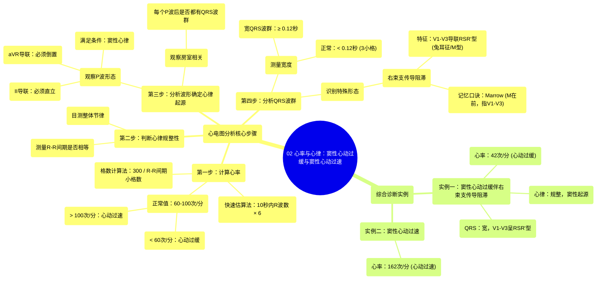

# 02 Rate and Rhythm Sinus Bradycardia and Sinus Tachycardia

  <video controls preload="metadata" playsinline>
    <source src="https://helly.s3.bitiful.net/心血管学科/%E4%B8%93%E8%BE%91%2005%EF%BC%9A%E5%BF%83%E7%94%B5%E5%9B%BE%E5%9F%BA%E7%A1%80%E5%85%A5%E9%97%A8%20%28ECG%20Basics%29/02%20Rate%20and%20Rhythm%20Sinus%20Bradycardia%20and%20Sinus%20Tachycardia.mp4" type="video/mp4">
    
您的浏览器不支持播放，请升级。

  </video>

::: tip ⚡️ 核心考点 (30s速读)
*   **核心考点**：掌握通过心电图计算心率、判断心律规整性、识别P波形态以确定心律起源（窦性或非窦性），以及分析QRS波群宽度和形态来诊断传导阻滞（如右束支传导阻滞）的方法。
*   **临床意义**：能够系统分析心电图，识别窦性心动过缓、窦性心动过速等常见心律失常，并理解宽QRS波群（如右束支传导阻滞）的临床意义。
:::

## 🧠 深度精讲

本视频通过两份心电图实例，系统讲解了心电图分析的核心步骤：**心率计算**、**心律判断**和**波形分析**。

*   **心率计算**：视频演示了两种常用方法。
    1.  **快速估算法**：在10秒心电图条图上，数出R波的数量，然后乘以6，即可得到每分钟的心率（次/分）。例如，数出7个R波，则心率为 `7 × 6 = 42次/分`。
    2.  **格数计算法**：利用心电图标准走纸速度（25mm/s），每个小格（1mm）代表0.04秒。通过测量R-R间期占多少个小格，再用300除以该格数，即可估算心率。例如，R-R间期为8个小格，则心率约为 `300 ÷ 8 ≈ 38次/分`。视频更推荐第一种方法，因其快速简便。

*   **心律判断**：
    1.  **规整性**：通过测量连续R-R间期的格数是否相等或近似，判断心律是否规整。视频中通过目测和测量，确认心律是规整的。
    2.  **起源判断（是否为窦性心律）**：这是关键步骤。需要观察两个导联：
        *   **II导联**：P波必须**直立**。
        *   **aVR导联**：P波必须**倒置**。
        同时满足以上两点，即可判定为**窦性心律**，意味着心律起源于窦房结，是正常的心律起源点。

*   **波形分析**：
    1.  **QRS波群宽度**：测量QRS波群的持续时间。正常应小于0.12秒（即3个小格）。视频中测量的QRS波群宽度超过3个小格（>0.12秒），因此判定为**宽QRS波群**。
    2.  **右束支传导阻滞（RBBB）识别**：视频结合宽QRS波群，进一步识别出右束支传导阻滞的特征性表现：
        *   **V1-V3导联**：出现典型的“兔耳征”或“M型”波，即RSR'型波群。
        *   **V5-V6导联**：可能出现宽而有切迹的S波，有时伴有ST段压低。
        记忆口诀：**“Marrow”** —— “M”代表V1-V3导联的M型波（兔耳征），指向**右**束支传导阻滞。

*   **综合诊断**：
    *   **第一份心电图**：心率42次/分（<60次/分），为**心动过缓**；心律规整；P波在II导联直立、aVR导联倒置，为**窦性心律**；QRS波群增宽，且在V1-V3导联呈RSR'型。因此，最终诊断为：**窦性心动过缓伴右束支传导阻滞**。
    *   **第二份心电图**：通过快速估算法，数出27个R波，心率为 `27 × 6 = 162次/分`（>100次/分），因此为**窦性心动过速**（视频虽未展示完整分析，但根据心率可推断）。

## 📚 双语术语表 (Terminology)
| 英文术语 | 中文翻译 | 定义/解释 |
| :--- | :--- | :--- |
| EKG / ECG | 心电图 | 记录心脏电活动的图形。 |
| Rate | 心率 | 心脏每分钟跳动的次数。 |
| Rhythm | 心律 | 心脏跳动的节律和规律性。 |
| Sinus Bradycardia | 窦性心动过缓 | 起源于窦房结，但心率低于60次/分的心律。 |
| Sinus Tachycardia | 窦性心动过速 | 起源于窦房结，但心率高于100次/分的心律。 |
| R wave | R波 | QRS波群中第一个向上的波。 |
| Bradycardic | 心动过缓的 | 形容心率过慢的状态。 |
| Regular Rhythm | 规整心律 | R-R间期基本相等的心律。 |
| P wave | P波 | 代表心房除极的波形。 |
| Lead II | II导联 | 标准心电图导联之一，常用于观察P波方向。 |
| Lead aVR | aVR导联 | 加压肢体导联之一，其P波方向常与II导联相反。 |
| Upright | 直立的 | 指波形向上（正向）偏转。 |
| Inverted | 倒置的 | 指波形向下（负向）偏转。 |
| AV association | 房室相关 | 指每个P波后都跟随一个QRS波群，表示心房激动能正常下传至心室。 |
| QRS complex | QRS波群 | 代表心室除极的波形组合。 |
| Wide QRS | 宽QRS波群 | QRS波群时限 ≥ 0.12秒，提示心室除极时间延长。 |
| RSR' configuration | RSR'型波群 | 在V1导联等出现的特征性波形，形似“兔耳”或字母“M”，是右束支传导阻滞的典型表现。 |
| Right Bundle Branch Block (RBBB) | 右束支传导阻滞 | 心脏右束支传导受阻，导致心室除极顺序异常的心电图表现。 |
| ST segment depression | ST段压低 | ST段低于基线，可能提示心肌缺血等。 |

## 🗺️ 知识图谱

