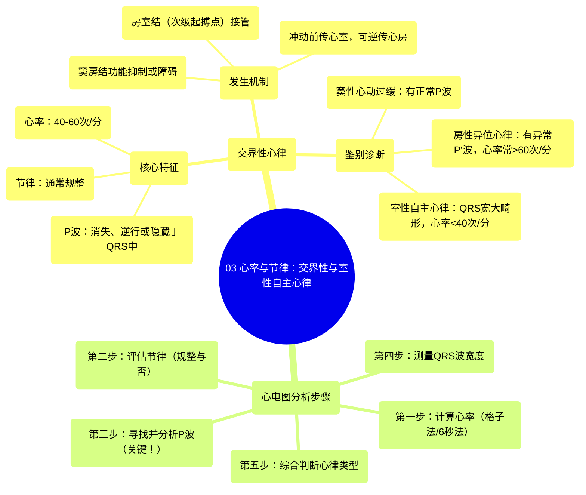

# 03 Rate and Rhythm Junctional and Idioventricular Rhythm

  <video controls preload="metadata" playsinline>
    <source src="https://helly.s3.bitiful.net/心血管学科/%E4%B8%93%E8%BE%91%2005%EF%BC%9A%E5%BF%83%E7%94%B5%E5%9B%BE%E5%9F%BA%E7%A1%80%E5%85%A5%E9%97%A8%20%28ECG%20Basics%29/03%20Rate%20and%20Rhythm%20Junctional%20and%20Idioventricular%20Rhythm.mp4" type="video/mp4">
    
您的浏览器不支持播放，请升级。

  </video>

::: tip ⚡️ 核心考点 (30s速读)
*   **核心考点**：掌握交界性心律的识别要点，包括心率范围（40-60次/分）、P波特征（消失、逆行或隐藏）及其与窦性心律、室性心律的鉴别。
*   **临床意义**：交界性心律通常提示窦房结功能异常或被抑制，是心脏的次级起搏点（房室结）接管的表现。识别它有助于判断心律失常的起源和严重性。
:::

## 🧠 深度精讲
*   **概念1：交界性心律的识别流程**
    视频中演示了系统分析心电图的方法。首先，**计算心率**。本例中，使用“6秒法”（数6秒内的R波数乘以10）估算心率约为90次/分，但更精确的“格子法”（300/大格数）显示心率约为50次/分，属于**心动过缓**（<60次/分）。其次，**评估节律**。虽然本例因QRS波群数量不足难以绝对确定，但初步判断为规整。最关键的一步是**寻找P波**。在II导联和aVR导联均未发现明显P波，这**排除了窦性心律**。结合心率在40-60次/分的典型范围内，且未发现异常或逆行P波（可能隐藏于QRS波群中），高度提示为**交界性心律**。

*   **概念2：交界性心律的生理机制**
    当心脏的**正常起搏点（窦房结）** 因病变、药物或迷走神经张力增高等原因不能正常工作时，次级起搏点会“接管”。**房室结**是其中最重要的次级起搏点，其固有的自律性频率约为40-60次/分。由它主导的心律即为交界性心律。它产生的冲动可以同时向心室（前传，产生QRS波）和心房（逆传，可能产生**逆行P波**）传导。逆行P波可能出现在QRS波之前、之中（隐藏）或之后。

*   **概念3：鉴别诊断**
    1.  **与窦性心动过缓鉴别**：关键区别在于**P波**。窦性心动过缓有正常形态的窦性P波，而交界性心律无P波或有逆行P波。
    2.  **与房性异位心律鉴别**：房性异位心律（如房性逸搏心律）的心率通常稍快（>60次/分），且会产生**异常形态的P‘波**（非逆行性），与交界性心律不同。
    3.  **与室性逸搏心律鉴别**：室性逸搏心律的心率更慢（通常<40次/分），且QRS波群**宽大畸形**（时限>0.12秒）。虽然交界性心律有时QRS波也可增宽（尤其伴有束支传导阻滞时），但心率范围是重要鉴别点。

## 📚 双语术语表 (Terminology)
| 英文术语 | 中文翻译 | 定义/解释 |
| :--- | :--- | :--- |
| Junctional Rhythm | 交界性心律 | 起源于房室交界区（房室结）的心律，心率通常为40-60次/分。 |
| Sinus Rhythm | 窦性心律 | 由窦房结正常发起的心律，心电图表现为每个QRS波前有形态正常的P波。 |
| Bradycardia | 心动过缓 | 心率低于60次/分。 |
| P Wave | P波 | 心电图上代表心房除极的波形。 |
| Retrograde P Wave | 逆行P波 | 冲动从房室交界区逆传至心房所产生的P波，在II、III、aVF导联通常倒置。 |
| AV Node (Atrioventricular Node) | 房室结 | 心脏的次级起搏点，位于房室交界区，固有频率40-60次/分。 |
| SA Node (Sinoatrial Node) | 窦房结 | 心脏的正常起搏点，位于右心房，固有频率60-100次/分。 |
| Ectopic Focus | 异位节律点 | 心脏正常起搏点（窦房结）以外的部位自发产生冲动的病灶。 |
| QRS Complex | QRS波群 | 心电图上代表心室除极的波形。 |
| AV Dissociation | 房室分离 | 心房和心室分别由不同的起搏点控制，彼此独立活动的一种状态。 |

## 🗺️ 知识图谱

