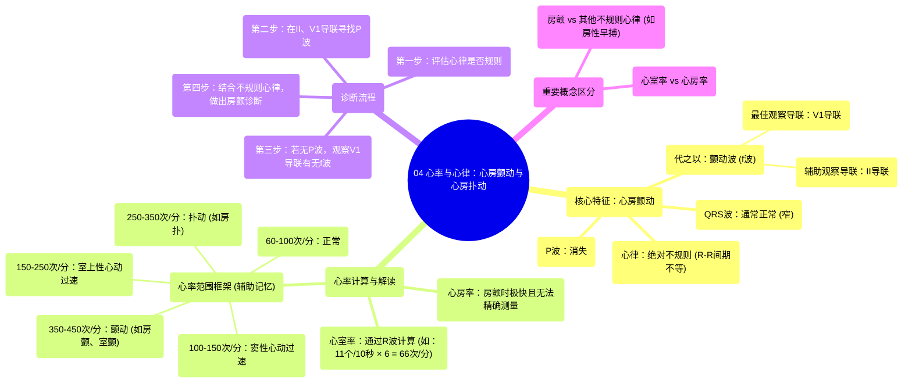

# 04 Rate and Rhythm Atrial Fibrillation and Atrial Flutter

  <video controls preload="metadata" playsinline>
    <source src="https://helly.s3.bitiful.net/心血管学科/%E4%B8%93%E8%BE%91%2005%EF%BC%9A%E5%BF%83%E7%94%B5%E5%9B%BE%E5%9F%BA%E7%A1%80%E5%85%A5%E9%97%A8%20%28ECG%20Basics%29/04%20Rate%20and%20Rhythm%20Atrial%20Fibrillation%20and%20Atrial%20Flutter.mp4" type="video/mp4">
    
您的浏览器不支持播放，请升级。

  </video>

::: tip ⚡️ 核心考点 (30s速读)
*   **核心考点**：掌握心房颤动（房颤）的心电图核心特征：**心室律绝对不齐**、**无清晰可辨的P波**、**V1或II导联可见颤动波（f波）**。
*   **临床意义**：房颤是最常见的持续性心律失常，可导致心悸、心力衰竭和血栓栓塞（如脑卒中）风险显著增加，准确识别是临床处理的第一步。
:::

## 🧠 深度精讲

*   **心率与心律分析**：
    *   **心室率计算**：视频中通过计算10秒心律条上的R波数量（11个），乘以6，得出心室率约为66次/分。**关键点**：此方法计算的是**心室率**，而非心房率。心房率需通过测量P-P间期来计算。
    *   **心律判断**：通过对比R-R间期（例如4个大格 vs. 5-6个大格），明确心律**不规则**。视频强调，对于明显不规则的心律，无需精确测量每个格子，通过整体观察即可判断。

*   **房颤的典型心电图特征**：
    1.  **心律**：**绝对不规则**（R-R间期完全不齐）。这是房颤最直观的特征。
    2.  **P波**：**消失**，代之以形态、振幅、间距均不规则的**颤动波（f波）**。
    3.  **关键导联**：
        *   **V1导联**：是观察f波的最佳导联之一，常表现为基线不平稳的“锯齿状”或“波浪状”细小波动。
        *   **II导联**：同样可用于观察f波。当在II导联看到不规则的基线波动，结合不规则的心室律，强烈提示房颤。
    4.  **QRS波群**：通常形态正常（窄QRS），除非合并束支传导阻滞或差异性传导。

*   **心律失常的“心率范围”框架（辅助记忆）**：
    *   **60-100次/分**：正常范围。
    *   **100-150次/分**：常见于**窦性心动过速**。
    *   **150-250次/分**：常见于**室上性心动过速**。
    *   **250-350次/分**：常见于**扑动**（如心房扑动）。
    *   **350-450次/分**：常见于**颤动**（如心房颤动、心室颤动）。**注意**：此范围为心房电活动频率，心室率取决于房室结传导情况，房颤时心室率可快可慢。

*   **诊断流程提炼**：
    1.  **第一步：看心律是否规则**。若不规则，高度怀疑房颤。
    2.  **第二步：寻找P波**。在II导联和V1导联仔细查看。
    3.  **第三步：若未见明确P波，重点观察V1导联**。若看到纤细不规则的f波，即可确诊房颤。
    4.  **第四步：评估QRS波宽度**，并完成心电图系统分析的其他步骤。

## 📚 双语术语表 (Terminology)
| 英文术语 | 中文翻译 | 定义/解释 |
| :--- | :--- | :--- |
| Atrial Fibrillation (AFib) | 心房颤动 | 一种常见心律失常，心房失去有效收缩，代之以快速无序的颤动，心电图表现为P波消失、心律绝对不齐。 |
| Ventricular Rate | 心室率 | 每分钟心室收缩的次数，通常通过计算R波数量得出。 |
| Atrial Rate | 心房率 | 每分钟心房电活动的频率，需通过测量P-P间期计算。房颤时心房率极快且无法精确测量。 |
| Rhythm Strip | 心律条 | 心电图记录中一段连续、通常是某个导联（如II导联）的长时间记录，用于分析心律。 |
| R-R Interval | R-R间期 | 相邻两个R波之间的时间距离，用于判断心律是否规整。 |
| Fibrillatory Waves (f waves) | 颤动波 | 房颤时在心电图上取代P波的快速、不规则、低振幅的基线波动。 |
| Lead II | II导联 | 标准心电图肢体导联之一，是观察P波形态的常用导联。 |
| Lead V1 | V1导联 | 胸导联之一，位于胸骨右缘第4肋间，是观察心房活动（特别是房扑、房颤）的极佳导联。 |
| QRS Complex | QRS波群 | 心电图上代表心室除极的波形。其宽度用于判断激动是经正常希浦系统传导（窄）还是经心室肌缓慢传导（宽）。 |
| AV Dissociation | 房室分离 | 心房和心室的电活动各自独立，没有传导关系。在房颤中，心房激动无序地传向心室，属于一种房室分离状态。 |

## 🗺️ 知识图谱

