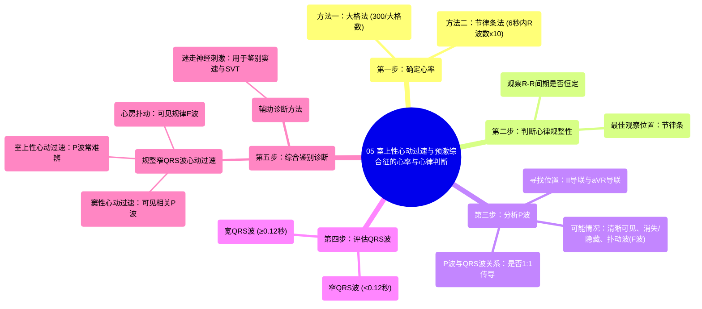

# 05 Rate and Rhythm Supraventricular Tachycardia (SVT) and Wolff-Parkinson-White (WPW) Syndrome

  <video controls preload="metadata" playsinline>
    <source src="https://helly.s3.bitiful.net/心血管学科/%E4%B8%93%E8%BE%91%2005%EF%BC%9A%E5%BF%83%E7%94%B5%E5%9B%BE%E5%9F%BA%E7%A1%80%E5%85%A5%E9%97%A8%20%28ECG%20Basics%29/05%20Rate%20and%20Rhythm%20Supraventricular%20Tachycardia%20%28SVT%29%20and%20Wolff-Parkinson-White%20%28WPW%29%20Syndrome.mp4" type="video/mp4">
    
您的浏览器不支持播放，请升级。

  </video>

::: tip ⚡️ 核心考点 (30s速读)
*   **核心考点**：掌握快速、规整、窄QRS波心动过速的鉴别诊断流程，重点在于识别P波、评估QRS波宽度，并理解迷走神经刺激的辅助诊断价值。
*   **临床意义**：快速准确地区分窦性心动过速、室上性心动过速和心房扑动，是急诊和心内科处理快速性心律失常的关键第一步，直接影响后续治疗策略。
:::

## 🧠 深度精讲

*   **概念1：心率计算**
    视频中演示了三种计算心率的方法：
    1.  **大格法（快速估算）**：找到两个R波对齐大格的位置，用300除以间隔的大格数。例如，间隔2个大格，心率 ≈ 300/2 = 150次/分。
    2.  **小格法（更精确）**：若R波间隔小于2个大格，可估算小格数。例如，间隔约1.5个小格，心率介于150-300次/分之间，可估算为约250次/分。
    3.  **节律条法（标准方法）**：取标准心电图上的6秒节律条（通常为30个大格），数出其中的R波数量，乘以10，即得每分钟心率。例如，6秒内19个R波，心率 ≈ 19 * 10 = 190次/分。

*   **概念2：心律规整性判断**
    判断心律是否规整，关键在于测量**R-R间期**是否恒定。最佳观察位置是**节律条**。方法是用卡尺或目测比较连续几个R-R间期所占的小格数是否大致相同。如果一致，则为规整心律；反之则为不规整。

*   **概念3：P波分析**
    P波分析是鉴别诊断的核心。
    1.  **寻找位置**：首选**II导联**（观察直立P波）和**aVR导联**（观察倒置P波）。
    2.  **可能情况**：
        *   **清晰可见**：可能为窦性心律。
        *   **消失/难以辨认**：可能隐藏在QRS波或T波中（尤其在心率极快时），提示可能为房室结折返性心动过速等SVT。
        *   **未见典型P波，但见规律“锯齿波”**：需考虑**心房扑动**，此时应重点观察**V1导联**和**II导联**寻找扑动波（F波）。
    3.  **P波与QRS波关系**：尝试判断是否每个QRS波前都有一个P波（1:1房室传导）。

*   **概念4：QRS波宽度分析**
    测量QRS波持续时间。
    *   **窄QRS波**（通常<0.12秒或3个小格）：提示心室激动起源于希氏束以上，属于室上性起源。
    *   **宽QRS波**（≥0.12秒）：需鉴别室性心动过速、室上速伴差异性传导或预激综合征。

*   **概念5：规整窄QRS波心动过速的鉴别诊断**
    当遇到**心率快（>100次/分）、心律规整、QRS波窄**的心动过速时，主要考虑三种可能：
    1.  **窦性心动过速**：有可见的、与QRS波关系固定的窦性P波。
    2.  **室上性心动过速**：P波常难以辨认（隐藏于QRS波中或紧随其后）。
    3.  **心房扑动**：可见规律的扑动波（F波），房室传导比例常为2:1、3:1等。
    **鉴别要点**：核心在于**寻找并分析P波/扑动波**。

*   **概念6：迷走神经刺激**
    当心电图难以鉴别窦速与SVT时，**迷走神经刺激**（如Valsalva动作、颈动脉窦按摩）是一个重要的床边辅助手段。
    *   **原理**：增强迷走神经张力，减慢房室结传导。
    *   **反应**：
        *   **窦性心动过速**：心率可能逐渐减慢，但不会突然终止。
        *   **SVT**：可能突然终止发作（尤其是房室结折返性心动过速）。
        *   **心房扑动**：可能增加房室传导阻滞比例（如从2:1变为3:1），使扑动波显露得更清楚。

## 📚 双语术语表 (Terminology)
| 英文术语 | 中文翻译 | 定义/解释 |
| :--- | :--- | :--- |
| Supraventricular Tachycardia (SVT) | 室上性心动过速 | 起源于心房或房室交界区（希氏束以上）的快速、规整的心律失常。 |
| Wolff-Parkinson-White (WPW) Syndrome | 沃尔夫-帕金森-怀特综合征 | 一种由于存在房室旁路（肯特束）导致心室预激的先天性异常，心电图表现为短PR间期和delta波。 |
| Rate | 心率 | 心脏每分钟跳动的次数。 |
| Rhythm | 心律 | 心脏跳动的节律和规律性。 |
| Regular Rhythm | 规整心律 | R-R间期恒定或几乎恒定的心律。 |
| P Wave | P波 | 心电图上代表心房除极的波形。 |
| QRS Complex | QRS波群 | 心电图上代表心室除极的波形。 |
| Narrow QRS Complex | 窄QRS波群 | 持续时间通常小于0.12秒（3个小格）的QRS波，提示心室激动源于希氏束以上。 |
| Flutter Waves (F Waves) | 扑动波（F波） | 心房扑动时在心电图上出现的规律、形态一致的锯齿状波形。 |
| Vagal Maneuver | 迷走神经刺激 | 通过物理方法（如Valsalva动作）刺激迷走神经，以减慢心率或终止某些心动过速。 |
| R-R Interval | R-R间期 | 心电图上相邻两个R波顶点之间的时间间隔，用于判断心律规整性。 |
| Lead II | II导联 | 标准心电图肢体导联之一，是观察P波方向的常用导联。 |
| Lead V1 | V1导联 | 标准心电图胸导联之一，是观察心房活动和鉴别宽QRS波心动过速的重要导联。 |
| Sinus Tachycardia | 窦性心动过速 | 由窦房结主导的、频率超过100次/分的规整心律，通常是对生理需求（如运动、发热）的反应。 |
| Atrial Flutter | 心房扑动 | 一种快速而规整的房性心律失常，心房率通常在250-350次/分，心电图可见规律的扑动波。 |

## 🗺️ 知识图谱

