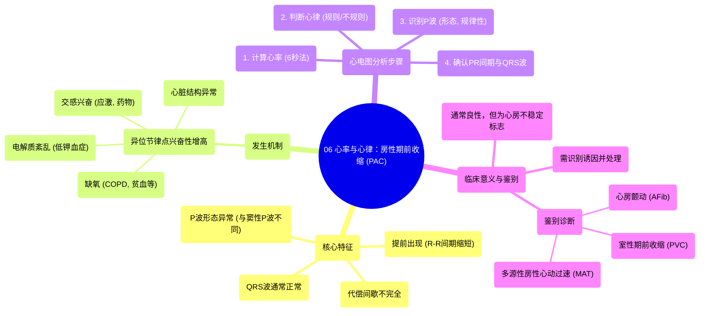

# 06 Rate and Rhythm Premature Atrial Contraction (PAC)

  <video controls preload="metadata" playsinline>
    <source src="https://helly.s3.bitiful.net/心血管学科/%E4%B8%93%E8%BE%91%2005%EF%BC%9A%E5%BF%83%E7%94%B5%E5%9B%BE%E5%9F%BA%E7%A1%80%E5%85%A5%E9%97%A8%20%28ECG%20Basics%29/06%20Rate%20and%20Rhythm%20Premature%20Atrial%20Contraction%20%28PAC%29.mp4" type="video/mp4">
    
您的浏览器不支持播放，请升级。

  </video>

::: tip ⚡️ 核心考点 (30s速读)
*   **核心考点**：房性期前收缩 (PAC) 是一种起源于心房异位节律点的提前心跳，其核心识别要点是：**提前出现** 且 **P波形态异常**。
*   **临床意义**：PAC本身通常无症状，但它是心房电活动不稳定的标志。其出现常与缺氧、电解质紊乱、药物刺激等因素相关，频繁PAC可能诱发房性心动过速或心房颤动。
:::

## 🧠 深度精讲

*   **概念1：房性期前收缩 (PAC) 的定义与机制**
    *   **定义**：房性期前收缩是指起源于窦房结以外心房任何部位的异位起搏点，在窦房结正常冲动下达之前，提前激动心房而产生的一次心跳。
    *   **发生机制**：正常心脏节律由窦房结主导。当心房内某处心肌细胞（异位节律点）因缺氧、电解质异常（如低钾血症）、儿茶酚胺水平升高（如应激、药物）等因素而兴奋性增高时，它可能抢先于窦房结发出电冲动，从而产生一次提前的心房收缩。

*   **概念2：PAC在心电图上的特征**
    *   **提前出现**：PAC的R-R间期短于其前后的正常窦性R-R间期，表现为一次“提前”的心跳。
    *   **P波形态异常**：由于激动起源点不同，PAC的P波在形态、方向或振幅上，与正常窦性P波不同。
    *   **QRS波群通常正常**：只要房室结和心室传导系统功能正常，来自心房的异位冲动通常能正常下传，因此PAC的QRS波群形态与窦性心律的QRS波群相似（除非伴有室内差异性传导）。
    *   **代偿间歇不完全**：PAC后常跟随一个不完全性代偿间歇（即包含PAC的R-R间期短于两个正常窦性R-R间期之和），这是因为PAC的冲动常能逆传侵入窦房结，使其节律重整。

*   **概念3：心率与心律的判断**
    *   **心率计算**：对于节律条，可数出6秒内的R波个数，乘以10，得到估算的心率（次/分）。视频中示例心率约为80次/分。
    *   **心律判断**：PAC会导致整体心律不规则。识别不规则心律是诊断PAC的第一步。常见的不规则心律包括：心房颤动 (AFib)、房性期前收缩 (PAC)、室性期前收缩 (PVC) 和多源性房性心动过速 (MAT)。

*   **概念4：PAC的临床诱因**
    *   **缺氧**：如慢性阻塞性肺疾病 (COPD)、肺炎、贫血、肺栓塞等。
    *   **电解质紊乱**：如低钾血症 (Hypokalemia)。
    *   **交感神经兴奋**：如应激、焦虑、甲状腺功能亢进，或使用拟交感神经药物（如某些支气管扩张剂）。
    *   **药物与物质**：如咖啡因、酒精、尼古丁，以及可卡因、甲基苯丙胺等兴奋剂。
    *   **心脏疾病**：如心力衰竭、心肌缺血、心房扩大等。

## 📚 双语术语表 (Terminology)
| 英文术语 | 中文翻译 | 定义/解释 |
| :--- | :--- | :--- |
| Premature Atrial Contraction (PAC) | 房性期前收缩 (房早) | 起源于心房异位节律点的提前心跳。 |
| SA Node (Sinoatrial Node) | 窦房结 | 位于右心房，是心脏正常的初级起搏点。 |
| AV Node (Atrioventricular Node) | 房室结 | 位于房间隔下部，负责延迟和传导心房冲动至心室。 |
| Ectopic Focus | 异位节律点 | 心脏中除窦房结外，能自发产生冲动的异常部位。 |
| Hypoxia | 缺氧 | 组织或血液中氧含量不足的状态。 |
| Hypokalemia | 低钾血症 | 血液中钾离子浓度低于正常水平。 |
| Catecholamines | 儿茶酚胺 | 一类神经递质和激素，如肾上腺素、去甲肾上腺素，能增强心肌兴奋性。 |
| Rhythm Strip | 节律条图 | 长时间记录单一导联的心电图，主要用于分析心律。 |
| R-R Interval | R-R间期 | 心电图上相邻两个R波之间的时间间隔，反映心室节律。 |
| Irregular Rhythm | 不规则心律 | 心跳间隔不规律的心律。 |
| Atrial Fibrillation (AFib) | 心房颤动 (房颤) | 一种常见的不规则、快速的心房电活动紊乱。 |
| Multifocal Atrial Tachycardia (MAT) | 多源性房性心动过速 | 一种不规则心动过速，由心房内多个异位节律点交替发放冲动引起。 |

## 🗺️ 知识图谱

