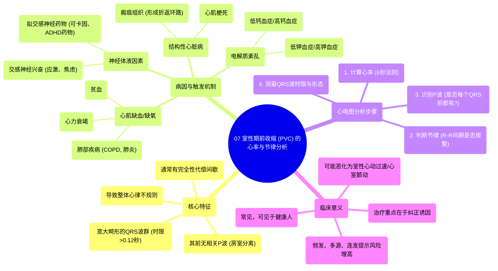

# 07 Rate and Rhythm Premature Ventricular Contraction (PVC)

  <video controls preload="metadata" playsinline>
    <source src="https://helly.s3.bitiful.net/心血管学科/%E4%B8%93%E8%BE%91%2005%EF%BC%9A%E5%BF%83%E7%94%B5%E5%9B%BE%E5%9F%BA%E7%A1%80%E5%85%A5%E9%97%A8%20%28ECG%20Basics%29/07%20Rate%20and%20Rhythm%20Premature%20Ventricular%20Contraction%20%28PVC%29.mp4" type="video/mp4">
    
您的浏览器不支持播放，请升级。

  </video>

::: tip ⚡️ 核心考点 (30s速读)
*   **核心考点**：室性期前收缩（PVC）是起源于心室的异位搏动，其核心识别要点是**宽大畸形的QRS波群（通常>0.12秒）** 且**其前无相关P波**。
*   **临床意义**：PVC本身常见，但需警惕其触发因素（如心肌缺血、电解质紊乱）和潜在风险（如诱发恶性室性心律失常）。
:::

## 🧠 深度精讲

*   **概念1：什么是室性期前收缩（PVC）？**
    *   室性期前收缩，简称室早，是指起源于心室（而非正常的窦房结）的提前出现的心脏搏动。它打断了正常的心脏节律。在视频中，讲师通过比喻，将心室内的异位节律点描述为一个“易激惹的小家伙”，它会不恰当地发放电冲动，从而产生一个提前的、形态异常的QRS波群。

*   **概念2：如何识别与分析PVC？**
    视频中演示了系统性的心电图分析方法：
    1.  **确定心率**：在6秒的心电图纸上，数出所有QRS波（包括正常和异常的）的数量，然后乘以10，得到每分钟的心率（如视频中为90次/分）。
    2.  **判断节律**：观察R-R间期（或R-S间期）。由于PVC提前出现，其后的代偿间歇通常完全，导致整体节律**不规则**。视频中通过测量相邻R波间期，直观展示了这种不规则性。
    3.  **寻找P波**：仔细检查每个QRS波群前是否有P波。对于正常的窦性搏动，其前有P波。但对于PVC，**其前没有与之相关的P波**，这被称为“房室分离”，是诊断PVC的关键特征之一。
    4.  **观察QRS波形态**：PVC的QRS波群通常宽大畸形（时限>0.12秒），形态与正常窦性下传的QRS波不同。视频中通过标记“R波”和“S波”来指代这些形态。

*   **概念3：PVC的常见病因与发生机制**
    视频详细解释了可能“激惹”心室异位节律点的多种原因：
    *   **心肌缺血/缺氧**：如贫血、慢性阻塞性肺疾病（COPD）、心力衰竭等，导致心肌细胞能量供应不足。
    *   **电解质紊乱**：特别是钾离子（K+）、钙离子（Ca2+）水平的异常波动，影响心肌细胞的电稳定性。
    *   **交感神经兴奋**：任何增加肾上腺素、去甲肾上腺素分泌的情况（如应激、焦虑），通过刺激β-肾上腺素能受体，增加心肌自律性。
    *   **药物或兴奋剂**：如可卡因、治疗ADHD的哌甲酯或苯丙胺类药物。
    *   **结构性心脏病**：如心肌梗死后的**瘢痕组织**。这是视频中强调的一个重要机制。电冲动无法通过坏死的瘢痕组织，只能绕行，可能形成**折返环路**，这是引发持续性快速性室性心律失常（如室速）的常见机制，因此具有危险性。

## 📚 双语术语表 (Terminology)
| 英文术语 | 中文翻译 | 定义/解释 |
| :--- | :--- | :--- |
| Premature Ventricular Contraction (PVC) | 室性期前收缩（室早） | 起源于心室的提前发生的心脏搏动。 |
| Ectopic Focus | 异位节律点 | 心脏正常起搏点（窦房结）以外的部位发起的电冲动起源点。 |
| Irritable Focus | 易激惹节律点 | 指因各种原因（如缺血、电解质紊乱）而变得不稳定、容易自发放电的心肌区域。 |
| QRS Complex | QRS波群 | 心电图上代表心室除极（收缩）的波形。PVC的QRS波通常宽大畸形。 |
| P Wave | P波 | 心电图上代表心房除极的波形。PVC前无相关P波。 |
| AV Dissociation | 房室分离 | 指心房和心室的电活动失去正常的关联性。在PVC中表现为心室搏动前无心房（P波）活动驱动。 |
| Reentrant Circuit | 折返环路 | 一种心律失常机制，电冲动在心脏内沿着一个环形路径持续循环传导，可导致快速性心律失常。 |
| Compensatory Pause | 代偿间歇 | PVC后常见的一个长间歇，因为PVC通常不会逆传重置窦房结节律，下一次窦性冲动按原周期到来。 |
| Hypoxia | 缺氧 | 组织氧气供应不足。是诱发PVC的常见原因之一。 |
| Electrolyte Abnormality | 电解质紊乱 | 血液中电解质（如钾、钙、镁）浓度异常，可干扰心脏电活动。 |

## 🗺️ 知识图谱

