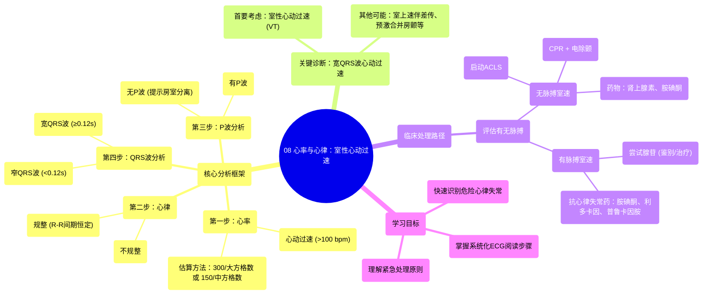

# 08 Rate and Rhythm Ventricular Tachycardia

  <video controls preload="metadata" playsinline>
    <source src="https://helly.s3.bitiful.net/心血管学科/%E4%B8%93%E8%BE%91%2005%EF%BC%9A%E5%BF%83%E7%94%B5%E5%9B%BE%E5%9F%BA%E7%A1%80%E5%85%A5%E9%97%A8%20%28ECG%20Basics%29/08%20Rate%20and%20Rhythm%20Ventricular%20Tachycardia.mp4" type="video/mp4">
    
您的浏览器不支持播放，请升级。

  </video>

::: tip ⚡️ 核心考点 (30s速读)
*   **核心考点**：掌握宽QRS波心动过速（WCT）的快速识别流程，特别是将“规整的宽QRS波心动过速”首先视为**室性心动过速（VT）**，直到有证据证明是其他情况。
*   **临床意义**：室速是一种可能危及生命的心律失常，需要立即评估和处理。识别错误可能导致错误的治疗，从而对患者造成伤害。
:::

## 🧠 深度精讲

本视频的核心是教授一种系统化、可重复的心电图（EKG）分析方法，重点在于快速识别和处理危险的心律失常，特别是室性心动过速。

*   **分析框架：心率与心律**：视频强调，阅读心电图的首要目的是快速回答两个关键问题：1）患者是否有心律失常？2）患者是否有心肌缺血或梗死的迹象？对于心律失常，采用一套固定的步骤进行分析，确保不会遗漏关键信息。
*   **逐步分析法**：
    1.  **心率**：通过计算心电图大方格（300 bpm）或中方格（150 bpm）的方法快速估算。本例中心率约为150次/分，属于心动过速。
    2.  **心律**：检查R-R间期是否规整。本例中R-R间期恒定（约2小格），故为**规整心律**。
    3.  **P波**：观察是否有P波。本例在II导联和V1导联均未发现明确的P波，提示可能存在**房室分离**。
    4.  **QRS波群**：测量QRS波宽度。本例QRS波宽度明显大于0.12秒（3小格），属于**宽QRS波**。
*   **关键诊断逻辑**：当遇到一个**心动过速、心律规整、QRS波增宽**的心电图时，必须首先考虑**室性心动过速**。这是一个重要的临床思维，因为室速是最危险的可能性之一。其他可能性包括伴有差异性传导的室上性心动过速（SVT with aberrancy）或预激综合征合并房颤（AFib with WPW）等，但处理原则不同。
*   **临床处理路径**：识别出室速后，立即进行临床评估：
    *   **有无脉搏？**
        *   **无脉搏室速**：属于心脏骤停，立即启动高级心血管生命支持（ACLS）流程，包括心肺复苏（CPR）和电除颤。
        *   **有脉搏室速**：患者情况相对稳定，可尝试药物治疗。首选**腺苷**进行鉴别诊断和治疗（若为某些室上速，腺苷可能终止发作）。若腺苷无效，则需使用抗心律失常药物，如**胺碘酮、利多卡因、普鲁卡因胺**等。

## 📚 双语术语表 (Terminology)

| 英文术语 | 中文翻译 | 定义/解释 |
| :--- | :--- | :--- |
| Ventricular Tachycardia (VT/VTAC) | 室性心动过速 | 起源于心室的心动过速，通常频率>100次/分，QRS波宽大畸形。是一种可能危及生命的心律失常。 |
| Monomorphic VT | 单形性室速 | 所有QRS波形态基本一致的室性心动过速。 |
| Rate and Rhythm | 心率与心律 | 心电图分析的两个基本要素。心率指心脏跳动的频率，心律指心跳的规律性。 |
| Wide QRS Complex | 宽QRS波群 | QRS波时限≥0.12秒（心电图上的3个小格）。提示心室除极时间延长，可能源于心室自身节律或室内传导阻滞。 |
| Regular Rhythm | 规整心律 | R-R间期基本相等的心律。 |
| P-Wave | P波 | 心电图上代表心房除极的波形。 |
| AV Dissociation | 房室分离 | 心房和心室各自独立跳动，彼此之间没有传导关系。是诊断室速的重要线索之一。 |
| Adenosine | 腺苷 | 一种能短暂阻断房室结传导的药物，常用于终止阵发性室上性心动过速，也用于宽QRS波心动过速的鉴别诊断。 |
| ACLS (Advanced Cardiovascular Life Support) | 高级心血管生命支持 | 一套用于处理心脏骤停和其他心血管急症的标准化流程和技能。 |
| Amiodarone | 胺碘酮 | 一种广谱抗心律失常药物，常用于治疗室性心动过速和心室颤动。 |
| Defibrillation | 电除颤 | 使用电击终止致命性快速性心律失常（如室颤、无脉性室速）的治疗方法。 |

## 🗺️ 知识图谱

