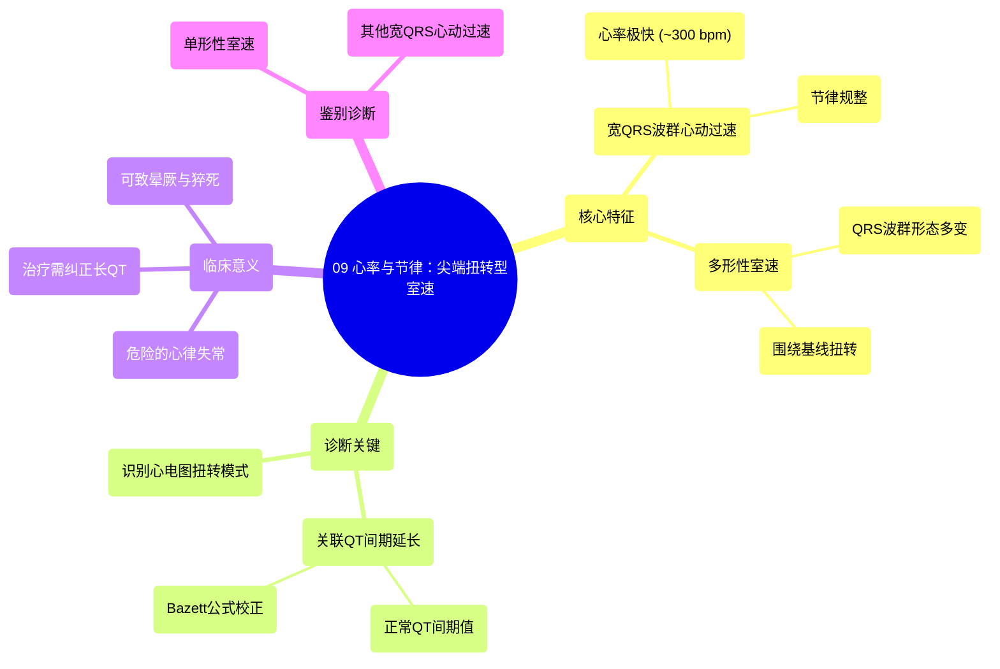

# 09 Rate and Rhythm Torsades de Pointes

  <video controls preload="metadata" playsinline>
    <source src="https://helly.s3.bitiful.net/心血管学科/%E4%B8%93%E8%BE%91%2005%EF%BC%9A%E5%BF%83%E7%94%B5%E5%9B%BE%E5%9F%BA%E7%A1%80%E5%85%A5%E9%97%A8%20%28ECG%20Basics%29/09%20Rate%20and%20Rhythm%20Torsades%20de%20Pointes.mp4" type="video/mp4">
    
您的浏览器不支持播放，请升级。

  </video>

::: tip ⚡️ 核心考点 (30s速读)
*   **核心考点**：识别**尖端扭转型室速**是一种特殊类型的**多形性室性心动过速**，其核心特征是QRS波群围绕基线扭转，且与**QT间期延长**密切相关。
*   **临床意义**：这是一种**危险且罕见**的心律失常，可导致晕厥、猝死。识别其心电图特征（宽QRS波群、快速、规整、多形性扭转）对于紧急处理至关重要。
:::

## 🧠 深度精讲

*   **概念1：心电图特征分析**
    视频中，教授通过一份心电图演示了如何系统分析一种危险的心律失常。分析遵循标准流程：
    1.  **心率**：在心律失常发作时，心率极快，可达约**300次/分**（每个小格一个R波）。
    2.  **节律**：R-R间期规整，心律是**规整的**。
    3.  **P波**：在快速心律失常期间，**看不到P波**，存在房室分离。
    4.  **QRS波群**：QRS波群时限**增宽**（>0.12秒），因此属于**宽QRS波群心动过速**。
    5.  **形态**：关键点在于，所有QRS波群的**形态并不相同**。它们围绕基线上下扭转，振幅和方向不断变化，因此是**多形性**的。这种特殊的多形性室速，当其形态看起来像“围绕尖端扭转”时，就称为**尖端扭转型室速**。

*   **概念2：尖端扭转型室速的核心关联**
    尖端扭转型室速并非孤立出现，其根本的电生理基础是**QT间期延长**。QT间期代表心室从除极到复极的总时间。
    *   **正常值**：在心率60次/分时，男性QT间期约440毫秒，女性约460毫秒。
    *   **校正QT间期**：心率变化会影响QT间期，因此需要使用公式（如Bazett公式）计算校正后的QT间期（QTc）来判断是否延长。公式为：QTc = QT间期 / √(R-R间期)。
    *   **临床联系**：长QT间期使得心室肌复极离散度增加，容易诱发尖端扭转型室速。因此，识别长QT间期是预防和诊断该心律失常的关键。

*   **概念3：诊断与鉴别诊断思路**
    当遇到一份宽QRS波群心动过速的心电图时，视频给出了清晰的鉴别思路：
    1.  如果心律**规整**、心率**快**、QRS波群**宽**，首先要考虑**室性心动过速**。
    2.  进一步观察QRS波群形态：
        *   如果所有QRS波形态一致，称为**单形性室速**。
        *   如果QRS波形态多变，称为**多形性室速**。
    3.  在多形性室速中，如果观察到QRS波群围绕基线呈周期性、振幅高低交替的“扭转”现象，且存在**QT间期延长**的背景，即可诊断为**尖端扭转型室速**。

## 📚 双语术语表 (Terminology)

| 英文术语 | 中文翻译 | 定义/解释 |
| :--- | :--- | :--- |
| Torsades de Pointes (TdP) | 尖端扭转型室速 | 一种特殊类型的多形性室性心动过速，QRS波群形态围绕等电位线扭转，常与QT间期延长相关。 |
| Polymorphic VTAC | 多形性室性心动过速 | 室性心动过速的一种，其QRS波群形态在发作期间不断变化。 |
| Wide Complex Tachycardia (WCT) | 宽QRS波群心动过速 | 心率>100次/分且QRS波群时限>0.12秒的心动过速，需鉴别室速与室上速伴差传。 |
| QT Interval | QT间期 | 心电图上从QRS波起点到T波终点的间期，代表心室除极和复极的总时间。 |
| Prolonged QT Interval | QT间期延长 | 校正后的QT间期（QTc）超过正常上限（通常>440-460ms，取决于性别和心率），是发生尖端扭转型室速的重要危险因素。 |
| AV Dissociation | 房室分离 | 心房和心室各自独立激动，P波与QRS波群无固定关系，是诊断室性心动过速的重要线索之一。 |
| Bazett‘s Formula | Bazett公式 | 用于根据心率校正QT间期的常用公式：QTc = QT / √RR。 |
| Monomorphic VT | 单形性室速 | 室性心动过速的一种，所有QRS波群形态基本一致。 |

## 🗺️ 知识图谱

