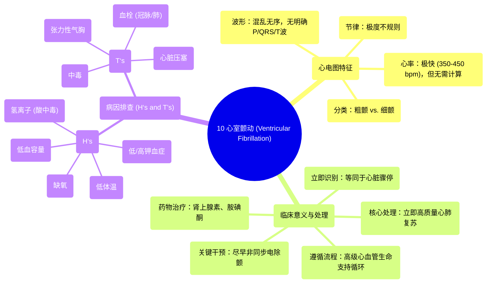

# 10 Rate and Rhythm Ventricular Fibrillation

  <video controls preload="metadata" playsinline>
    <source src="https://helly.s3.bitiful.net/心血管学科/%E4%B8%93%E8%BE%91%2005%EF%BC%9A%E5%BF%83%E7%94%B5%E5%9B%BE%E5%9F%BA%E7%A1%80%E5%85%A5%E9%97%A8%20%28ECG%20Basics%29/10%20Rate%20and%20Rhythm%20Ventricular%20Fibrillation.mp4" type="video/mp4">
    
您的浏览器不支持播放，请升级。

  </video>

::: tip ⚡️ 核心考点 (30s速读)
*   **核心考点**：室颤是一种致命性心律失常，心电图表现为无明确P波、QRS波和T波的、形态和节律完全不规则的“蠕动”或“锯齿状”波形。**无需计算心率**，识别形态是关键。
*   **临床意义**：患者**无有效心输出量**，等同于心脏骤停。必须**立即启动心肺复苏**，并尽快准备**除颤**。治疗遵循高级心血管生命支持流程，同时排查可逆性病因。
:::

## 🧠 深度精讲

*   **概念1：心电图特征**
    *   **波形**：完全混乱，无明确可辨的P波、QRS波群或T波。描述为“蜿蜒曲折”、“锯齿状”或“像小孩乱涂的蜡笔线”。
    *   **心率**：颤动波频率极快，通常在**350-450次/分**，但临床识别时**无需精确计算**。
    *   **节律**：**极度不规则**，R-R间期（如果存在可辨的“R”波）完全不齐。
    *   **QRS波**：宽大、畸形（若勉强辨认），通常>0.12秒（3小格）。
    *   **房室关系**：存在**房室分离**，心房与心室活动无关。

*   **概念2：临床处理（高级心血管生命支持流程）**
    1.  **立即启动**：识别后**立即开始高质量心肺复苏**（胸外按压）。
    2.  **尽早除颤**：在准备药物的同时，应尽快进行**非同步电除颤**（电击）。室颤时电击无需与R波同步。
    3.  **药物治疗**：在持续心肺复苏的周期中给予药物，核心药物包括：
        *   **肾上腺素**：每3-5分钟静脉注射一次，用于提升冠脉和脑灌注压。
        *   **胺碘酮**：用于难治性室颤/无脉性室速，提高除颤成功率。
    4.  **循环进行**：遵循“**心肺复苏 → 检查心律/除颤 → 心肺复苏/给药**”的循环。
    5.  **病因排查**：在抢救同时，必须系统性地排查可逆性病因，即“**H’s and T’s**”：
        *   **H（低/血相关）**：低血容量、缺氧、氢离子（酸中毒）、低/高钾血症、低体温。
        *   **T（毒/栓相关）**：血栓形成（冠脉/肺）、心脏压塞、张力性气胸、中毒。

*   **概念3：粗颤与细颤**
    *   **粗大型室颤**：波形振幅相对较高，除颤成功率相对较高。
    *   **细颤**：波形振幅低、纤细，更接近心室停搏，预后更差。但处理原则相同：**心肺复苏 + 除颤**。

## 📚 双语术语表 (Terminology)
| 英文术语 | 中文翻译 | 定义/解释 |
| :--- | :--- | :--- |
| Ventricular Fibrillation (V-fib) | 心室颤动（室颤） | 一种致命性心律失常，心室肌出现快速、混乱、不同步的收缩，无法产生有效心输出量。 |
| Coarse V-fib | 粗大型室颤 | 室颤的一种类型，心电图颤动波的振幅相对较高。 |
| Fine V-fib | 细颤 | 室颤的一种类型，心电图颤动波振幅低且纤细，预后较差。 |
| Asystole | 心室停搏 | 心电图上呈一条直线，无任何心电活动。 |
| Defibrillation | 除颤 | 使用除颤器对心脏进行非同步电击，旨在终止恶性心律失常（如室颤），使窦房结重新控制心律。 |
| Cardiopulmonary Resuscitation (CPR) | 心肺复苏 | 对心脏骤停患者采取的急救措施，包括胸外按压和人工呼吸，以维持最低限度的血液循环和氧合。 |
| Epinephrine | 肾上腺素 | 心脏骤停抢救中的核心药物，能收缩血管、提高血压，增加心脑血流。 |
| Amiodarone | 胺碘酮 | 一种抗心律失常药，用于治疗难治性室颤/无脉性室速。 |
| ACLS (Advanced Cardiovascular Life Support) | 高级心血管生命支持 | 针对心脏骤停和危重心血管急症的标准化抢救流程和培训体系。 |
| H’s and T’s | H’s and T’s（可逆病因记忆法） | 用于系统排查心脏骤停可逆性病因的助记符，包括低血容量、缺氧等（H开头）和血栓、心脏压塞等（T开头）。 |
| AV Dissociation | 房室分离 | 心房和心室各自独立激动，彼此无关，常见于室性心律失常。 |
| Non-synchronized Cardioversion | 非同步电复律 | 电击释放不与心电图R波同步，用于治疗室颤/无脉性室速。 |

## 🗺️ 知识图谱

