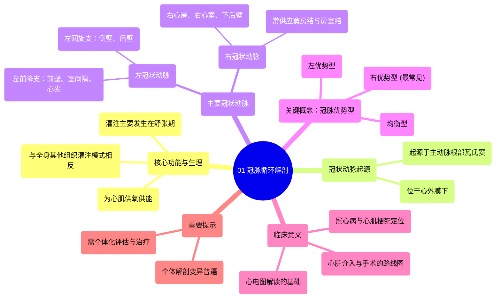

# 01 The Anatomy of the Coronary Circulation

  <video controls preload="metadata" playsinline>
    <source src="https://helly.s3.bitiful.net/心血管学科/%E4%B8%93%E8%BE%91%2006%EF%BC%9A12%E5%AF%BC%E8%81%94%E5%BF%83%E7%94%B5%E5%9B%BE%E5%88%A4%E8%AF%BB%E5%A4%A7%E5%B8%88%20%2812%20Lead%20EKG%20Mastery%29/01%20The%20Anatomy%20of%20the%20Coronary%20Circulation.mp4" type="video/mp4">
    
您的浏览器不支持播放，请升级。

  </video>

::: tip ⚡️ 核心考点 (30s速读)
*   **核心考点**：冠脉循环负责为心脏自身供血供氧，其灌注主要发生在**舒张期**，这与身体其他组织相反。主要解剖结构包括**左冠状动脉**和**右冠状动脉**及其分支。
*   **临床意义**：理解冠脉解剖是解读心电图、诊断冠状动脉疾病（如心肌梗死）和规划介入治疗（如支架或搭桥手术）的基础。解剖变异普遍存在，需个体化评估。
:::

## 🧠 深度精讲

*   **冠脉循环的功能与生理特点**：冠脉循环是心脏自身的血液供应系统，其核心功能是确保心肌获得足够的氧气和能量以维持泵血。一个关键的生理特点是，由于心肌在收缩（**收缩期**）时挤压内部的血管，血液无法有效流入心肌。因此，心脏的灌注主要发生在心脏放松的**舒张期**，此时主动脉瓣关闭，血液可反流进入冠状动脉开口。这与全身其他组织主要在收缩期灌注的模式截然相反。

*   **冠状动脉解剖概述**：两条主要的冠状动脉均起源于**升主动脉根部**、**主动脉瓣**上方的**主动脉窦**（Valsalva窦）。它们走行于心脏表面的**心外膜**下。
    1.  **左冠状动脉**：开口于左主动脉窦。发出后很快分为两大主干：
        *   **左前降支**：沿**前室间沟**下行，供应心脏前壁、室间隔前2/3和心尖部。它是冠心病最常累及的血管。
        *   **左回旋支**：沿**左房室沟**走行，供应左心室侧壁和后壁。
    2.  **右冠状动脉**：开口于右主动脉窦，沿**右房室沟**走行。它主要供应右心房、右心室、窦房结、房室结以及心脏下壁和后壁的大部分区域。其重要性取决于冠脉优势型。

*   **重要概念：冠脉优势型**：指由哪条冠状动脉供应心脏膈面（下壁）和后室间沟区域。大多数人为**右优势型**（约70%），即由右冠状动脉发出后降支。部分人为**左优势型**或**均衡型**。优势型的判断对于理解心肌梗死部位和介入治疗策略至关重要。

*   **解剖变异与临床提示**：视频强调，每个人的冠脉解剖都存在差异，包括血管的起源、走行、管径大小和分支数量。因此，在阅读冠脉造影或进行心脏手术时，必须意识到“教科书式”的解剖并非唯一标准，个体化评估是关键。

## 📚 双语术语表 (Terminology)
| 英文术语 | 中文翻译 | 定义/解释 |
| :--- | :--- | :--- |
| Coronary Circulation | 冠脉循环 | 供应心脏肌肉（心肌）氧气和营养的血液循环系统。 |
| Systole | 收缩期 | 心脏收缩、将血液泵出的阶段。此期心肌内血管受压，冠脉灌注减少。 |
| Diastole | 舒张期 | 心脏放松、充盈血液的阶段。此期心肌内血管压力解除，是冠脉灌注的主要时期。 |
| Aortic Valve | 主动脉瓣 | 位于左心室和主动脉之间的瓣膜，防止血液从主动脉反流回心脏。 |
| Aortic Root / Sinus of Valsalva | 主动脉根部 / 瓦氏窦 | 升主动脉的起始部分，主动脉瓣附着处上方的膨大部分，左、右冠状动脉开口于此。 |
| Left Coronary Artery | 左冠状动脉 | 起源于左主动脉窦的主要冠脉，主要供应左心室大部分区域。 |
| Left Anterior Descending Artery | 左前降支 | 左冠状动脉的主要分支，沿前室间沟下行，供应前壁和室间隔。 |
| Left Circumflex Artery | 左回旋支 | 左冠状动脉的主要分支，沿左房室沟走行，供应侧壁和后壁。 |
| Right Coronary Artery | 右冠状动脉 | 起源于右主动脉窦的主要冠脉，主要供应右心及心脏下后壁。 |
| Coronary Dominance | 冠脉优势型 | 定义哪条冠状动脉（右冠或左回旋支）发出后降支供应心脏膈面，分为右优势、左优势和均衡型。 |

## 🗺️ 知识图谱

