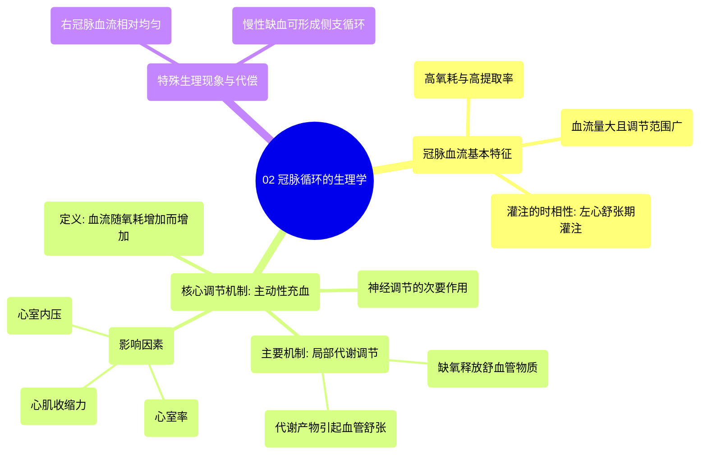

# 02 What is the PHYSIOLOGY of the coronary circulation

  <video controls preload="metadata" playsinline>
    <source src="https://helly.s3.bitiful.net/心血管学科/%E4%B8%93%E8%BE%91%2006%EF%BC%9A12%E5%AF%BC%E8%81%94%E5%BF%83%E7%94%B5%E5%9B%BE%E5%88%A4%E8%AF%BB%E5%A4%A7%E5%B8%88%20%2812%20Lead%20EKG%20Mastery%29/02%20What%20is%20the%20PHYSIOLOGY%20of%20the%20coronary%20circulation.mp4" type="video/mp4">
    
您的浏览器不支持播放，请升级。

  </video>

::: tip ⚡️ 核心考点 (30s速读)
*   **核心考点**：冠脉循环生理的核心是**主动性充血**，即冠脉血流量与心肌耗氧量紧密匹配。心脏在舒张期（尤其是左心）获得主要灌注，以满足其极高的氧需求。
*   **临床意义**：理解此生理机制是诊治冠心病（如心绞痛、心肌梗死）的基础。当冠脉因粥样硬化狭窄时，血流量无法随需求增加，导致心肌缺血。
:::

## 🧠 深度精讲

*   **冠脉血流的基本特征**：
    *   **高氧需求**：心脏是全身耗氧量最高的器官，静息时即可提取动脉血中60-70%的氧气，动静脉氧差最大。
    *   **血流量大且可变**：静息时冠脉血流量约占心输出量的5%（约250-300 mL/min），运动时可迅速增加至1000-2000 mL/min。
    *   **灌注时相性**：**左心室**主要在**舒张期**灌注。因为收缩期心肌强力挤压微血管，阻碍血流；舒张期心肌松弛，主动脉压驱动血液流入。**右心室**由于腔内压力低，在整个心动周期均可获得灌注，血流更均匀。

*   **主动性充血**：
    *   **定义**：心肌耗氧量增加时，冠脉血流量相应增加的现象，是冠脉血流**自动调节**的核心。
    *   **机制**：主要依赖**局部代谢调节**。心肌活动增加导致代谢产物（如腺苷、H+、CO2、K+）堆积和局部缺氧，这些物质是强效的血管舒张剂，使微循环血管扩张，降低阻力，从而增加血流量和氧输送。
    *   **影响因素**：心室率、心室内压、心肌收缩力共同决定心脏做功和氧耗，进而通过上述机制调节血流量。
    *   **神经调节作用**：交感神经兴奋直接引起血管收缩，但同时通过增加心率、收缩力大幅提升氧耗，后者引发的强代谢性血管舒张效应通常覆盖了直接的收缩作用，最终导致净血管舒张和血流增加。

*   **侧支循环**：
    *   在慢性缺血性心脏病患者中，可发生**血管生成**，形成与狭窄血管平行的**侧支循环**，这是一种代偿机制，能增加缺血区域的血供，降低血管总阻力。

## 📚 双语术语表 (Terminology)
| 英文术语 | 中文翻译 | 定义/解释 |
| :--- | :--- | :--- |
| Coronary circulation | 冠脉循环 | 供应心脏自身血液的血管系统。 |
| Physiology | 生理学 | 生物体及其各部分正常功能活动的科学。 |
| Perfusion | 灌注 | 血液流经组织或器官毛细血管床的过程。 |
| Microcirculation | 微循环 | 小动脉、毛细血管和小静脉组成的网络，是物质交换的主要场所。 |
| Systole | 收缩期 | 心脏（心室）收缩射血的时期。 |
| Diastole | 舒张期 | 心脏（心室）舒张充盈的时期。 |
| Active hyperemia | 主动性充血 | 组织或器官因活动增强、代谢增加而导致的局部血流量增加。 |
| A-V O2 difference | 动静脉氧差 | 动脉血与静脉血氧含量的差值，反映组织对氧的摄取利用量。 |
| Angiogenesis | 血管生成 | 从已有血管形成新血管的过程。 |
| Collateral circulation | 侧支循环 | 在主供血管阻塞或狭窄时，能代偿供血的旁路血管网络。 |
| Ischemic coronary artery disease | 缺血性冠状动脉疾病 | 因冠脉狭窄或阻塞导致心肌血液供应不足的疾病。 |
| Stenosis | 狭窄 | 血管腔异常变窄。 |
| Vasodilation | 血管舒张 | 血管平滑肌松弛，管径增大的过程。 |
| Myocardium | 心肌 | 构成心脏壁的肌肉组织。 |

## 🗺️ 知识图谱

