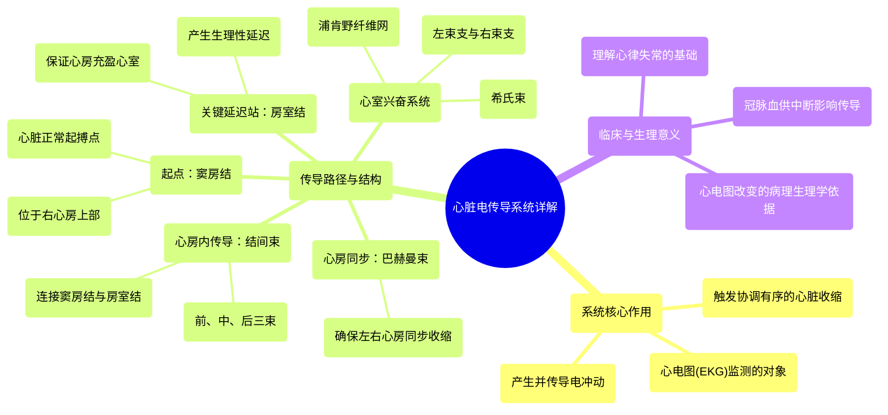

# 03 The Electrical Conduction System of the Heart EXPLAINED!

  <video controls preload="metadata" playsinline>
    <source src="https://helly.s3.bitiful.net/心血管学科/%E4%B8%93%E8%BE%91%2006%EF%BC%9A12%E5%AF%BC%E8%81%94%E5%BF%83%E7%94%B5%E5%9B%BE%E5%88%A4%E8%AF%BB%E5%A4%A7%E5%B8%88%20%2812%20Lead%20EKG%20Mastery%29/03%20The%20Electrical%20Conduction%20System%20of%20the%20Heart%20EXPLAINED%21.mp4" type="video/mp4">
    
您的浏览器不支持播放，请升级。

  </video>

::: tip ⚡️ 核心考点 (30s速读)
*   **核心考点**：心脏电传导系统是驱动心脏机械泵血的“火花”，其功能正常是维持有效心输出量的基础。理解其组成、路径和功能是解读心电图（EKG）异常的关键。
*   **临床意义**：传导系统任一环节（如窦房结、房室结）的功能障碍或血液供应中断，都会导致心律失常（如心动过缓、传导阻滞），直接影响心脏泵血功能，是危重症护理中的核心观察内容。
:::

## 🧠 深度精讲

*   **心脏的双重属性**：心脏是一个“机械泵”，但其工作依赖于“电传导系统”产生的电活动来触发心肌收缩。心电图（EKG）记录的是这种电活动，而非机械收缩本身。
*   **电传导系统的目的**：该系统由特化的心肌细胞构成，主要目的是：1) **产生电冲动**（起搏）；2) **快速传导信号**；3) **协调有序地激活**整个心脏，确保心房先收缩充盈心室，随后心室再收缩泵血。
*   **传导路径详解**：
    1.  **起点：“窦房结”**：位于右心房上部，是心脏的**正常起搏点**，自律性最高，决定心率。它发出的冲动触发心房肌细胞同步收缩。
    2.  **心房同步：“巴赫曼束”**：一条特化的高速传导通路，将窦房结的冲动快速传至左心房，确保**双心房同步收缩**。
    3.  **心房内传导：“结间束”**（前、中、后）：负责将窦房结的冲动传导至下一个关键站——房室结。
    4.  **关键延迟站：“房室结”**：位于右心房下部。其核心功能是**生理性延迟**（约0.1秒）冲动的下传。这个延迟至关重要，它为心房收缩留出时间，让血液充分充盈心室，是保证心室有效泵血的前提。
    5.  **心室兴奋的“高速公路”**：冲动离开房室结后，进入“希氏束”，并分为“左、右束支”及其终末分支“浦肯野纤维网”。这套系统以极快的速度将电信号传递至**左右心室的所有心肌细胞**，确保心室肌几乎同步收缩，产生最大的泵血效率。
*   **血液供应的重要性**：传导系统的关键部分（如窦房结、房室结）由冠状动脉分支供血。冠状动脉疾病导致的血流中断，会直接引起传导功能障碍和心律失常。

## 📚 双语术语表 (Terminology)
| 英文术语 | 中文翻译 | 定义/解释 |
| :--- | :--- | :--- |
| Electrical Conduction System | 电传导系统 | 心脏内产生和传导电冲动的特化细胞网络，是触发心脏机械收缩的起始点。 |
| Sinoatrial (SA) Node | 窦房结 | 位于右心房上部，是心脏的正常起搏点，以60-100次/分的频率自发产生冲动。 |
| Bachman Bundle | 巴赫曼束 | 连接右心房与左心房的特殊传导束，确保双心房同步收缩。 |
| Internodal Pathways | 结间束 | 连接窦房结与房室结的传导通路（前、中、后束）。 |
| Atrioventricular (AV) Node | 房室结 | 位于右心房下部，冲动传导的关键延迟站，保证心房收缩完成后心室再收缩。 |
| Bundle of His | 希氏束 | 房室结的延续，是连接心房与心室的唯一电传导通路。 |
| Bundle Branches | 束支 | 希氏束在室间隔分为左束支和右束支，将冲动传向左右心室。 |
| Purkinje Fibers | 浦肯野纤维 | 束支的终末分支，形成网状遍布心室心内膜下，以最快速度将冲动传至心室肌。 |
| Myocyte | 心肌细胞 | 构成心肌组织的特化细胞，包括起搏、传导和收缩等多种功能类型。 |
| EKG / ECG | 心电图 | 记录心脏电活动随时间变化的图形，是评估传导系统功能的核心工具。 |

## 🗺️ 知识图谱

