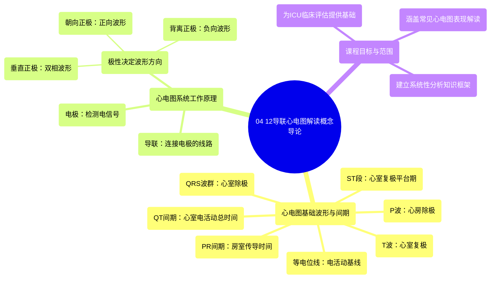

# 04 Introduction to Concepts of 12-Lead EKG Interpretation

  <video controls preload="metadata" playsinline>
    <source src="https://helly.s3.bitiful.net/心血管学科/%E4%B8%93%E8%BE%91%2006%EF%BC%9A12%E5%AF%BC%E8%81%94%E5%BF%83%E7%94%B5%E5%9B%BE%E5%88%A4%E8%AF%BB%E5%A4%A7%E5%B8%88%20%2812%20Lead%20EKG%20Mastery%29/04%20Introduction%20to%20Concepts%20of%2012-Lead%20EKG%20Interpretation.mp4" type="video/mp4">
    
您的浏览器不支持播放，请升级。

  </video>

::: tip ⚡️ 核心考点 (30s速读)
*   **核心考点**：理解12导联心电图的基础在于掌握其基本波形（P波、QRS波群、T波）和间期（PR间期、QT间期、ST段）的生理意义，以及电极极性如何决定波形方向。
*   **临床意义**：这是系统学习12导联心电图解读的第一步，为后续分析心律失常、心肌缺血/梗死等重症监护常见问题建立必要的知识框架。
:::

## 🧠 深度精讲

*   **心电图波形与间期回顾**：一个完整的心动周期波形反映了心脏的电活动。基线是“等电位线”，代表无电活动状态。“P波”代表心房除极；“QRS波群”代表心室除极；“T波”代表心室复极。重要的测量包括：“PR间期”（心房除极到心室除极的时间）、“QRS波群宽度”（心室除极所需时间）、“QT间期”（心室除极和复极的总时间）以及“ST段”（心室除极后、复极前的平台期，正常时应与等电位线平齐）。

*   **心电图系统工作原理**：心电图机通过贴在病人身上的“电极”测量电信号，并通过“导联”连接。导联有极性（正极和负极）。电活动方向相对于正极电极的位置，直接决定了波形在图纸上的形态：电活动朝向正极产生“正向（直立）波形”；背离正极产生“负向（向下）波形”；垂直于正极则产生“双相波形”（正负波幅相等时为等电位线波形，不等时则比例不同）。

*   **学习路径说明**：本系列课程旨在为ICU工作者提供12导联心电图判读的实用知识，涵盖最常见临床问题的评估，但并非极度深入的专科课程。目标是让学习者在课程结束后具备分析和理解大多数心电图表现的基础能力。

## 📚 双语术语表 (Terminology)
| 英文术语 | 中文翻译 | 定义/解释 |
| :--- | :--- | :--- |
| EKG / ECG | 心电图 | 记录心脏电活动的图形。 |
| 12-Lead EKG | 12导联心电图 | 从12个不同角度记录心脏电活动的标准检查。 |
| Waveform | 波形 | 心电图上的图形，代表特定的电事件（如P波）。 |
| Isoelectric Line | 等电位线 | 心电图的基线，代表无净电活动的时期。 |
| Depolarization | 除极 | 心肌细胞由静息状态转为兴奋状态的电活动过程。 |
| Repolarization | 复极 | 心肌细胞恢复静息电位的电活动过程。 |
| P Wave | P波 | 心电图波形，代表心房的除极。 |
| QRS Complex | QRS波群 | 心电图波形，代表心室的除极。 |
| T Wave | T波 | 心电图波形，代表心室的复极。 |
| PR Interval | PR间期 | 从P波起点到QRS波群起点的时间，反映房室传导时间。 |
| QT Interval | QT间期 | 从QRS波群起点到T波终点的时间，反映心室电活动的总时间。 |
| ST Segment | ST段 | QRS波群终点到T波起点之间的线段，代表心室早期复极的平台期。 |
| Electrode | 电极 | 贴在皮肤上用以检测心脏电信号的贴片。 |
| Lead | 导联 | 连接电极和心电图机的线路，代表一个特定的观察角度。 |
| Bipolar Lead | 双极导联 | 同时具有正极和负极的导联。 |
| Positive/Negative Waveform | 正向/负向波形 | 电活动朝向/背离正极电极时记录到的向上/向下波形。 |
| Biphasic Waveform | 双相波形 | 同时包含正向和负向成分的波形。 |

## 🗺️ 知识图谱

