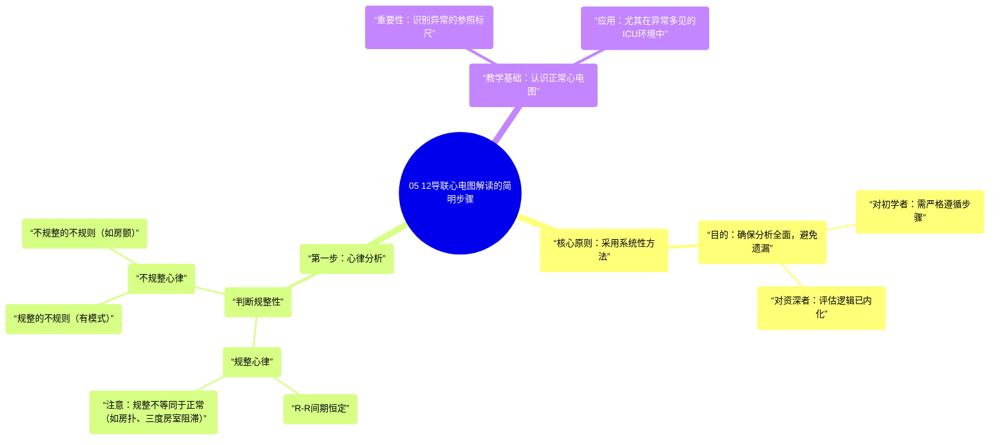

# 05 The SIMPLE Steps of 12-Lead EKG Interpretation - EXPLAINED CLEARLY!

  <video controls preload="metadata" playsinline>
    <source src="https://helly.s3.bitiful.net/心血管学科/%E4%B8%93%E8%BE%91%2006%EF%BC%9A12%E5%AF%BC%E8%81%94%E5%BF%83%E7%94%B5%E5%9B%BE%E5%88%A4%E8%AF%BB%E5%A4%A7%E5%B8%88%20%2812%20Lead%20EKG%20Mastery%29/05%20The%20SIMPLE%20Steps%20of%2012-Lead%20EKG%20Interpretation%20-%20EXPLAINED%20CLEARLY%21.mp4" type="video/mp4">
    
您的浏览器不支持播放，请升级。

  </video>

::: tip ⚡️ 核心考点 (30s速读)
*   **核心考点**：掌握一套**系统性、分步进行**的12导联心电图解读方法至关重要，它能确保分析全面、不遗漏关键信息。
*   **临床意义**：通过遵循固定流程，初学者可以避免在海量信息中迷失，而资深者也能确保评估的完整性。识别“正常”心电图是发现“异常”的基础。
:::

## 🧠 深度精讲
*   **系统性方法的重要性**：视频强调，解读12导联心电图时，必须建立并坚持一套适合自己的系统性分析流程。这并非死板的规定，而是为了确保每一次分析都能**全面覆盖**所有关键评估点，避免因经验不足或疏忽而遗漏重要发现。对于初学者，应“严格坚持”此流程；对于资深者，虽然可能不严格按步骤，但其内在的评估逻辑已内化，本质上仍覆盖了所有系统性的检查点。
*   **心律分析（Rhythm Analysis）是第一步**：这是整个解读流程的起点。首先需要判断心律的**规整性**：
    *   **规整心律**：R-R间期恒定。但需注意，规整的心律不一定是正常窦性心律，也可能是心房扑动、三度房室传导阻滞等。
    *   **不规整心律**：需进一步区分是“规整的不规则”（如文氏现象）还是“不规整的不规则”（如心房颤动）。视频中展示了房颤心电图作为不规整心律的示例。
*   **建立“正常”参照**：视频特意使用一份**正常心电图**作为教学示例，强调认识“正常”形态、间期和波形的重要性。在临床中（尤其是ICU），患者常伴有各种异常，此时心中有一个“正常”的标尺，能更敏锐、准确地识别出偏离正常的病理改变。

## 📚 双语术语表 (Terminology)
| 英文术语 | 中文翻译 | 定义/解释 |
| :--- | :--- | :--- |
| 12-Lead EKG | 12导联心电图 | 同时记录心脏12个不同方向电活动的检查，是评估心脏节律、传导、缺血等的重要工具。 |
| Rhythm Analysis | 心律分析 | 心电图解读的第一步，核心是判断心脏跳动的节律是否规整及其起源。 |
| Regular Rhythm | 规整心律 | R-R间期（相邻两个R波之间的时间）保持恒定。 |
| Irregularly Irregular | 不规整的不规则 | R-R间期完全无规律，最常见于心房颤动（AFib）。 |
| Regularly Irregular | 规整的不规则 | 不规整的心律中存在某种可重复的模式。 |
| R-to-R Interval | R-R间期 | 心电图上相邻两个R波顶峰之间的时间距离，用于判断心室率及心律规整性。 |
| Systematic Approach | 系统性方法 | 一套固定的、分步骤的心电图分析流程，旨在确保评估的全面性和一致性。 |

## 🗺️ 知识图谱

