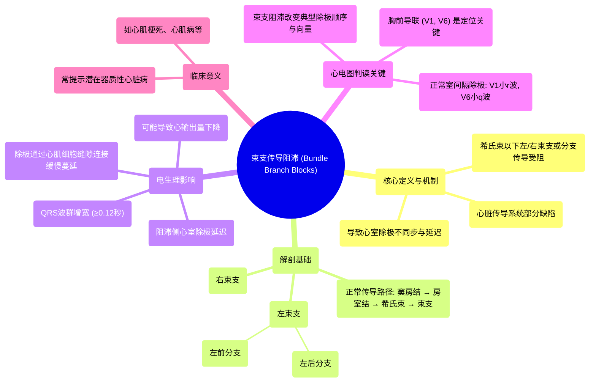

# 06 Bundle Branch Blocks MADE EASY!! - 12 Lead EKG

  <video controls preload="metadata" playsinline>
    <source src="https://helly.s3.bitiful.net/心血管学科/%E4%B8%93%E8%BE%91%2006%EF%BC%9A12%E5%AF%BC%E8%81%94%E5%BF%83%E7%94%B5%E5%9B%BE%E5%88%A4%E8%AF%BB%E5%A4%A7%E5%B8%88%20%2812%20Lead%20EKG%20Mastery%29/06%20Bundle%20Branch%20Blocks%20MADE%20EASY%21%21%20-%2012%20Lead%20EKG.mp4" type="video/mp4">
    
您的浏览器不支持播放，请升级。

  </video>

::: tip ⚡️ 核心考点 (30s速读)
*   **核心考点**：束支传导阻滞是心脏电传导系统中，希氏束以下的分支（右束支、左束支或其分支）发生传导障碍，导致心室除极不同步和QRS波群增宽。
*   **临床意义**：常见于器质性心脏病（如心肌梗死、心肌病），可导致心输出量下降。识别束支阻滞是心电图判读的基础，对诊断和评估病情至关重要。
:::

## 🧠 深度精讲

*   **概念1：束支传导阻滞的解剖与生理基础**
    心脏的正常电传导始于窦房结，经房室结、希氏束，再下传至**左束支**和**右束支**。左束支又迅速分为**左前分支**和**左后分支**。这些束支和分支将电信号快速、同步地传递至左右心室，引发协调收缩。当束支或分支因缺血、梗死或纤维化等损伤而发生“阻滞”时，电信号无法快速通过，导致该束支支配的心室区域除极延迟。

*   **概念2：束支阻滞的电生理机制与心电图表现**
    以**右束支传导阻滞**为例：右束支阻滞后，电信号只能通过左束支下传。因此，**左心室**先正常快速除极，而**右心室**的除极则需等待电活动通过心肌细胞间的**缝隙连接**缓慢“蔓延”过去。这造成了两个主要后果：1) **心室除极不同步**；2) **总除极时间延长**，在心电图上表现为**QRS波群时限增宽（通常≥0.12秒）**。胸前导联（V1、V6）是判断束支阻滞部位的关键。

*   **概念3：正常心室除极在V1/V6导联的波形**
    理解异常前需先掌握正常。正常心室除极始于**室间隔**从左向右除极：
    *   **V1导联**（电极在右胸）：除极向量**朝向**V1，产生一个小的正向波（**r波**）。
    *   **V6导联**（电极在左胸）：除极向量**背离**V6，产生一个小的负向波（**q波**）。
    随后，左右心室心肌同时快速除极，产生主要的QRS波群。

## 📚 双语术语表 (Terminology)
| 英文术语 | 中文翻译 | 定义/解释 |
| :--- | :--- | :--- |
| Bundle Branch Block (BBB) | 束支传导阻滞 | 希氏束以下的左或右束支发生传导障碍。 |
| Right Bundle Branch Block (RBBB) | 右束支传导阻滞 | 右束支传导受阻，右心室除极延迟。 |
| Left Bundle Branch Block (LBBB) | 左束支传导阻滞 | 左束支传导受阻，左心室除极延迟。 |
| Fascicle | 分支 | 特指左束支分出的左前分支和左后分支。 |
| Septal Depolarization | 室间隔除极 | 心室除极的初始阶段，通常从左向右进行。 |
| Purkinje Fibers | 浦肯野纤维 | 心内膜下的特化传导纤维，负责将电信号快速传递至心室肌细胞。 |
| Gap Junctions | 缝隙连接 | 心肌细胞间的连接通道，允许离子和电信号直接通过，是细胞间电传导的基础。 |
| QRS Complex | QRS波群 | 心电图上代表心室除极的波形。 |
| Chest Leads (V1-V6) | 胸前导联 (V1-V6) | 放置在胸壁特定位置的6个心电图导联，用于从水平面观察心脏电活动。 |
| Cardiac Output | 心输出量 | 每分钟一侧心室泵出的血液总量。束支阻滞可能因心室不同步收缩而降低心输出量。 |

## 🗺️ 知识图谱

