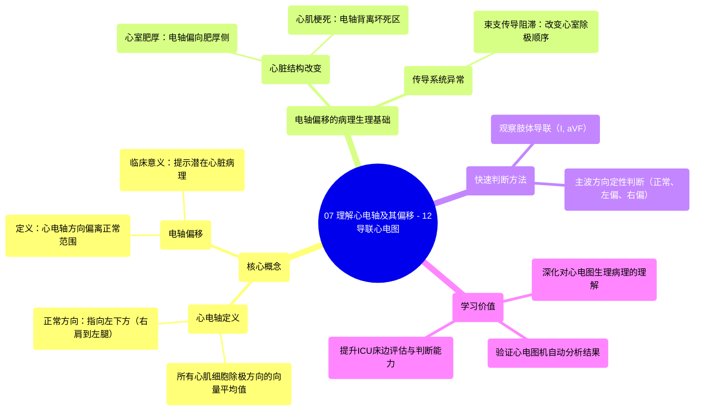

# 07 Understanding Cardiac Axis and Deviations - 12-Lead EKG

  <video controls preload="metadata" playsinline>
    <source src="https://helly.s3.bitiful.net/心血管学科/%E4%B8%93%E8%BE%91%2006%EF%BC%9A12%E5%AF%BC%E8%81%94%E5%BF%83%E7%94%B5%E5%9B%BE%E5%88%A4%E8%AF%BB%E5%A4%A7%E5%B8%88%20%2812%20Lead%20EKG%20Mastery%29/07%20Understanding%20Cardiac%20Axis%20and%20Deviations%20-%2012-Lead%20EKG.mp4" type="video/mp4">
    
您的浏览器不支持播放，请升级。

  </video>

::: tip ⚡️ 核心考点 (30s速读)
*   **核心考点**：心电轴是所有心肌细胞除极方向的**向量平均值**，正常指向左下方。其偏移是判断心脏结构或传导系统异常的**重要线索**。
*   **临床意义**：通过分析心电轴偏移，可以辅助诊断心室肥厚、心肌梗死、束支传导阻滞等病理状态，是解读12导联心电图的关键一环。
:::

## 🧠 深度精讲

*   **心电轴的概念**：心电轴并非指单个心肌细胞的电活动方向，而是整个心脏在除极过程中，数百万个心肌细胞电活动方向的**综合向量平均值**。由于左心室心肌质量最大，其电活动占主导地位，因此正常心电轴指向患者的左下方（大致从右肩到左腿的方向）。
*   **心电轴偏移的病理生理基础**：任何改变心脏电活动平衡的因素都可能导致心电轴偏移。
    *   **心脏结构改变**：如左心室肥厚，电活动向量会偏向肥厚的心肌；心肌梗死区域因失去电活动，会使综合向量背离梗死区。
    *   **传导系统异常**：如左束支或右束支传导阻滞，会改变心室除极的顺序和方向，从而引起特征性的电轴偏移。
*   **如何快速判断心电轴**：视频中提到，虽然精确计算需要方法，但通过观察肢体导联（尤其是I导联和aVF导联）QRS波群的主波方向，可以快速、粗略地判断电轴是否正常、左偏或右偏。这是一种实用的床边评估技能。
*   **学习本课的价值**：对于ICU护士而言，理解心电轴的意义远胜于精确计算。它能帮助你更深入地理解心电图波形背后的生理与病理，并验证心电图机自动分析结果的可靠性，从而提升临床判断能力。

## 📚 双语术语表 (Terminology)
| 英文术语 | 中文翻译 | 定义/解释 |
| :--- | :--- | :--- |
| Cardiac Axis / Electrical Axis | 心电轴 | 心脏除极过程中所有瞬间向量的综合平均方向。 |
| Axis Deviation | 电轴偏移 | 心电轴方向偏离正常范围（通常指左偏或右偏）。 |
| Vector | 向量 | 具有大小和方向的量，在心电图中表示电活动的方向和强度。 |
| Depolarization | 除极 | 心肌细胞由静息状态转为兴奋状态的过程，产生电活动。 |
| Limb Leads | 肢体导联 | 心电图导联系统的一部分，包括I, II, III, aVR, aVL, aVF导联，主要用于观察心脏在额面的电活动。 |
| Positive/Negative Waveform | 正向/负向波形 | 当电活动方向朝向某导联的正极时，记录到正向波；背离时记录到负向波。 |
| Bundle Branch Block (BBB) | 束支传导阻滞 | 希氏束以下左或右束支的传导延迟或中断，导致心室非同步除极。 |
| Infarction | 梗死 | 因血液供应中断而导致的心肌组织坏死。 |
| Enlarged Ventricle / Hypertrophy | 心室扩大/肥厚 | 心室心肌质量增加，常由长期压力或容量负荷过重引起。 |

## 🗺️ 知识图谱

