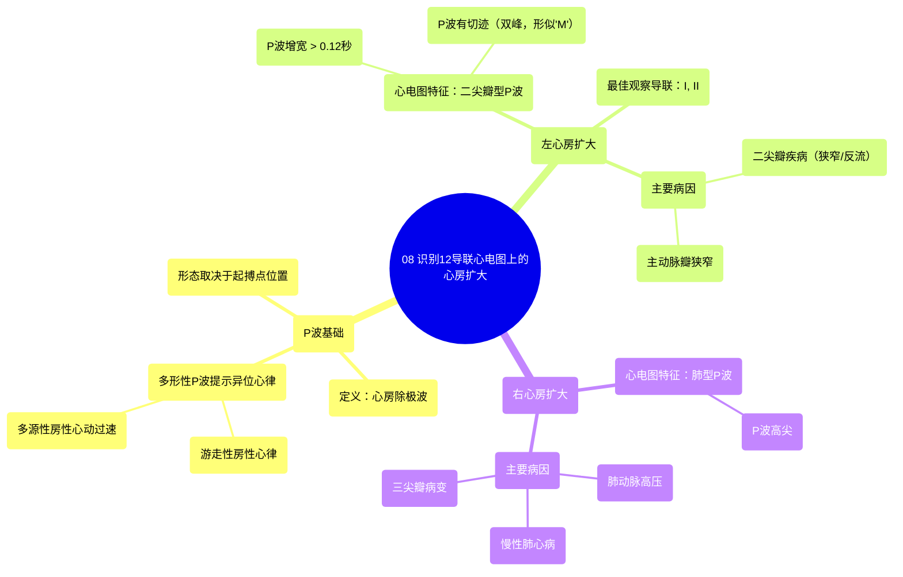

# 08 IDENTIFY Atrial Enlargement on 12-Lead EKG

  <video controls preload="metadata" playsinline>
    <source src="https://helly.s3.bitiful.net/心血管学科/%E4%B8%93%E8%BE%91%2006%EF%BC%9A12%E5%AF%BC%E8%81%94%E5%BF%83%E7%94%B5%E5%9B%BE%E5%88%A4%E8%AF%BB%E5%A4%A7%E5%B8%88%20%2812%20Lead%20EKG%20Mastery%29/08%20IDENTIFY%20Atrial%20Enlargement%20on%2012-Lead%20EKG.mp4" type="video/mp4">
    
您的浏览器不支持播放，请升级。

  </video>

::: tip ⚡️ 核心考点 (30s速读)
*   **核心考点**：通过P波形态识别心房扩大。左心房扩大表现为“二尖瓣型P波”（P-mitral），即P波增宽（>0.12秒）且有切迹，形似“M”；右心房扩大表现为“肺型P波”（P-pulmonale），即P波高尖。
*   **临床意义**：心房扩大是心脏结构异常的早期心电图线索，常提示瓣膜病（如二尖瓣狭窄/反流）、肺动脉高压等潜在疾病，对病因诊断和病情评估有重要价值。
:::

## 🧠 深度精讲

*   **P波形态与起搏点**：P波是心电图中第一个波，代表心房除极。其形态取决于心脏起搏点的位置。正常窦性心律下，P波形态基本一致。若在同一导联观察到多种形态的P波，可能提示异位起搏，如房性早搏、游走性房性心律或多源性房性心动过速。
*   **左心房扩大 (LAE)**：
    *   **心电图特征**：表现为“二尖瓣型P波”（P-mitral）。主要特点有两点：1) **P波增宽**：持续时间 > 0.12秒（>3个小格）；2) **P波切迹**：呈双峰型，形似驼峰或字母“M”。这是由于左心房扩大导致其内部电传导延迟，使左心房的除极晚于右心房完成。
    *   **最佳观察导联**：肢体导联I和II。
    *   **常见病因**：主要与左心系统压力或容量负荷过重有关，最常见于**严重的二尖瓣疾病**（狭窄或反流）。主动脉瓣狭窄也可导致。
    *   **记忆技巧**：P波像“M”，联想到左侧的“二尖瓣”（Mitral）。
*   **右心房扩大 (RAE)**：
    *   **心电图特征**：表现为“肺型P波”（P-pulmonale）。主要特点是**P波高尖**，振幅增大。这是由于右心房扩大导致其产生的电动力增强。
    *   **常见病因**：主要与右心系统压力负荷增加有关，常见于**肺动脉高压**、慢性肺源性心脏病、三尖瓣病变等。
    *   **记忆技巧**：P波高“尖”，联想到“肺”部疾病（Pulmonary）。

## 📚 双语术语表 (Terminology)
| 英文术语 | 中文翻译 | 定义/解释 |
| :--- | :--- | :--- |
| Atrial Enlargement | 心房扩大 | 心房（左心房或右心房）因压力或容量负荷过重而导致的心肌肥厚或心腔扩张。 |
| P-wave morphology | P波形态 | 心电图上P波的形状、宽度、振幅等特征。 |
| P-mitrale | 二尖瓣型P波 | 左心房扩大的特征性P波，表现为增宽（>0.12秒）且有切迹（双峰）。 |
| P-pulmonale | 肺型P波 | 右心房扩大的特征性P波，表现为高尖。 |
| Notched P-wave | 切迹P波 | P波顶端出现凹陷，形成双峰，是左心房扩大的典型表现。 |
| Wandering atrial pacemaker | 游走性房性心律 | 心房内起搏点不固定，导致同一导联上出现至少三种不同形态的P波，心率通常正常。 |
| Multifocal atrial tachycardia (MAT) | 多源性房性心动过速 | 与游走性房性心律类似，但心率>100次/分，同一导联上出现至少三种不同形态的P波。 |
| Mitral stenosis / regurgitation | 二尖瓣狭窄 / 反流 | 导致左心房压力或容量负荷增加的常见心脏瓣膜病，是左心房扩大的主要原因。 |

## 🗺️ 知识图谱

