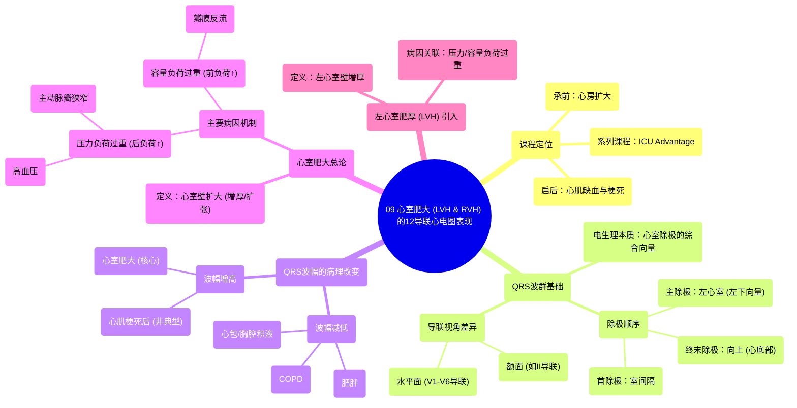

# 09 Ventricular Hypertrophy (LVH & RVH) on 12-Lead EKG

  <video controls preload="metadata" playsinline>
    <source src="https://helly.s3.bitiful.net/心血管学科/%E4%B8%93%E8%BE%91%2006%EF%BC%9A12%E5%AF%BC%E8%81%94%E5%BF%83%E7%94%B5%E5%9B%BE%E5%88%A4%E8%AF%BB%E5%A4%A7%E5%B8%88%20%2812%20Lead%20EKG%20Mastery%29/09%20Ventricular%20Hypertrophy%20%28LVH%20%26%20RVH%29%20on%2012-Lead%20EKG.mp4" type="video/mp4">
    
您的浏览器不支持播放，请升级。

  </video>

::: tip ⚡️ 核心考点 (30s速读)
*   **核心考点**：心室肥大（Ventricular Hypertrophy）是心室壁增厚或扩张，在心电图上主要表现为QRS波群振幅增高。左心室肥大（LVH）通常由压力负荷（如高血压、主动脉瓣狭窄）或容量负荷过重引起。
*   **临床意义**：识别心室肥大有助于诊断潜在的心脏结构异常（如瓣膜病、高血压性心脏病），是评估心脏长期负荷状态的重要线索。
:::

## 🧠 深度精讲

*   **课程背景与目标**：本课程是“ICU Advantage”系列的一部分，旨在将复杂危重症主题讲解得通俗易懂。本节课承接“心房扩大”的内容，专门讲解如何在12导联心电图上识别**心室肥大**，为后续学习心肌缺血和梗死打下基础。
*   **QRS波群的构成与电生理基础**：
    *   **波形来源**：心电图上看到的QRS波是心脏在特定时刻电活动综合平均方向的体现，且相对于观察电极（即导联）的位置而变化。
    *   **除极顺序**：心室除极始于**室间隔**，随后由强大的**左心室**主导，向量指向左下（下壁和侧壁），最后向上（心底部）除极。这些电活动事件在时间上是连续融合的，而非孤立发生。
    *   **导联视角差异**：从额面（如肢体导联II）和水平面（胸前导联V1-V6）观察，由于电极相对于心脏电向量的位置不同，会记录到形态各异的QRS波形。例如，从V1（右心视角）到V6（左心视角），QRS波形会发生规律性演变。
*   **影响QRS波幅度的病理因素**：
    *   **波幅减低**：见于抑制电传导的情况，如慢性阻塞性肺疾病（COPD）、肥胖、心包积液、胸腔积液。
    *   **波幅增高**：见于：
        1.  **心肌梗死（MI）后**：坏死组织不产生电活动，但可能使电信号更易通过周围组织，导致波幅相对增大（但并非肥厚的典型表现）。
        2.  **组织扩大**：即本节课核心——**心室肥大**。心肌因牵张（容量负荷）或增厚（压力负荷）导致电活动总量增加，从而产生更高振幅的QRS波。
*   **心室肥大的定义与病因**：
    *   **定义**：心室肥大指心室壁的扩大，可发生于单侧或双侧心室。
    *   **主要病因机制**：
        1.  **压力负荷过重（后负荷增加）**：心肌需对抗异常增高的阻力收缩。常见原因包括**系统性高血压**、**主动脉瓣狭窄**（左心室流出道梗阻）。
        2.  **容量负荷过重（前负荷增加）**：心室腔因血容量增多而扩张。例如瓣膜反流性疾病（如主动脉瓣关闭不全）。

## 📚 双语术语表 (Terminology)
| 英文术语 | 中文翻译 | 定义/解释 |
| :--- | :--- | :--- |
| Ventricular Hypertrophy (VH) | 心室肥大 | 心室心肌壁的增厚或扩大。 |
| Left Ventricular Hypertrophy (LVH) | 左心室肥厚 | 左心室壁的增厚。 |
| QRS Complex | QRS波群 | 心电图上代表心室除极的波形。 |
| Depolarization | 除极 | 心肌细胞电活动由静息状态转为兴奋状态的过程。 |
| Septum | 室间隔 | 分隔左、右心室的心脏结构。 |
| Precordial Leads | 胸前导联 | 放置在胸壁的6个心电图导联（V1-V6），反映心脏水平面的电活动。 |
| Amplitude | 振幅 | 心电图波形的高度，代表电活动的强度。 |
| Outflow Obstruction | 流出道梗阻 | 血液从心室流向动脉的通道受阻，如主动脉瓣狭窄。 |
| Hypertension | 高血压 | 体循环动脉压持续升高的病理状态。 |
| Aortic Stenosis | 主动脉瓣狭窄 | 主动脉瓣开口狭窄，导致左心室射血阻力增加。 |
| Volume Overload | 容量负荷过重 | 心室舒张期容量增加，导致心室腔扩张。 |

## 🗺️ 知识图谱

