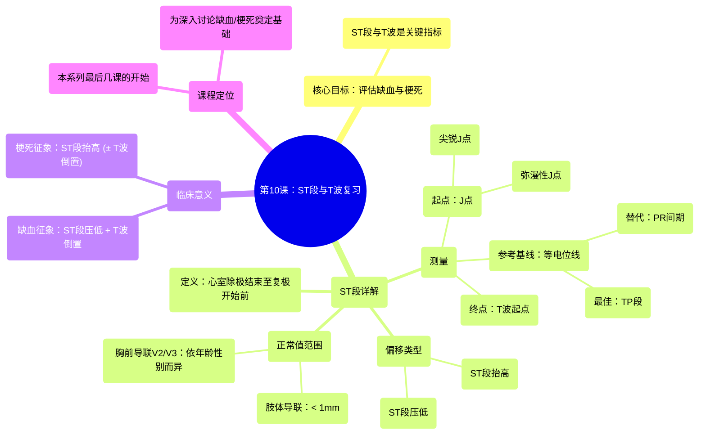

# 10 The ST Segment and T Wave REVIEW

  <video controls preload="metadata" playsinline>
    <source src="https://helly.s3.bitiful.net/心血管学科/%E4%B8%93%E8%BE%91%2006%EF%BC%9A12%E5%AF%BC%E8%81%94%E5%BF%83%E7%94%B5%E5%9B%BE%E5%88%A4%E8%AF%BB%E5%A4%A7%E5%B8%88%20%2812%20Lead%20EKG%20Mastery%29/10%20The%20ST%20Segment%20and%20T%20Wave%20REVIEW.mp4" type="video/mp4">
    
您的浏览器不支持播放，请升级。

  </video>

::: tip ⚡️ 核心考点 (30s速读)
*   **核心考点**：ST段和T波是评估心肌缺血和梗死的关键指标。ST段压低伴T波倒置提示缺血，ST段抬高（无论T波方向）提示梗死。
*   **临床意义**：准确识别J点、测量ST段相对于等电位线（TP段或PR间期）的偏移（抬高或压低），并理解正常范围，是进行正确临床判断的基础。
:::

## 🧠 深度精讲
*   **ST段与T波的重要性**：本课是评估心肌缺血和梗死系列课程的开篇。ST段和T波是12导联心电图（EKG）中用于判断心肌供血问题的两个最重要部分。ST段代表心室除极结束到复极开始前的时间。T波代表心室的快速复极。
*   **ST段的测量**：
    *   **起点（J点）**：ST段始于QRS波群结束的点，称为J点。J点可分为“尖锐J点”（清晰易辨）和“弥漫性J点”（过渡平缓，难以精确定位）。弥漫性J点常见于左室肥厚伴劳损、心包炎、早期复极等，也可见于心肌梗死（尤其是墓碑样改变）。
    *   **终点**：ST段结束于T波的起点。
    *   **等电位基线**：测量ST段偏移的参考线，最佳选择是TP段（T波结束至下一个P波开始）。当心率过快或TP段不清时，可使用PR间期或根据经验判断。
*   **ST段偏移的判断**：通过比较ST段与等电位线的高度来判断。
    *   **ST段抬高**：ST段位于等电位线之上。
    *   **ST段压低**：ST段位于等电位线之下。
    *   **正常范围**：
        *   肢体导联：ST段抬高 < 1mm 为正常。
        *   胸前导联V2、V3：
            *   男性 > 40岁：抬高 ≤ 2mm 为正常。
            *   男性 ≤ 40岁：抬高 ≤ 2.5mm 为正常。
            *   女性：抬高 ≤ 1.5mm 为正常。
        *   其他胸前导联（V1, V4-V6）：ST段抬高通常也应 < 1mm。
*   **临床关联**：ST段压低伴T波倒置是心肌缺血的征象；ST段抬高（无论是否伴T波倒置）是心肌梗死的征象。因此，在深入学习缺血和梗死前，必须牢固掌握ST段和T波的基础知识。

## 📚 双语术语表 (Terminology)
| 英文术语 | 中文翻译 | 定义/解释 |
| :--- | :--- | :--- |
| ST Segment | ST段 | 心电图波形的一部分，代表心室肌除极结束到复极开始前的时间。 |
| T Wave | T波 | 心电图波形的一部分，代表心室的快速复极。 |
| Ischemia | 缺血 | 心肌血液供应不足，但尚未导致细胞死亡。 |
| Infarction | 梗死 | 心肌因持续缺血导致的细胞死亡，即心肌梗死。 |
| J Point | J点 | QRS波群结束与ST段开始的交界点。 |
| Sharp J Point | 尖锐J点 | 清晰、明确的J点，易于识别。 |
| Diffuse J Point | 弥漫性J点 | 过渡平缓、难以精确定位的J点。 |
| Isoelectric Baseline | 等电位线 | 心电图上的参考水平线，通常以TP段或PR间期为代表，用于测量ST段偏移。 |
| TP Segment | TP段 | T波结束到下一个P波开始之间的线段，是确定等电位线的理想部位。 |
| PR Interval | PR间期 | P波开始到QRS波群开始的时间，在TP段不清时可作为等电位线的参考。 |
| ST Elevation | ST段抬高 | ST段高于等电位线。 |
| ST Depression | ST段压低 | ST段低于等电位线。 |
| Limb Leads | 肢体导联 | 心电图导联I, II, III, aVR, aVL, aVF。 |
| Precordial Leads | 胸前导联 | 心电图导联V1-V6。 |
| Tombstoning | 墓碑样改变 | 一种特殊形态的ST段抬高，形似墓碑，提示大面积透壁心肌梗死，预后不良。 |

## 🗺️ 知识图谱

