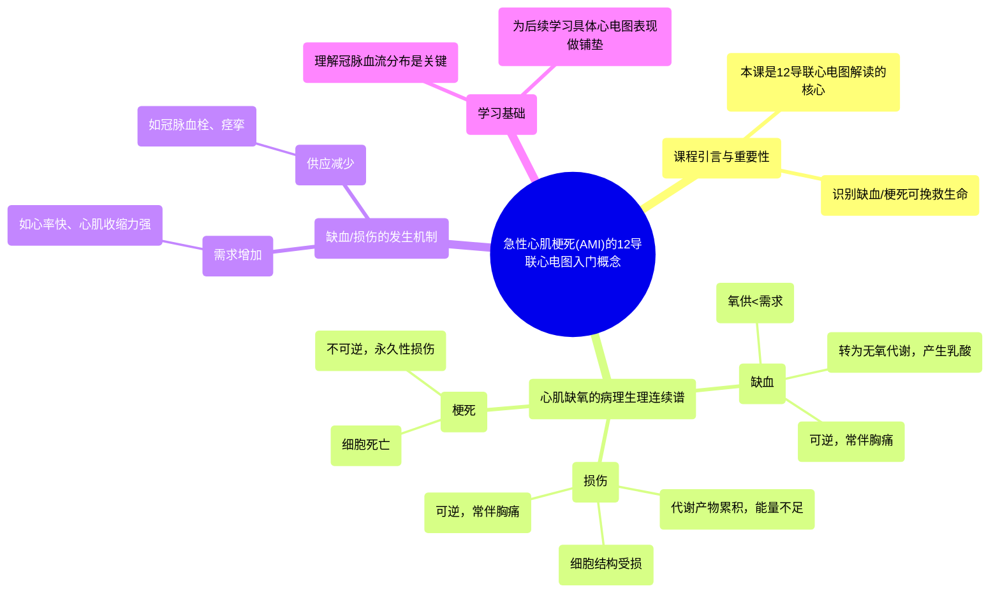

# 11 Introductory Concepts for Acute Myocardial Infarction (AMI) on 12-Lead EKG

  <video controls preload="metadata" playsinline>
    <source src="https://helly.s3.bitiful.net/心血管学科/%E4%B8%93%E8%BE%91%2006%EF%BC%9A12%E5%AF%BC%E8%81%94%E5%BF%83%E7%94%B5%E5%9B%BE%E5%88%A4%E8%AF%BB%E5%A4%A7%E5%B8%88%20%2812%20Lead%20EKG%20Mastery%29/11%20Introductory%20Concepts%20for%20Acute%20Myocardial%20Infarction%20%28AMI%29%20on%2012-Lead%20EKG.mp4" type="video/mp4">
    
您的浏览器不支持播放，请升级。

  </video>

::: tip ⚡️ 核心考点 (30s速读)
*   **核心考点**：理解心肌缺血、损伤、梗死是一个连续的病理生理过程，其本质是心肌细胞氧供与需求失衡，最终导致不可逆的细胞死亡。
*   **临床意义**：识别12导联心电图上的缺血/梗死改变是心血管急症诊疗中最关键的技能之一，直接关系到患者的生命救治。本课是后续深入学习心电图具体表现的基础。
:::

## 🧠 深度精讲

*   **课程定位与重要性**：本课程是“ICU Advantage”系列中关于12导联心电图解读的关键部分。作者Eddie Watson强调，在众多心电图发现中，识别心肌缺血和梗死可能是最重要的，因为它直接关系到能否及时进行挽救生命的治疗。
*   **病理生理连续谱**：心肌缺氧引发一系列渐进性改变：
    1.  **缺血**：心肌氧供不足以满足代谢需求，细胞从高效的有氧代谢转为低效的无氧代谢，产生乳酸，导致细胞内环境酸化。此阶段通常表现为胸痛，且**是可逆的**。
    2.  **损伤**：如果缺氧持续，有害代谢产物累积，能量生产严重不足，导致细胞结构受损。此阶段也常表现为胸痛，**仍是可逆的**。
    3.  **梗死**：缺氧状态无法逆转，导致心肌细胞死亡。这是**不可逆的**永久性损伤，其临床后果取决于梗死范围的大小。
*   **失衡的两种机制**：缺血和损伤的发生源于氧供与需求的失衡，主要有两种情况：
    1.  **需求增加**：如心率增快、心肌收缩力增强（见于高血压、主动脉瓣狭窄等）。
    2.  **供应减少**：如冠状动脉粥样硬化斑块破裂形成血栓（最常见）、冠状动脉痉挛等。
*   **冠状动脉解剖基础**：理解心脏的血液供应分布（冠状动脉及其分支）是学习不同部位心肌梗死心电图表现的基础。不同的血管阻塞会导致特定区域的心肌缺血/梗死，从而在心电图的不同导联上表现出特征性改变。

## 📚 双语术语表 (Terminology)
| 英文术语 | 中文翻译 | 定义/解释 |
| :--- | :--- | :--- |
| Acute Myocardial Infarction (AMI) | 急性心肌梗死 | 由于冠状动脉血流突然中断，导致部分心肌细胞缺血性坏死。 |
| Ischemia | 缺血 | 组织或器官的血液（氧）供应不足，无法满足其代谢需求的状态。 |
| Infarction | 梗死 | 由于血液供应持续中断而导致的组织坏死。 |
| 12-Lead EKG/ECG | 12导联心电图 | 一种同时从12个不同角度记录心脏电活动的检查，是诊断心肌缺血/梗死的关键工具。 |
| Aerobic Metabolism | 有氧代谢 | 细胞在氧气充足情况下进行的、高效的能量产生方式。 |
| Anaerobic Metabolism | 无氧代谢 | 细胞在缺氧情况下进行的、低效的能量产生方式，并产生乳酸。 |
| Lactic Acid | 乳酸 | 无氧代谢的产物，累积会导致组织酸中毒。 |
| Coronary Arteries | 冠状动脉 | 为心肌本身供应血液和氧气的动脉。 |

## 🗺️ 知识图谱

