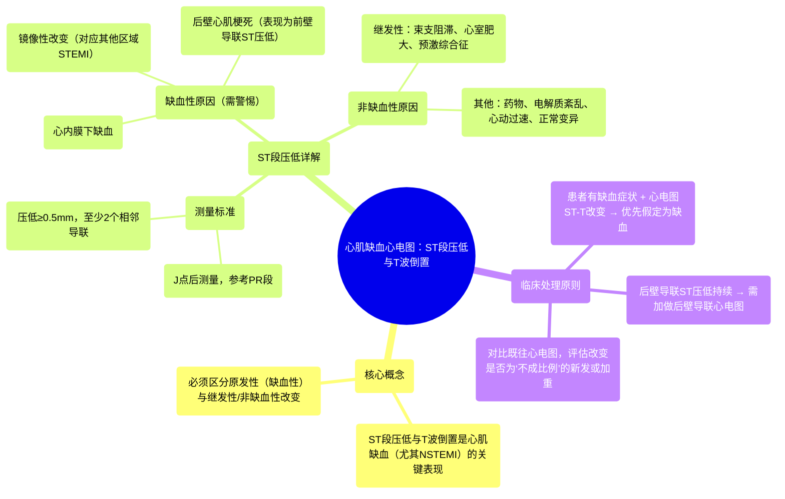

# 12 Myocardial Ischemia - ST Depression & T Wave Inversion - 12-lead EKG

  <video controls preload="metadata" playsinline>
    <source src="https://helly.s3.bitiful.net/心血管学科/%E4%B8%93%E8%BE%91%2006%EF%BC%9A12%E5%AF%BC%E8%81%94%E5%BF%83%E7%94%B5%E5%9B%BE%E5%88%A4%E8%AF%BB%E5%A4%A7%E5%B8%88%20%2812%20Lead%20EKG%20Mastery%29/12%20Myocardial%20Ischemia%20-%20ST%20Depression%20%26%20T%20Wave%20Inversion%20-%2012-lead%20EKG.mp4" type="video/mp4">
    
您的浏览器不支持播放，请升级。

  </video>

::: tip ⚡️ 核心考点 (30s速读)
*   **核心考点**：ST段压低和T波倒置是心肌缺血的重要心电图表现，尤其在非ST段抬高型心肌梗死（NSTEMI）中。识别原发性（缺血性）改变，并排除继发性（如束支传导阻滞）或非缺血性原因（如药物、电解质紊乱）至关重要。
*   **临床意义**：当患者出现缺血症状（如胸痛）并伴有心电图ST-T改变时，必须优先考虑缺血性心脏病，并立即启动相应评估与治疗流程。后壁心肌梗死可能仅表现为前壁导联的镜像性ST段压低。
:::

## 🧠 深度精讲

*   **课程目标**：本课程是12导联心电图系列的一部分，旨在深入讲解如何识别与心肌缺血和梗死相关的心电图改变，特别是ST段压低和T波倒置。
*   **ST段压低与T波倒置的病因分类**：
    *   **继发性改变**：由除极异常引起，本身通常不提示急性缺血。常见原因包括：
        *   束支传导阻滞（左束支、右束支）
        *   心室肥大（左心室、右心室）
        *   预激综合征
    *   **原发性改变**：在除极正常的情况下出现，若患者同时有缺血症状，则高度提示为缺血所致。
    *   **混合性改变**：可同时存在原发性和继发性改变，此时需与既往心电图对比，观察ST-T改变的深度是否与QRS波群大小“不成比例”地加深。
*   **ST段压低的详细解析**：
    *   **测量标准**：在J点后测量，ST段相对于PR段压低**≥0.5毫米**（半个小格），且在**至少两个解剖学相邻的导联**出现。
    *   **非缺血性原因**：
        *   药物影响（如治疗剂量的洋地黄）
        *   心动过速
        *   代谢或电解质异常（如低钾血症）
        *   正常变异（通常<1毫米）
        *   心脏复律后
    *   **缺血性原因（需高度警惕）**：
        1.  **镜像性改变**：其他导联发生ST段抬高型心肌梗死时，其对侧导联可表现为ST段压低。这是“镜面”效应。
        2.  **后壁心肌梗死**：标准12导联无法直接看到心脏后壁。后壁透壁性梗死时，会在前壁导联（尤其是V1-V4，以V2/V3最显著）表现为ST段压低。若此改变持续存在，强烈提示后壁STEMI，需加做后壁导联心电图。
        3.  **心内膜下缺血**：缺血未累及心室壁全层，仅局限于心内膜下区域，心电图表现为ST段压低而无ST段抬高。
*   **T波倒置的临床意义**：视频中虽未展开，但常与ST段压低伴随出现，同样是心肌缺血（尤其是心内膜下缺血）的常见表现。也可见于其他情况，如心肌病、脑血管事件等，需结合临床判断。

## 📚 双语术语表 (Terminology)
| 英文术语 | 中文翻译 | 定义/解释 |
| :--- | :--- | :--- |
| Myocardial Ischemia | 心肌缺血 | 心肌供血不足，导致氧气供应减少的状态。 |
| ST Depression | ST段压低 | 心电图ST段低于等电位线（常以PR段为参考）的异常表现。 |
| T Wave Inversion | T波倒置 | 心电图T波方向与正常相反（如原本直立的T波变为倒置）的异常表现。 |
| NSTEMI | 非ST段抬高型心肌梗死 | 一种心肌梗死类型，心电图表现为ST段压低和/或T波倒置，而无持续性ST段抬高。 |
| Reciprocal Changes | 镜像性改变 | 心肌梗死区域对侧的心电图导联上出现的相反方向的ST段改变（如ST段压低）。 |
| Subendocardial Ischemia | 心内膜下缺血 | 缺血仅累及心室壁内侧（心内膜下）心肌层，常表现为ST段压低。 |
| Transmural Ischemia | 透壁性缺血 | 缺血累及心室壁全层，常表现为ST段抬高。 |
| Posterior MI | 后壁心肌梗死 | 发生在心脏后壁的心肌梗死。标准心电图可能仅显示前壁导联的镜像性ST段压低。 |
| Bundle Branch Block | 束支传导阻滞 | 心脏电冲动在左或右束支传导受阻，导致心室除极顺序异常。 |
| Ventricular Hypertrophy | 心室肥大 | 心室肌肉异常增厚，常因长期压力或容量负荷过重引起。 |

## 🗺️ 知识图谱

