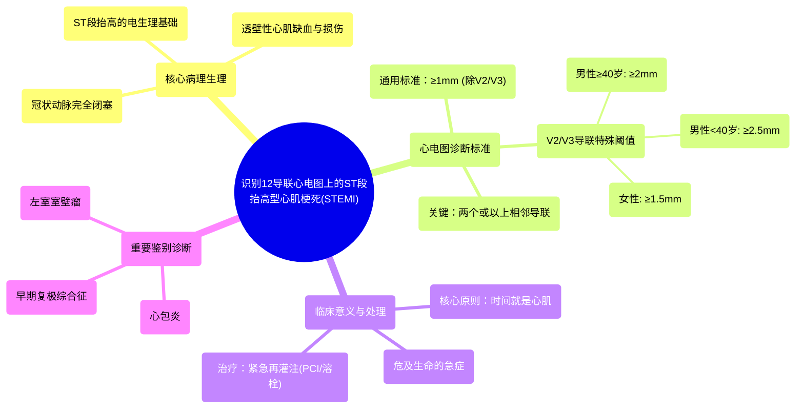

# 13 Recognize ST Elevation Myocardial Infarction (STEMI) on 12-lead EKG!

  <video controls preload="metadata" playsinline>
    <source src="https://helly.s3.bitiful.net/心血管学科/%E4%B8%93%E8%BE%91%2006%EF%BC%9A12%E5%AF%BC%E8%81%94%E5%BF%83%E7%94%B5%E5%9B%BE%E5%88%A4%E8%AF%BB%E5%A4%A7%E5%B8%88%20%2812%20Lead%20EKG%20Mastery%29/13%20Recognize%20ST%20Elevation%20Myocardial%20Infarction%20%28STEMI%29%20on%2012-lead%20EKG%21.mp4" type="video/mp4">
    
您的浏览器不支持播放，请升级。

  </video>

::: tip ⚡️ 核心考点 (30s速读)
*   **核心考点**：在12导联心电图上识别ST段抬高型心肌梗死（STEMI）的关键是：在**两个或更多相邻导联**中，出现**ST段抬高≥1mm**（除V2、V3导联外）。V2、V3导联的诊断阈值更高（男性>2mm，女性>1.5mm）。
*   **临床意义**：STEMI是**危及生命**的急症，由冠状动脉**完全闭塞**导致透壁性心肌缺血。**时间就是心肌**，早期识别并启动再灌注治疗（如PCI）是挽救生命、减少心肌损伤的关键。
:::

## 🧠 深度精讲

*   **STEMI的病理生理学**：STEMI的核心是冠状动脉的**完全闭塞**。最常见的原因是动脉粥样硬化斑块破裂，继发血栓形成，完全阻断了血流。这导致其供血区域的心肌细胞因缺氧而迅速发生**透壁性损伤和坏死**。这种大面积的电损伤在心电图上表现为特征性的**ST段抬高**。

*   **心电图诊断标准**：
    1.  **通用标准**：在**两个或更多相邻导联**中，ST段在J点后60-80ms处测量，**抬高≥1mm（0.1mV）**。此标准适用于除V2、V3外的所有导联。
    2.  **胸前导联V2、V3的特殊标准**：由于这些导联常存在生理性ST段抬高，诊断阈值更高：
        *   **男性 ≥40岁**：ST段抬高 ≥ **2mm**
        *   **男性 <40岁**：ST段抬高 ≥ **2.5mm**
        *   **女性（任何年龄）**：ST段抬高 ≥ **1.5mm**

*   **临床处理原则**：识别STEMI后，必须立即启动**再灌注治疗**流程，目标是尽快开通闭塞的血管。主要方法包括**直接经皮冠状动脉介入治疗（PCI）** 或**静脉溶栓治疗**。治疗延迟将直接导致更多心肌坏死，增加心力衰竭、恶性心律失常和死亡的风险。

*   **鉴别诊断**：ST段抬高并非STEMI特有，需与其他情况鉴别，如**心包炎**、**早期复极综合征**、**左心室室壁瘤**、**高钾血症**等。结合临床表现、心电图动态演变及心肌酶学检查至关重要。

## 📚 双语术语表 (Terminology)
| 英文术语 | 中文翻译 | 定义/解释 |
| :--- | :--- | :--- |
| ST Elevation Myocardial Infarction (STEMI) | ST段抬高型心肌梗死 | 一种因冠状动脉完全闭塞导致透壁性心肌缺血坏死的心肌梗死，心电图特征为两个或以上相邻导联ST段抬高。 |
| Transmural Infarction | 透壁性梗死 | 心肌坏死贯穿心室壁全层，通常与STEMI相关。 |
| Contiguous Leads | 相邻导联 | 在心脏解剖位置上相邻的导联组（如II, III, aVF；V1-V4等），用于定位心肌梗死区域。 |
| Reperfusion Therapy | 再灌注治疗 | 旨在迅速恢复阻塞冠状动脉血流的治疗，包括直接PCI和溶栓治疗。 |
| Pathologic Q Wave | 病理性Q波 | 宽度≥0.04秒或深度≥1/4 R波的Q波，提示陈旧性心肌梗死。 |
| Time is Muscle | 时间就是心肌 | 强调对STEMI患者，治疗延迟与心肌坏死量直接相关，必须争分夺秒。 |

## 🗺️ 知识图谱

