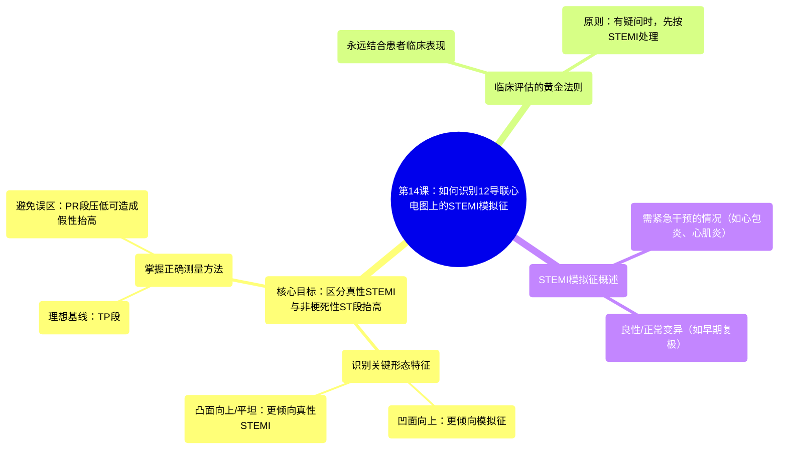

# 14 HOW-TO Recognize STEMI Mimics on 12-Lead EKG!

  <video controls preload="metadata" playsinline>
    <source src="https://helly.s3.bitiful.net/心血管学科/%E4%B8%93%E8%BE%91%2006%EF%BC%9A12%E5%AF%BC%E8%81%94%E5%BF%83%E7%94%B5%E5%9B%BE%E5%88%A4%E8%AF%BB%E5%A4%A7%E5%B8%88%20%2812%20Lead%20EKG%20Mastery%29/14%20HOW-TO%20Recognize%20STEMI%20Mimics%20on%2012-Lead%20EKG%21.mp4" type="video/mp4">
    
您的浏览器不支持播放，请升级。

  </video>

::: tip ⚡️ 核心考点 (30s速读)
*   **核心考点**：识别心电图上的ST段抬高（STE）并非总是由ST段抬高型心肌梗死（STEMI）引起。存在多种“STEMI模拟征”，其ST段形态（常为凹面向上）和临床表现与STEMI不同。
*   **临床意义**：快速区分真性STEMI与模拟征至关重要。真性STEMI需紧急再灌注治疗（时间就是心肌），而模拟征的处理策略各异，从紧急干预到无需特殊处理不等。评估时必须结合患者具体临床表现。
:::

## 🧠 深度精讲

*   **课程背景与目标**：本课程是ICU Advantage 12导联心电图系列的一部分，旨在讲解如何识别那些在心电图上表现为ST段抬高，但并非由急性心肌梗死（AMI）引起的临床情况，即“STEMI模拟征”。
*   **ST段抬高的形态学线索**：
    *   **凹面向上 (Concave)**：ST段从J点到T波顶点的连线位于ST段下方。这种形态更常见于STEMI模拟征。
    *   **凸面向上 (Convex) 或 平坦 (Flat)**：ST段位于上述连线上方或与之平齐。这种形态更可能提示真性STEMI。
    *   **基线参考**：理想情况下，应将ST段与TP段进行比较，以避免因PR段压低造成的假性ST段抬高误判。
*   **临床评估的核心原则**：心电图必须与**患者的具体临床表现**相结合。体格检查、症状（如胸痛性质）、病史和生命体征等信息对于鉴别诊断至关重要。不能孤立地解读心电图。
*   **STEMI模拟征概述**：这是一组能产生类似STEMI心电图表现的病症。其中一些（如心包炎、心肌炎、应激性心肌病）仍需要紧急评估和处理，而另一些（如早期复极、良性ST段抬高）可能是正常变异，无需干预。
*   **行动指南**：当心电图显示ST段抬高且临床怀疑STEMI时，应遵循“有疑问，按STEMI处理”的原则启动紧急流程。同时，积极寻找支持或反对STEMI诊断的其他证据，以优化治疗决策。

## 📚 双语术语表 (Terminology)
| 英文术语 | 中文翻译 | 定义/解释 |
| :--- | :--- | :--- |
| STEMI | ST段抬高型心肌梗死 | 一种由冠状动脉完全阻塞引起的心肌梗死，心电图上表现为特征性的ST段抬高。 |
| ST Elevation (STE) | ST段抬高 | 心电图ST段相对于基线（通常为TP段）的异常抬高。 |
| STEMI Mimics | STEMI模拟征 | 一系列非心肌梗死原因引起的心电图ST段抬高，临床表现可能与STEMI相似。 |
| Concave ST Elevation | 凹面向上的ST段抬高 | ST段形态呈向上弯曲的凹面，更常见于非缺血性原因。 |
| Convex ST Elevation | 凸面向上的ST段抬高 | ST段形态呈向上弓起的凸面，更典型于急性心肌缺血/梗死。 |
| J Point | J点 | QRS波群结束与ST段开始的交界点，是测量ST段偏移的基准点。 |
| TP Segment | TP段 | 心电图T波结束到下一个P波开始之间的等电位线段，常作为测量ST段偏移的基线参考。 |
| PR Segment Depression | PR段压低 | PR段相对于TP基线的下移，若误将其作为基线，可导致假性ST段抬高的判断。 |
| 12-Lead EKG | 12导联心电图 | 一种标准的心脏电活动记录方法，通过体表12个不同位置的电极捕捉心脏电信号。 |

## 🗺️ 知识图谱

