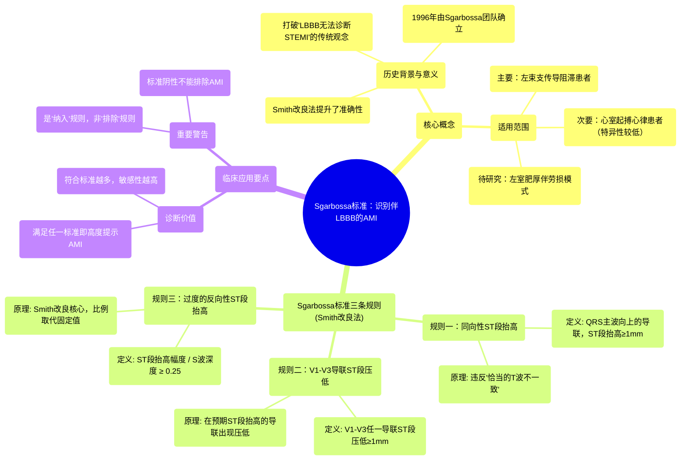

# 15 Sgarbossa's Criteria - HOW TO Identify AMI with LBBB on 12-lead EKG

  <video controls preload="metadata" playsinline>
    <source src="https://helly.s3.bitiful.net/心血管学科/%E4%B8%93%E8%BE%91%2006%EF%BC%9A12%E5%AF%BC%E8%81%94%E5%BF%83%E7%94%B5%E5%9B%BE%E5%88%A4%E8%AF%BB%E5%A4%A7%E5%B8%88%20%2812%20Lead%20EKG%20Mastery%29/15%20Sgarbossa%27s%20Criteria%20-%20HOW%20TO%20Identify%20AMI%20with%20LBBB%20on%2012-lead%20EKG.mp4" type="video/mp4">
    
您的浏览器不支持播放，请升级。

  </video>

::: tip ⚡️ 核心考点 (30s速读)
*   **核心考点**：Sgarbossa标准（及其Smith改良法）是一套用于在存在左束支传导阻滞（LBBB）或心室起搏心律时，识别急性心肌梗死（AMI）的特定心电图规则。
*   **临床意义**：打破了“LBBB时无法诊断STEMI”的传统观念，为识别这类高危患者的急性心肌梗死提供了关键工具，提高了诊断的准确性。
:::

## 🧠 深度精讲

*   **背景与概述**：在1996年之前，普遍认为在左束支传导阻滞（LBBB）患者中无法可靠诊断ST段抬高型心肌梗死（STEMI），因为LBBB本身就会引起继发性ST-T改变（即“恰当的T波不一致”），模拟心肌缺血或梗死图形。Sgarbossa博士及其团队通过分析数据，总结出三条特异性标准，改变了这一局面。后来，Smith博士对其进行了改良，进一步提升了诊断准确性。该标准主要适用于LBBB患者，也可用于心室起搏心律（但特异性稍低）。

*   **Sgarbossa标准（Smith改良法）的三条规则**：
    1.  **同向性ST段抬高 ≥ 1 mm**：在QRS波主波为正向（R波为主）的导联中，出现与QRS波同向的ST段抬高（即ST段也向上），且抬高幅度≥ 1 mm。这与LBBB预期的“恰当的T波不一致”（ST段应压低）相矛盾，高度提示心肌梗死。
    2.  **V1-V3导联中任一导联ST段压低 ≥ 1 mm**：在胸前导联V1-V3中，出现ST段压低≥ 1 mm。这些导联在LBBB时QRS波通常以负向波（S波）为主，根据“恰当的T波不一致”原则，ST段应抬高。如果出现显著压低，属于矛盾性改变，提示缺血。
    3.  **过度的反向性ST段抬高**：在QRS波主波为负向（S波为主）的导联中，ST段抬高的幅度与S波深度的比值 ≥ 0.25（即ST段抬高幅度 ÷ S波深度 ≥ 25%）。这是Smith改良的核心，用比例代替了固定的5mm阈值，提高了敏感性。例如，在V1导联S波深20mm，若ST段抬高≥5mm（20mm x 0.25 = 5mm）即为阳性。

*   **应用要点**：
    *   **诊断价值**：满足以上任何一条标准，都高度提示合并急性心肌梗死。符合的标准越多，诊断的敏感性越高。
    *   **重要提醒**：**不满足Sgarbossa标准，绝不能用来排除急性心肌梗死**。它只是一个“纳入”工具，而非“排除”工具。患者仍可能因不满足这些特定标准而发生心梗。
    *   **适用范围**：主要针对**左束支传导阻滞**。谨慎用于心室起搏心律。对于左室肥厚伴劳损模式，证据尚不充分。

## 📚 双语术语表 (Terminology)
| 英文术语 | 中文翻译 | 定义/解释 |
| :--- | :--- | :--- |
| Sgarbossa‘s Criteria | Sgarbossa标准 | 一套用于在左束支传导阻滞（LBBB）患者中识别急性心肌梗死（AMI）的心电图诊断标准。 |
| Smith‘s Modification | Smith改良法 | 对原始Sgarbossa标准的改进，特别是将第三条标准中的固定ST段抬高阈值改为与S波深度成比例，提高了诊断敏感性。 |
| Left Bundle Branch Block (LBBB) | 左束支传导阻滞 | 一种心室内传导障碍，导致左心室激动延迟，在心电图上产生特征性的宽QRS波和继发性ST-T改变。 |
| Acute Myocardial Infarction (AMI) | 急性心肌梗死 | 由于冠状动脉血流突然中断导致的心肌缺血性坏死。 |
| ST-Elevation Myocardial Infarction (STEMI) | ST段抬高型心肌梗死 | 一种以心电图两个相邻导联新出现ST段抬高为特征的急性心肌梗死。 |
| Appropriate T-wave Discordance | 恰当的T波不一致 | 在束支传导阻滞中，继发性复极改变导致的预期现象：T波方向与QRS波主波方向相反，J点（ST段起点）被拉向T波方向。 |
| Concordant ST Elevation | 同向性ST段抬高 | ST段抬高的方向与QRS波主波方向相同。在LBBB中，这是异常表现，提示心肌梗死。 |
| Ventricularly Paced Rhythm | 心室起搏心律 | 由心脏起搏器刺激心室肌产生的心律，其QRS波形态宽大畸形，类似束支传导阻滞。 |

## 🗺️ 知识图谱

