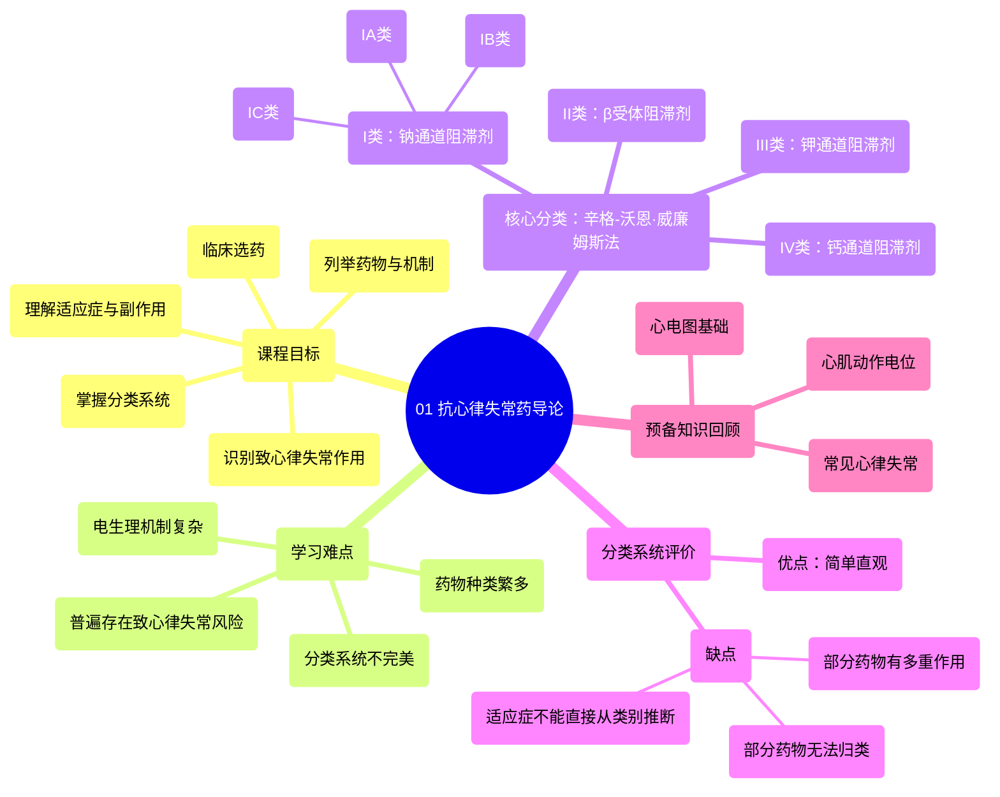

# 01 Antiarrhythmics (Lesson 1 - An Introduction)

  <video controls preload="metadata" playsinline>
    <source src="https://helly.s3.bitiful.net/心血管学科/%E4%B8%93%E8%BE%91%2007%EF%BC%9A%E5%BF%83%E5%BE%8B%E5%A4%B1%E5%B8%B8%E8%AF%8A%E6%96%AD%E5%AE%9E%E6%88%98%20%28Arrhythmia%20Diagnosis%29/01%20Antiarrhythmics%20%28Lesson%201%20-%20An%20Introduction%29.mp4" type="video/mp4">
    
您的浏览器不支持播放，请升级。

  </video>

::: tip ⚡️ 核心考点 (30s速读)
*   **核心考点**：抗心律失常药主要采用辛格-沃恩·威廉姆斯分类法，根据主要作用机制分为四类：I类（钠通道阻滞剂）、II类（β受体阻滞剂）、III类（钾通道阻滞剂）、IV类（钙通道阻滞剂）。该分类系统简单实用，但存在局限性。
*   **临床意义**：所有抗心律失常药均有致心律失常的副作用，即可能引发新的心律失常。因此，临床用药需权衡利弊，并理解药物作用的复杂性。
:::

## 🧠 深度精讲
*   **课程目标**：本系列课程旨在帮助学习者掌握抗心律失常药的分类、常见药物的作用机制、适应症、副作用，并能在特定临床情境下选择合适的药物，同时识别药物可能引发的致心律失常作用。
*   **学习难点**：抗心律失常药学习难度大，原因包括：药物种类繁多（本系列涵盖21种）、心肌动作电位和心律失常的病理生理复杂、所有药物均有致心律失常风险、以及现有分类系统无法完美概括所有药物的复杂作用。
*   **分类系统详解**：
    *   **辛格-沃恩·威廉姆斯分类法**：这是目前临床最常用的分类系统，由药理学家迈尔斯·沃恩·威廉姆斯及其博士生布拉马·辛格共同建立。它根据药物的主要作用机制分为四类。
    *   **分类与亚类**：
        1.  **I类**：钠通道阻滞剂。进一步细分为IA、IB、IC三个亚类，区别在于对钠通道结合/解离动力学的不同影响。
        2.  **II类**：β受体拮抗剂（β受体阻滞剂）。
        3.  **III类**：钾通道阻滞剂。
        4.  **IV类**：钙通道阻滞剂。
    *   **分类系统的优缺点**：
        *   **优点**：简单直观，基于四种核心电生理机制。
        *   **缺点**：1) 部分药物具有多类别作用；2) 部分药物（如腺苷、地高辛）无法归类；3) 无法直接从药物类别准确推断其临床适应症（例如，同为I类药，有的用于房颤，有的用于室速）。
*   **动作电位回顾**：动作电位是细胞膜两侧电位的短暂变化，是心脏电信号传导的基础。正常心电活动始于窦房结，经心房、房室结（延迟）、希氏束-浦肯野系统传导至心室，引发协调收缩。理解动作电位是学习抗心律失常药作用机制的基础。

## 📚 双语术语表 (Terminology)
| 英文术语 | 中文翻译 | 定义/解释 |
| :--- | :--- | :--- |
| Antiarrhythmics | 抗心律失常药 | 用于治疗或预防心律失常的药物。 |
| Singh-Von Williams Classification | 辛格-沃恩·威廉姆斯分类法 | 最常用的抗心律失常药分类系统，基于主要作用机制分为I-IV类。 |
| Proarrhythmic effect | 致心律失常作用 | 抗心律失常药物本身可能引发新的或加重已有的心律失常的副作用。 |
| Action Potential | 动作电位 | 细胞膜电位快速、短暂的波动，是神经和心肌细胞电信号传导的基础。 |
| Sodium Channel Blocker | 钠通道阻滞剂 | I类抗心律失常药，通过阻断心肌细胞钠通道发挥作用。 |
| Beta Blocker | β受体阻滞剂 | II类抗心律失常药，通过拮抗β肾上腺素能受体发挥作用。 |
| Potassium Channel Blocker | 钾通道阻滞剂 | III类抗心律失常药，通过阻断钾通道延长动作电位时程。 |
| Calcium Channel Blocker | 钙通道阻滞剂 | IV类抗心律失常药，主要阻断L型钙通道。 |
| Sicilian Gambit | 西西里赌局分类法 | 一种更复杂、更生理学导向但临床不常用的抗心律失常药分类方案。 |
| Atrial Fibrillation (AFib) | 心房颤动（房颤） | 一种常见的心律失常，心房出现快速、不协调的电活动。 |
| Ventricular Tachycardia (VT) | 室性心动过速（室速） | 起源于心室的一种快速性心律失常。 |

## 🗺️ 知识图谱

