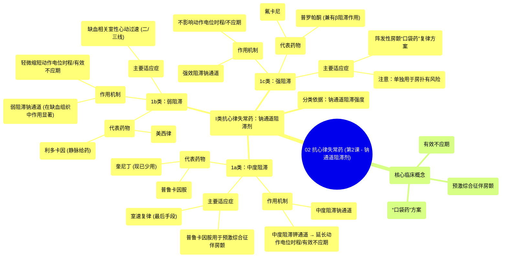

# 02 Antiarrhythmics (Lesson 2 - Sodium Channel Blockers)

  <video controls preload="metadata" playsinline>
    <source src="https://helly.s3.bitiful.net/心血管学科/%E4%B8%93%E8%BE%91%2007%EF%BC%9A%E5%BF%83%E5%BE%8B%E5%A4%B1%E5%B8%B8%E8%AF%8A%E6%96%AD%E5%AE%9E%E6%88%98%20%28Arrhythmia%20Diagnosis%29/02%20Antiarrhythmics%20%28Lesson%202%20-%20Sodium%20Channel%20Blockers%29.mp4" type="video/mp4">
    
您的浏览器不支持播放，请升级。

  </video>

::: tip ⚡️ 核心考点 (30s速读)
*   **核心考点**：I类抗心律失常药（钠通道阻滞剂）根据阻滞强度分为1a、1b、1c三个亚类，其作用机制、对动作电位的影响及临床适应症各不相同。
*   **临床意义**：1a类（如奎尼丁）因副作用多已少用；1b类（如利多卡因）主要用于缺血相关室性心律失常；1c类（如氟卡尼）用于房颤的“口袋药”复律方案。注意，Ic类药物单独用于心房扑动有风险。
:::

## 🧠 深度精讲

*   **概念1：I类抗心律失常药的分类与机制**
    I类抗心律失常药，即钠通道阻滞剂，是依据其对心肌细胞电压门控钠通道的阻滞强度进行分类的。这种阻滞强度直接影响了心肌细胞动作电位0期（快速除极期）的上升速度（Vmax），从而改变心肌的传导速度。
    1.  **1a类**：**中度**阻滞钠通道，同时也有**中度**阻滞钾通道的作用。钾通道阻滞导致复极延迟，因此会**延长**动作电位时程和有效不应期。代表药物有奎尼丁、普鲁卡因胺。奎尼丁因疗效有限且耐受性差，现已极少使用。
    2.  **1b类**：**弱**阻滞钠通道，其作用在**已除极**（如缺血）的组织中更为显著。它们会**轻微缩短**动作电位时程和有效不应期。代表药物有利多卡因、美西律。利多卡因需静脉给药用于抗心律失常。
    3.  **1c类**：**强效**阻滞钠通道，显著减慢0期上升支。对动作电位时程和不应期**无影响**。代表药物有氟卡尼、普罗帕酮（后者兼有轻度β受体阻滞作用）。

*   **概念2：主要适应症与临床应用**
    不同亚类的药物适用于不同的心律失常场景。
    1.  **1a类**：
        *   **普鲁卡因胺**：用于**预激综合征伴房颤**患者的节律与心率控制（因其能减慢旁路传导）；也用于无预激综合征患者的房颤药物复律、室速复律及终止房室折返性心动过速。
        *   **奎尼丁**：极少用，仅作为抑制室速的最后手段。
    2.  **1b类**：主要用于预防和治疗**缺血相关**的**室性心动过速**，常作为二线或三线药物。
    3.  **1c类**：主要用于**阵发性房颤**的**“口袋药”复律方案**。患者感觉房颤发作时自行口服一片（如氟卡尼或普罗帕酮），可在1-2小时内转复窦律。**重要提示**：采用此方案时，通常需联用一种房室结阻滞药（如美托洛尔或地尔硫䓬），以防误将心房扑动当作房颤治疗，因单独使用Ic类药物治疗心房扑动可能导致严重风险（如1:1房室传导）。

*   **概念3：关键背景知识**
    *   **有效不应期**：指心肌细胞在一次动作电位后，不能对新的刺激产生可扩布性兴奋的一段时间。延长有效不应期有助于打断折返环路，是许多抗心律失常药的作用基础。
    *   **预激综合征伴房颤**：当存在绕过房室结的旁路（如WPW综合征）时，房颤的快速心房冲动可经旁路快速下传，引发极快的心室率，甚至恶化为室颤。此时，常规的房室结阻滞药（β阻滞剂、钙通道阻滞剂）无效且危险，而能减慢旁路传导的药物（如普鲁卡因胺）是合理选择。

## 📚 双语术语表 (Terminology)
| 英文术语 | 中文翻译 | 定义/解释 |
| :--- | :--- | :--- |
| Sodium Channel Blockers | 钠通道阻滞剂 | 通过阻滞心肌细胞钠通道，减慢动作电位0期除极速度，从而抑制心肌传导性的一类抗心律失常药。 |
| Class 1a, 1b, 1c | 1a类，1b类，1c类 | 根据钠通道阻滞强度划分的I类抗心律失常药亚类。1a中度，1b弱，1c强。 |
| Action Potential Duration (APD) | 动作电位时程 | 心肌细胞从除极开始到复极完毕所经历的时间。 |
| Effective Refractory Period (ERP) | 有效不应期 | 心肌细胞在一次兴奋后，不能对新的刺激产生可扩布性动作电位的时期。 |
| Quinidine | 奎尼丁 | 经典的1a类抗心律失常药，现因副作用已很少使用。 |
| Procanamide | 普鲁卡因胺 | 1a类药，用于预激综合征伴房颤等特殊情况。 |
| Lidocaine | 利多卡因 | 1b类抗心律失常药，也是局部麻醉药，静脉用于室性心律失常。 |
| Flecainide | 氟卡尼 | 强效的1c类抗心律失常药，常用于房颤的“口袋药”方案。 |
| Propafenone | 普罗帕酮 | 1c类抗心律失常药，兼有轻度β受体阻滞作用。 |
| Pre-excited AFib | 预激综合征伴心房颤动 | 指存在房室旁路（如WPW综合征）的患者发生房颤，是一种医疗急症，需特殊处理。 |
| Pill-in-the-pocket | “口袋药”方案 | 一种治疗策略，让阵发性房颤患者随身携带抗心律失常药（如氟卡尼），在感觉发作时自行服用以复律。 |
| Wolff-Parkinson-White (WPW) Syndrome | 沃-帕-怀综合征 | 一种预激综合征，心电图表现为短PR间期和delta波，易发生折返性心动过速。 |

## 🗺️ 知识图谱

