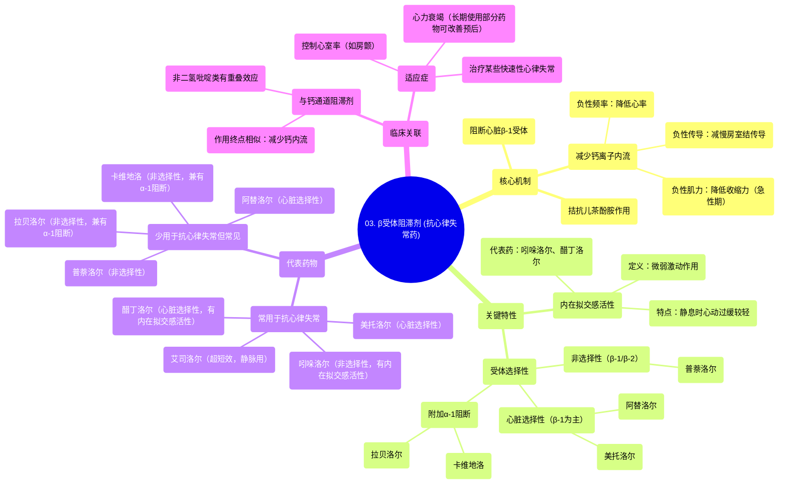

# 03 Antiarrhythmics (Lesson 3 - Beta Blockers)

  <video controls preload="metadata" playsinline>
    <source src="https://helly.s3.bitiful.net/心血管学科/%E4%B8%93%E8%BE%91%2007%EF%BC%9A%E5%BF%83%E5%BE%8B%E5%A4%B1%E5%B8%B8%E8%AF%8A%E6%96%AD%E5%AE%9E%E6%88%98%20%28Arrhythmia%20Diagnosis%29/03%20Antiarrhythmics%20%28Lesson%203%20-%20Beta%20Blockers%29.mp4" type="video/mp4">
    
您的浏览器不支持播放，请升级。

  </video>

::: tip ⚡️ 核心考点 (30s速读)
*   **核心考点**：β受体阻滞剂通过阻断心脏β-1受体，拮抗儿茶酚胺作用，从而降低心率、房室结传导性和心肌收缩力（急性期），是治疗多种心律失常的基础药物。
*   **临床意义**：不同β受体阻滞剂在受体选择性（心脏选择性）、内在拟交感活性等方面存在差异，导致其临床效应、适应症和副作用各不相同，需个体化选择。
:::

## 🧠 深度精讲

*   **作用机制**：β受体阻滞剂的核心作用是竞争性拮抗内源性儿茶酚胺（去甲肾上腺素、肾上腺素）与β-1受体的结合。这阻断了后续的G蛋白激活、腺苷酸环化酶活化、环磷酸腺苷生成、蛋白激酶A激活以及L型钙通道磷酸化等一系列级联反应。最终结果是减少钙离子内流，从而产生负性频率（降低心率）、负性传导（减慢房室结传导）和负性肌力（降低心肌收缩力，主要在急性期）作用。
*   **受体选择性**：这是区分不同β受体阻滞剂的关键特性。
    *   **心脏选择性（β-1选择性）**：如美托洛尔、阿替洛尔。主要阻断心脏β-1受体，对支气管和血管的β-2受体影响较小，因此诱发支气管痉挛和外周血管收缩的风险相对较低。
    *   **非选择性**：如普萘洛尔。同时阻断β-1和β-2受体。阻断β-2受体可能导致支气管收缩（哮喘患者慎用）和血管收缩。
    *   **附加α-1受体阻断作用**：如卡维地洛、拉贝洛尔。在阻断β受体的同时阻断α-1受体，可导致血管扩张，有助于降低血压，但可能引起体位性低血压。
*   **内在拟交感活性**：部分药物（如吲哚洛尔、醋丁洛尔）具有微弱的β受体激动效应。当交感张力低时（如静息状态），表现为轻微的激动作用，可能减轻心动过缓和负性肌力作用；当交感张力高时，仍主要表现为阻断作用。这使得此类药物在静息时引起的心动过缓可能较轻。
*   **药物分类与特点**：
    *   **常用于抗心律失常**：美托洛尔（心脏选择性）、艾司洛尔（超短效，仅静脉用）、醋丁洛尔（心脏选择性，具内在拟交感活性）、吲哚洛尔（非选择性，具内在拟交感活性）。
    *   **少用于抗心律失常但临床常见**：阿替洛尔（心脏选择性）、普萘洛尔（非选择性）、卡维地洛（非选择性，兼有α-1阻断）、拉贝洛尔（非选择性，兼有α-1阻断）。
*   **与钙通道阻滞剂的关联**：β受体阻滞剂的作用终点是减少钙离子内流，这与某些钙通道阻滞剂（特别是非二氢吡啶类，如维拉帕米、地尔硫䓬）的作用有重叠，因此两者在控制心率、治疗某些心律失常（如房颤心室率控制）方面有相似的适应症。

## 📚 双语术语表 (Terminology)
| 英文术语 | 中文翻译 | 定义/解释 |
| :--- | :--- | :--- |
| Beta-blockers | β受体阻滞剂 | 一类通过阻断β肾上腺素能受体来拮抗交感神经作用的药物。 |
| Catecholamines | 儿茶酚胺 | 一类含有儿茶酚结构的神经递质和激素，包括去甲肾上腺素、肾上腺素和多巴胺。 |
| Adrenoceptors | 肾上腺素能受体 | 能与儿茶酚胺结合的膜受体，分为α和β两大类及多个亚型。 |
| Beta-1 receptor | β-1受体 | 主要分布于心脏的肾上腺素能受体亚型，介导心率加快、传导加速和心肌收缩力增强。 |
| G-protein | G蛋白 | 一类与鸟嘌呤核苷酸结合的信号转导蛋白，在受体与效应器之间起偶联作用。 |
| Adenyl cyclase | 腺苷酸环化酶 | 一种跨膜酶，被激活后能将ATP转化为第二信使环磷酸腺苷。 |
| Cyclic AMP (cAMP) | 环磷酸腺苷 | 重要的细胞内第二信使，由ATP经腺苷酸环化酶催化生成。 |
| Protein Kinase A (PKA) | 蛋白激酶A | 一种依赖于cAMP的蛋白激酶，被cAMP激活后能磷酸化多种靶蛋白。 |
| L-type calcium channel | L型钙通道 | 心肌细胞上的一种电压门控钙通道，其开放导致钙离子内流，对动作电位和肌肉收缩至关重要。 |
| Cardio-selective | 心脏选择性 | 指β受体阻滞剂相对选择性地阻断β-1受体，而对β-2受体影响较小的特性。 |
| Intrinsic sympathomimetic activity (ISA) | 内在拟交感活性 | 某些β受体阻滞剂所具有的微弱β受体激动剂特性。 |
| Non-dihydropyridines | 非二氢吡啶类 | 一类钙通道阻滞剂（如维拉帕米、地尔硫䓬），主要作用于心脏，与β受体阻滞剂有部分重叠效应。 |

## 🗺️ 知识图谱

