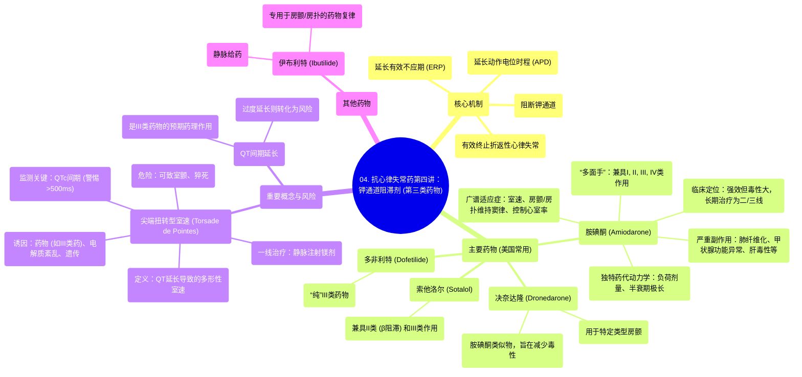

# 04 Antiarrhythmics (Lesson 4 - Potassium Channel Blockers)

  <video controls preload="metadata" playsinline>
    <source src="https://helly.s3.bitiful.net/心血管学科/%E4%B8%93%E8%BE%91%2007%EF%BC%9A%E5%BF%83%E5%BE%8B%E5%A4%B1%E5%B8%B8%E8%AF%8A%E6%96%AD%E5%AE%9E%E6%88%98%20%28Arrhythmia%20Diagnosis%29/04%20Antiarrhythmics%20%28Lesson%204%20-%20Potassium%20Channel%20Blockers%29.mp4" type="video/mp4">
    
您的浏览器不支持播放，请升级。

  </video>

::: tip ⚡️ 核心考点 (30s速读)
*   **核心考点**：第三类抗心律失常药（钾通道阻滞剂）通过阻断钾通道，延长心肌细胞动作电位时程和有效不应期，从而有效终止和预防折返性心律失常，尤其是心房颤动、心房扑动和室性心动过速。
*   **临床意义**：此类药物（尤其是胺碘酮）疗效显著但副作用复杂，需警惕尖端扭转型室速等致命性心律失常风险，用药期间必须严密监测QT间期。
:::

## 🧠 深度精讲

*   **药物分类与作用机制**：本视频聚焦于Vaughan Williams分类法中的第三类抗心律失常药——钾通道阻滞剂。其核心机制是阻断心肌细胞复极过程中的钾离子外流，从而延长动作电位时程和有效不应期。这使得折返环路中的异常电冲动更容易落入心肌组织的“不应期”而被阻断，因此对折返机制引起的心律失常（如房颤、房扑、室速）特别有效。
*   **主要药物概述**：美国临床常用的四种主要药物是胺碘酮、决奈达隆、索他洛尔和多非利特。此外，伊布利特作为静脉用药，专门用于房颤/房扑的药物复律，但使用较少。
*   **胺碘酮的“多面性”与复杂性**：
    *   **作用机制**：虽然被归为第三类，但胺碘酮实际上具有所有四类抗心律失常药的特性（多通道阻滞），这解释了其广谱疗效和复杂的药理学。
    *   **临床应用**：用于抑制室性心动过速、维持房颤/房扑患者的窦性心律，以及在β受体阻滞剂/钙通道阻滞剂禁忌时控制心室率。它甚至具有一定的复律能力。
    *   **显著的副作用**：长期使用副作用广泛且严重，包括**肺纤维化**（最危险，需基线胸片和肺功能检查）、甲状腺功能异常（甲减或甲亢，因其含大量碘）、肝毒性、视觉及神经系统症状等。静脉推注可引起低血压。
    *   **独特的药代动力学**：起效慢，分布容积大，半衰期极长（数周至数月）。因此，起始治疗需要数周的“负荷剂量”以达到稳态，停药后作用也会持续很久。
    *   **临床定位**：尽管疗效强大，但由于其显著的毒性，在需要长期治疗时，应被视为二线或三线选择。
*   **尖端扭转型室速**：
    *   **定义与危险**：这是一种发生在QT间期延长基础上的特殊类型的多形性室性心动过速，心电图表现为QRS波群振幅和极性围绕等电位线周期性扭转。它可自行终止，但极易恶化为室颤，导致猝死。
    *   **与药物的关系**：QT间期延长是第三类药物的预期药理作用（延长不应期），但过度延长（通常指校正后QTc > 500ms）则显著增加发生尖端扭转型室速的风险。因此，用药期间必须严密监测QTc。
    *   **治疗**：一旦发生，一线治疗是**静脉注射镁剂**，无论患者血镁水平是否正常。
*   **决奈达隆**：视频提到决奈达隆是胺碘酮的结构类似物，设计初衷是保留疗效的同时减少毒性（特别是肺和甲状腺毒性）。但需注意，后续研究显示其有特定的禁忌症（如用于永久性房颤或心衰患者可能增加风险），临床应用需严格遵循指南。

## 📚 双语术语表 (Terminology)
| 英文术语 | 中文翻译 | 定义/解释 |
| :--- | :--- | :--- |
| Potassium Channel Blockers (Class III Antiarrhythmics) | 钾通道阻滞剂（第三类抗心律失常药） | 通过阻断钾离子通道，延长动作电位时程和有效不应期来治疗心律失常的药物。 |
| Action Potential Duration (APD) | 动作电位时程 | 心肌细胞从去极化开始到复极化结束所经历的时间。 |
| Effective Refractory Period (ERP) | 有效不应期 | 心肌细胞在一次兴奋后，对任何刺激都不能再次产生动作电位的时期。 |
| Reentry | 折返 | 心律失常的一种常见机制，指电冲动在心脏内环形传导，持续激动心肌。 |
| Amiodarone (Amio) | 胺碘酮 | 一种广谱、强效但副作用复杂的第三类抗心律失常药，具有所有四类药物的特性。 |
| Dronedarone | 决奈达隆 | 胺碘酮的衍生物，旨在减少器官毒性，主要用于特定类型的房颤。 |
| Sotalol | 索他洛尔 | 兼具β受体阻滞（II类）和钾通道阻滞（III类）作用的抗心律失常药。 |
| Dofetilide | 多非利特 | 一种“纯”的第三类抗心律失常药，主要用于房颤/房扑的转复和窦律维持。 |
| Ibutilide | 伊布利特 | 静脉用第三类药物，几乎专用于房颤/房扑的快速药物复律。 |
| Torsade de Pointes (Torsade) | 尖端扭转型室速 | 一种与QT间期延长相关的特殊多形性室性心动过速，有猝死风险。 |
| QT Interval / QTc | QT间期 / 校正后QT间期 | 心电图上从QRS波开始到T波结束的时间，反映心室除极和复极的总时间。QTc是经心率校正后的值。 |
| Pulmonary Fibrosis | 肺纤维化 | 胺碘酮最严重的长期副作用之一，指肺组织瘢痕化，导致呼吸功能进行性下降。 |
| Pharmacologic Cardioversion | 药物复律 | 使用抗心律失常药物将异常心律（如房颤）转复为正常窦性心律。 |

## 🗺️ 知识图谱

