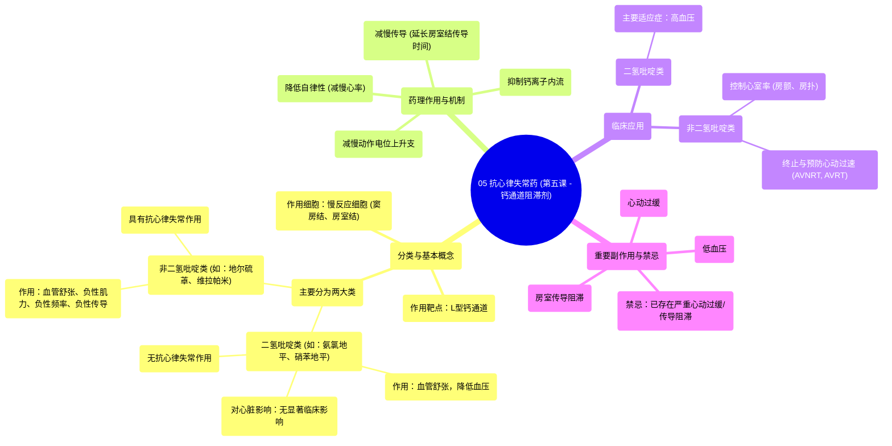

# 05 Antiarrhythmics (Lesson 5 - Calcium Channel Blockers)

  <video controls preload="metadata" playsinline>
    <source src="https://helly.s3.bitiful.net/心血管学科/%E4%B8%93%E8%BE%91%2007%EF%BC%9A%E5%BF%83%E5%BE%8B%E5%A4%B1%E5%B8%B8%E8%AF%8A%E6%96%AD%E5%AE%9E%E6%88%98%20%28Arrhythmia%20Diagnosis%29/05%20Antiarrhythmics%20%28Lesson%205%20-%20Calcium%20Channel%20Blockers%29.mp4" type="video/mp4">
    
您的浏览器不支持播放，请升级。

  </video>

::: tip ⚡️ 核心考点 (30s速读)
*   **核心考点**：钙通道阻滞剂分为二氢吡啶类和非二氢吡啶类。**只有非二氢吡啶类（地尔硫䓬、维拉帕米）具有抗心律失常作用**，主要作用于窦房结和房室结，减慢心率与传导。
*   **临床意义**：二氢吡啶类（如氨氯地平）主要用于降压；非二氢吡啶类用于控制房颤/房扑心室率、终止/预防房室结折返性心动过速。需警惕其引起低血压、心动过缓和房室传导阻滞的风险。
:::

## 🧠 深度精讲

*   **分类与作用机制**：钙通道阻滞剂主要分为“二氢吡啶类”和“非二氢吡啶类”。它们主要作用于心肌细胞上的L型钙通道。非二氢吡啶类通过抑制窦房结和房室结细胞的钙离子内流，减慢其动作电位上升支，从而降低自律性、减慢传导，这是其抗心律失常作用的基础。
*   **二氢吡啶类特点**：此类药物（如氨氯地平、硝苯地平）主要作用于血管平滑肌，引起外周血管舒张，从而降低血压。它们对心脏的收缩力、心率和传导**没有显著的临床影响**，因此**不具备抗心律失常作用**。
*   **非二氢吡啶类特点**：主要包括“地尔硫䓬”和“维拉帕米”。它们同时具有血管舒张、负性肌力（降低心肌收缩力）、负性频率（减慢心率）和负性传导（减慢房室结传导）的作用。这些特性使其适用于控制快速性房性心律失常（如房颤）的心室率，以及治疗房室结折返性心动过速。
*   **临床应用与注意事项**：
    *   **适应症**：二氢吡啶类主要用于高血压。非二氢吡啶类用于房颤/房扑的心室率控制、终止和预防房室结折返性心动过速等。
    *   **副作用与禁忌**：非二氢吡啶类的主要副作用是低血压、窦性心动过缓和房室传导阻滞。因此，禁用于已有严重心动过缓、病态窦房结综合征或高度房室传导阻滞的患者。在心力衰竭患者中使用也需谨慎。
    *   **临床选择**：地尔硫䓬在临床（尤其是房颤心室率控制）中比维拉帕米更常用，但两者药理学作用相似。

## 📚 双语术语表 (Terminology)
| 英文术语 | 中文翻译 | 定义/解释 |
| :--- | :--- | :--- |
| Calcium Channel Blockers (CCBs) | 钙通道阻滞剂 | 一类通过阻断钙离子通道发挥作用的药物，主要用于心血管疾病。 |
| Dihydropyridines | 二氢吡啶类 | 钙通道阻滞剂的一个亚类，主要作用于血管，用于降压，无抗心律失常作用。 |
| Non-dihydropyridines | 非二氢吡啶类 | 钙通道阻滞剂的另一个亚类，作用于心脏和血管，具有抗心律失常作用。 |
| L-type Calcium Channel | L型钙通道 | 长效型钙通道，是心血管系统钙通道阻滞剂的主要作用靶点。 |
| Slow Response Action Potential | 慢反应动作电位 | 见于窦房结和房室结细胞的动作电位，其除极依赖于钙离子内流。 |
| Systemic Vascular Resistance (SVR) | 全身血管阻力 | 血液循环的阻力，降低SVR是许多降压药的作用机制。 |
| Inotropy | 肌力 | 心肌收缩的能力。负性肌力即降低收缩力。 |
| Chronotropy | 变时性 | 影响心率的特性。负性变时性即减慢心率。 |
| Dromotropy | 传导性 | 影响心脏电冲动传导速度的特性。负性传导性即减慢传导。 |
| Atrial Fibrillation (AFib) | 心房颤动 | 一种常见的快速性房性心律失常。 |
| AV Nodal Reentrant Tachycardia (AVNRT) | 房室结折返性心动过速 | 一种常见的室上性心动过速。 |

## 🗺️ 知识图谱

