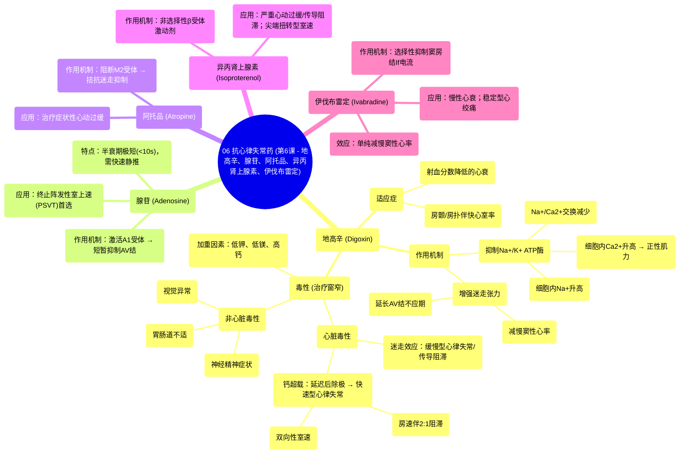

# 06 Antiarrhythmics (Lesson 6 - Digoxin, Adenosine, Atropine, Isoproterenol, and Ivabradine)

  <video controls preload="metadata" playsinline>
    <source src="https://helly.s3.bitiful.net/心血管学科/%E4%B8%93%E8%BE%91%2007%EF%BC%9A%E5%BF%83%E5%BE%8B%E5%A4%B1%E5%B8%B8%E8%AF%8A%E6%96%AD%E5%AE%9E%E6%88%98%20%28Arrhythmia%20Diagnosis%29/06%20Antiarrhythmics%20%28Lesson%206%20-%20Digoxin%2C%20Adenosine%2C%20Atropine%2C%20Isoproterenol%2C%20and%20Ivabradine%29.mp4" type="video/mp4">
    
您的浏览器不支持播放，请升级。

  </video>

::: tip ⚡️ 核心考点 (30s速读)
*   **核心考点**：本课介绍了五种“无法归类”的抗心律失常药物：地高辛、腺苷、阿托品、异丙肾上腺素和伊伐布雷定。重点掌握地高辛的**作用机制（抑制Na+/K+ ATP酶）**、**适应症（房颤/房扑伴快心室率、射血分数降低的心衰）** 及其**独特的毒性表现（如双向性室速）**。腺苷是**终止阵发性室上速的首选药物**，作用极快（半衰期<10秒）。
*   **临床意义**：地高辛治疗窗窄，毒性大，需警惕电解质紊乱（低钾、低镁、高钙）和肾功能对其的影响。腺苷使用需**快速静脉推注**，并准备好处理一过性的副作用（如胸闷、面部潮红）。
:::

## 🧠 深度精讲

*   **地高辛 (Digoxin)**
    *   **来源与历史**：源自毛地黄植物，18世纪起用于治疗心衰，是应用最广泛的强心苷类药物。
    *   **作用机制**：
        1.  **正性肌力作用**：抑制心肌细胞膜上的**Na+/K+ ATP酶** → 细胞内Na+升高 → **Na+/Ca2+交换体**反向转运减少 → 细胞内（胞质）Ca2+浓度升高 → 增强心肌收缩力。
        2.  **负性频率与传导作用**：通过增强**迷走神经张力**，减慢窦房结节律、延长房室结不应期、减慢房室结传导。
        3.  **致心律失常机制**：细胞内Ca2+超载可引发**延迟后除极**；迷走张力过高可导致房室传导阻滞。
    *   **适应症**：
        1.  心房颤动/心房扑动伴快速心室率（控制心室率）。
        2.  射血分数降低的心力衰竭（改善症状）。
        *注：因其毒性，常作为二线或三线药物，尤其在上述两种情况共存时考虑使用。*
    *   **药代动力学与毒性**：
        *   **治疗窗窄**，易中毒。
        *   经肾脏排泄，**肾功能不全者风险极高**。
        *   监测地高辛血药浓度时，通常只关注**上限**（中毒范围需减量），不因浓度“偏低”而盲目加量。
    *   **地高辛中毒表现**：
        *   **心脏毒性（致心律失常）**：
            *   迷走张力过高相关：**房颤伴异常缓慢心室率**、**房颤伴完全性心脏传导阻滞及加速性逸搏心律**。
            *   延迟后除极相关：**房性心动过速伴2:1房室传导阻滞**、**双向性室性心动过速**（极具特征性）。
        *   **非心脏毒性**：胃肠道不适、神经精神症状（头晕、疲劳、意识模糊、抑郁）、视觉异常（如色觉改变）。
        *   **加重因素**：**低钾血症**、**低镁血症**、**高钙血症**。

*   **腺苷 (Adenosine)**
    *   **本质**：一种内源性嘌呤核苷。
    *   **作用机制**：激活**腺苷A1受体** → 激活**乙酰胆碱敏感性钾通道** → 细胞超极化 → **强烈、短暂地抑制房室结传导**。可终止依赖于房室结折返的室上性心动过速（如AVNRT）。
    *   **药理学特点**：
        *   **起效极快**，**半衰期极短（<10秒）**。
        *   必须**快速静脉推注**，随后立即用生理盐水冲洗，以确保药物快速到达心脏。
    *   **临床应用**：**终止阵发性室上性心动过速（PSVT）的首选药物**。
    *   **副作用**：一过性，包括面部潮红、胸闷、呼吸困难、头晕。可能引发短暂的心脏停搏或房颤。

*   **阿托品 (Atropine)**
    *   **作用机制**：竞争性拮抗**M2毒蕈碱受体**，解除迷走神经对心脏的抑制。
    *   **效应**：提高窦房结自律性，加快心率；改善房室结传导。
    *   **临床应用**：主要用于治疗**症状性心动过缓**（如窦性心动过缓、房室传导阻滞）。

*   **异丙肾上腺素 (Isoproterenol)**
    *   **作用机制**：非选择性**β肾上腺素受体激动剂**（β1, β2）。
    *   **效应**：产生强大的**正性变时**（加快心率）、**正性变力**（增强收缩力）和**正性变传导**（加快传导）作用。
    *   **临床应用**：
        1.  临时治疗对阿托品无反应的**严重心动过缓**或**心脏传导阻滞**。
        2.  作为**心脏移植后**去神经心脏的起搏支持。
        3.  用于**尖端扭转型室速**的急性处理（通过增快心率缩短QT间期）。
    *   **副作用**：因其β2效应，可引起心悸、震颤、低血压。

*   **伊伐布雷定 (Ivabradine)**
    *   **作用机制**：选择性抑制窦房结的**If电流**（“funny”电流），此电流是窦房结细胞舒张期自动去极化的主要决定因素。
    *   **效应**：**单纯减慢窦性心率**，不影响心肌收缩力、血压或心脏传导。
    *   **临床应用**：
        1.  慢性心力衰竭（NYHA II-IV级，窦性心律，心率≥75次/分）的辅助治疗，以降低心衰住院风险。
        2.  治疗不适合或不耐受β受体阻滞剂的**慢性稳定型心绞痛**患者。
    *   **特点**：不干扰β受体，副作用包括视觉异常（光幻视）。

## 📚 双语术语表 (Terminology)
| 英文术语 | 中文翻译 | 定义/解释 |
| :--- | :--- | :--- |
| Digoxin | 地高辛 | 一种强心苷类抗心律失常药，通过抑制Na+/K+ ATP酶发挥作用，用于控制房颤心室率和治疗心衰。 |
| Cardiac glycosides | 强心苷 | 一类源自植物的药物（如地高辛），能增强心肌收缩力，常用于心衰和某些心律失常。 |
| Na+/K+ ATPase (Sodium-potassium pump) | 钠钾ATP酶（钠钾泵） | 一种跨膜蛋白，利用ATP能量将钠离子泵出细胞，钾离子泵入细胞，维持细胞膜电位。地高辛的抑制靶点。 |
| Na+/Ca2+ exchanger | 钠钙交换体 | 心肌细胞上的转运蛋白，通常将3个Na+转入细胞，1个Ca2+转出细胞。细胞内Na+升高会减弱其活动，导致Ca2+滞留。 |
| Delayed afterdepolarizations (DADs) | 延迟后除极 | 发生在动作电位完全复极后的一种异常去极化，与细胞内钙超载（如地高辛中毒时）有关，可触发心律失常。 |
| Vagal tone | 迷走神经张力 | 迷走神经对心脏的抑制性影响。地高辛可增强迷走张力，减慢心率和房室传导。 |
| Bidirectional ventricular tachycardia | 双向性室性心动过速 | 一种特殊类型的室速，其QRS波群形态在两种图形之间交替出现，是地高辛中毒的特征性表现之一。 |
| Adenosine | 腺苷 | 一种内源性核苷，通过短暂抑制房室结传导，成为终止阵发性室上性心动过速（PSVT）的一线药物。 |
| Atropine | 阿托品 | M胆碱受体拮抗剂，通过阻断迷走神经效应，用于治疗症状性心动过缓。 |
| Isoproterenol | 异丙肾上腺素 | 非选择性β肾上腺素受体激动剂，用于治疗严重心动过缓、心脏传导阻滞和某些类型的室速。 |
| Ivabradine | 伊伐布雷定 | 选择性窦房结If通道抑制剂，通过单纯减慢心率，用于治疗慢性心衰和稳定型心绞痛。 |
| If current (“funny” current) | If电流（“起搏”电流） | 窦房结起搏细胞在舒张期激活的一种超极化激活的阳离子电流，是决定心率的关键因素，伊伐布雷定的作用靶点。 |

## 🗺️ 知识图谱

