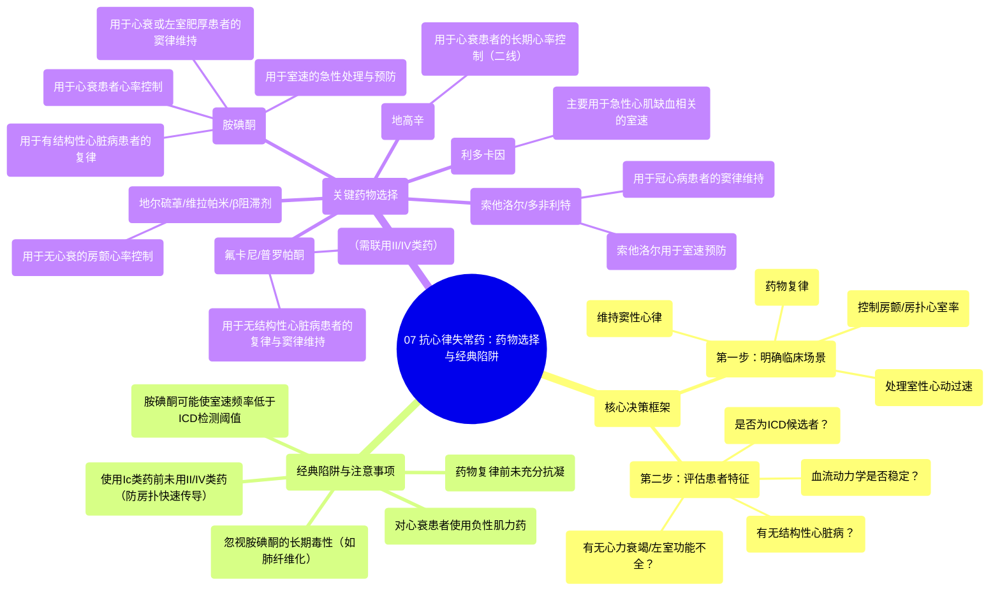

# 07 Antiarrhytmics (Lesson 7 - How to Choose the Right Med and Classic Pitfalls)

  <video controls preload="metadata" playsinline>
    <source src="https://helly.s3.bitiful.net/心血管学科/%E4%B8%93%E8%BE%91%2007%EF%BC%9A%E5%BF%83%E5%BE%8B%E5%A4%B1%E5%B8%B8%E8%AF%8A%E6%96%AD%E5%AE%9E%E6%88%98%20%28Arrhythmia%20Diagnosis%29/07%20Antiarrhytmics%20%28Lesson%207%20-%20How%20to%20Choose%20the%20Right%20Med%20and%20Classic%20Pitfalls%29.mp4" type="video/mp4">
    
您的浏览器不支持播放，请升级。

  </video>

::: tip ⚡️ 核心考点 (30s速读)
*   **核心考点**：掌握根据临床场景（房颤/房扑心率控制、复律、维持窦律、室速处理）和患者特征（有无心衰/结构性心脏病、血流动力学是否稳定）选择抗心律失常药物的决策路径。
*   **临床意义**：避免经典陷阱，如对心衰患者使用负性肌力药、忽视药物复律前的抗凝、胺碘酮的长期毒性及其对ICD功能的影响。
:::

## 🧠 深度精讲

本视频是抗心律失常药物系列的总结篇，重点讲解如何根据具体临床情境选择药物，并指出常见的使用陷阱。

*   **场景一：控制快速房颤/房扑的心室率**
    *   **急性住院患者**：
        *   **无心衰/左室功能不全**：首选静脉**地尔硫䓬**（可能最有效）、维拉帕米或心脏选择性**β受体阻滞剂**。
        *   **有心衰/左室功能不全**：避免使用上述负性肌力药。可选**胺碘酮**（注意药物复律和抗凝风险）、**地高辛**（起效慢）或直接**电复律**。
    *   **门诊/长期控制**：
        *   **无心衰**：**地尔硫䓬**、维拉帕米、**β受体阻滞剂**。
        *   **有心衰**：**β受体阻滞剂**一线，**地高辛**二线。避免长期使用**胺碘酮**（肺纤维化等毒性）。

*   **场景二：药物复律（转复房颤/房扑为窦律）**
    *   **血流动力学不稳定**：立即**电复律**，不用药物。
    *   **血流动力学稳定**：
        *   **无结构性心脏病**（指无显著心衰、冠脉病、重度左室肥厚）：可选**Ic类**（**氟卡尼**、**普罗帕酮**）或**III类**（**多非利特**）。**重要陷阱**：使用**氟卡尼**或**普罗帕酮**前，需先用**β受体阻滞剂**或**非二氢吡啶类钙通道阻滞剂**（II/IV类），以防房颤转为房扑时导致快速心室率。
        *   **有结构性心脏病**：首选**胺碘酮**。

*   **场景三：维持窦性心律（预防房颤/房扑复发）**
    *   **无其他心脏病**：**氟卡尼**、**普罗帕酮**、**索他洛尔**。
    *   **有左室肥厚**（如高血压所致）：通常用**胺碘酮**。
    *   **有冠状动脉疾病**：**多非利特**或**索他洛尔**。
    *   **有心力衰竭**：**胺碘酮**或**多非利特**。

*   **场景四：处理室性心动过速**
    *   **急性复律**：
        *   **不稳定**：立即**电复律**。
        *   **稳定**：可选**胺碘酮**、**利多卡因**（主要用于急性心肌缺血相关室速）、**普鲁卡因胺**。电复律仍是选项。
    *   **预防复发**：
        *   **适合植入ICD者**：**ICD**是首选，常联用**β受体阻滞剂**以减少发作和电击。
        *   **不适合ICD者**：单用**β受体阻滞剂**。
        *   **室速负荷仍重**（上述任一情况）：可考虑加用**胺碘酮**，或将/加用**索他洛尔**。**重要陷阱**：**胺碘酮**可能减慢室速频率，使其低于**ICD**的检测阈值，导致无法发放恰当电击。

## 📚 双语术语表 (Terminology)
| 英文术语 | 中文翻译 | 定义/解释 |
| :--- | :--- | :--- |
| AFib / Atrial Fibrillation | 心房颤动 | 一种常见的心律失常，心房快速、不规则地电激动。 |
| AFlutter / Atrial Flutter | 心房扑动 | 一种心律失常，心房快速但规则地电激动。 |
| Rate Control | 心率控制 | 治疗策略，旨在降低房颤/房扑时的心室率，而非转复心律。 |
| Cardioversion | 复律 | 通过电击或药物将异常心律（如房颤）转复为正常窦性心律的过程。 |
| Heart Failure (HF) / CHF | 心力衰竭 / 充血性心力衰竭 | 心脏泵血功能不足以满足身体需求的状态。 |
| LV Dysfunction | 左心室功能不全 | 左心室收缩或舒张功能减弱。 |
| Negative Inotrope | 负性肌力药 | 减弱心肌收缩力的药物，如维拉帕米、地尔硫䓬、β受体阻滞剂。 |
| Structural Heart Disease | 结构性心脏病 | 指心脏存在器质性病变，如心力衰竭、冠状动脉疾病、显著的心室肥厚等。 |
| ICD (Implantable Cardioverter Defibrillator) | 植入式心律转复除颤器 | 一种植入体内的设备，能检测并终止危及生命的室性心律失常。 |
| VT (Ventricular Tachycardia) | 室性心动过速 | 起源于心室的心动过速，可危及生命。 |
| Monomorphic VT | 单形性室性心动过速 | 所有QRS波形态一致的室速。 |

## 🗺️ 知识图谱

