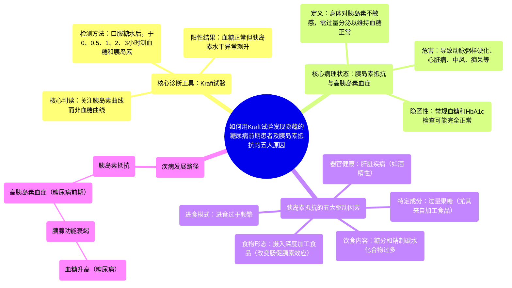

# 1_How Hidden Prediabetic Patients are found with Kraft Tests and 5 Major Causes of Insulin Resistance

  <video controls preload="metadata" playsinline>
    <source src="https://helly.s3.bitiful.net/心血管学科/%E4%B8%93%E8%BE%91%2008%EF%BC%9A%E5%BF%83%E8%A1%80%E7%AE%A1%E6%A3%80%E6%9F%A5%E6%8A%80%E6%9C%AF%20%28Procedures%20and%20Tests%29/1_How%20Hidden%20Prediabetic%20Patients%20are%20found%20with%20Kraft%20Tests%20and%205%20Major%20Causes%20of%20Insulin%20Resistance.mp4" type="video/mp4">
    
您的浏览器不支持播放，请升级。

  </video>

::: tip ⚡️ 核心考点 (30s速读)
*   **核心考点**：Kraft试验通过检测口服糖水后的血糖和胰岛素水平，能发现血糖正常但胰岛素水平异常升高的“糖尿病前期”患者，这是常规糖化血红蛋白和空腹血糖检查容易漏诊的。
*   **临床意义**：高胰岛素血症（胰岛素抵抗）是导致动脉粥样硬化、心脏病、中风、痴呆、肥胖、脂肪肝等多种疾病的独立危险因素。识别和管理糖尿病前期，对预防心血管疾病至关重要。
:::

## 🧠 深度精讲

*   **Kraft试验（葡萄糖-胰岛素耐量试验）**：这是一项动态功能测试。患者在饮用标准量的糖水后，分别在基线（0小时）、0.5小时、1小时、2小时、3小时抽血，同时检测血糖和胰岛素水平。其核心目的不是看血糖（常规糖耐量试验的目的），而是看**胰岛素的分泌模式和峰值**。
*   **糖尿病前期与高胰岛素血症**：许多患者常规检查（如糖化血红蛋白、空腹血糖）正常，但已存在严重的胰岛素抵抗。他们的身体为了将血糖维持在正常范围，胰腺必须超量分泌胰岛素，导致血液中胰岛素水平异常升高，即“高胰岛素血症”。这种状态对血管极具破坏性，是心血管疾病的隐形推手。
*   **胰岛素抵抗的五大原因**：
    1.  **进食过于频繁**：持续进食导致胰岛素水平持续处于高位，身体对其敏感性下降，产生抵抗。
    2.  **饮食中糖分和精制碳水化合物过多**：摄入高升糖指数的食物会引起血糖快速升高，需要大量胰岛素来应对，长期如此导致抵抗。
    3.  **果糖过量**：尤其是来自含糖饮料和加工食品中的添加果糖，会在肝脏直接导致胰岛素抵抗。
    4.  **肝脏疾病**：由酒精或其他原因引起的肝脏功能受损，也会引发胰岛素抵抗。
    5.  **摄入加工食品**：即使是相同的食物，经过精加工（如磨成粉、制成即食食品）后，其引起的胰岛素分泌反应会远高于天然完整形态的食物，这被称为“肠促胰素效应”的改变。

## 📚 双语术语表 (Terminology)
| 英文术语 | 中文翻译 | 定义/解释 |
| :--- | :--- | :--- |
| Kraft Test / Insulin Glucose Tolerance Test | 卡夫特试验 / 葡萄糖-胰岛素耐量试验 | 一种通过测量口服糖水后多个时间点的血糖和胰岛素水平，来评估胰岛素分泌功能及抵抗状态的动态试验。 |
| Prediabetes | 糖尿病前期 | 一种血糖水平高于正常但尚未达到糖尿病诊断标准的状态，常伴有胰岛素抵抗和高胰岛素血症。 |
| Insulin Resistance | 胰岛素抵抗 | 指机体对正常浓度的胰岛素反应减弱，需要更高水平的胰岛素才能产生正常的生理效应。 |
| Hyperinsulinemia | 高胰岛素血症 | 指血液中胰岛素水平异常升高，通常是胰岛素抵抗的代偿性表现。 |
| Hemoglobin A1C (HbA1c) | 糖化血红蛋白 | 反映过去2-3个月平均血糖水平的指标，是糖尿病诊断和监测的重要标准。 |
| Atherosclerosis / Hardening of the Arteries | 动脉粥样硬化 / 动脉硬化 | 动脉壁内脂质、胆固醇等物质沉积形成斑块，导致血管壁增厚、变硬、失去弹性。 |
| Incretin Effect | 肠促胰素效应 | 指食物进入肠道后，刺激肠道细胞分泌激素（如GLP-1），进而促进胰岛素分泌的生理效应。加工食品会异常放大此效应。 |
| Atherogenic Dyslipidemia | 致动脉粥样硬化性血脂异常 | 一种以高甘油三酯、低高密度脂蛋白胆固醇（HDL-C）及小而密低密度脂蛋白胆固醇（LDL-C）增多为特征的血脂紊乱，与胰岛素抵抗密切相关。 |

## 🗺️ 知识图谱

