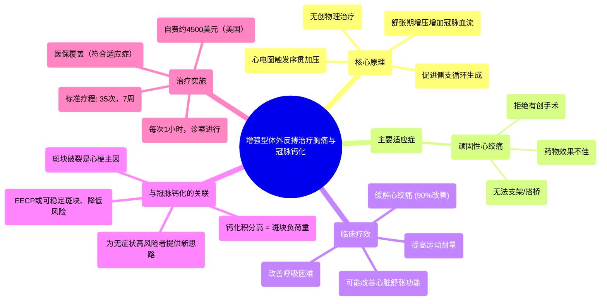

# 2 Why External Counterpulsation (ECP or EECP) benefits patients with Chest Pain and Coronary Calcium

  <video controls preload="metadata" playsinline>
    <source src="https://helly.s3.bitiful.net/心血管学科/%E4%B8%93%E8%BE%91%2008%EF%BC%9A%E5%BF%83%E8%A1%80%E7%AE%A1%E6%A3%80%E6%9F%A5%E6%8A%80%E6%9C%AF%20%28Procedures%20and%20Tests%29/2%20Why%20External%20Counterpulsation%20%28ECP%20or%20EECP%29%20benefits%20patients%20with%20Chest%20Pain%20and%20Coronary%20Calcium.mp4" type="video/mp4">
    
您的浏览器不支持播放，请升级。

  </video>

::: tip ⚡️ 核心考点 (30s速读)
*   **核心考点**：增强型体外反搏是一种无创、非药物的物理治疗方法，通过在心电信号引导下，对患者下肢及骨盆进行序贯式气囊加压，将血液“泵”回心脏，增加冠状动脉的搏动性血流，从而缓解心绞痛、促进侧支循环建立。
*   **临床意义**：主要适用于药物治疗效果不佳、无法或不愿接受支架/搭桥手术的顽固性心绞痛患者。它能有效改善症状、提高功能状态，并可能改善心脏舒张功能。对于高冠脉钙化积分但无症状的患者，其降低斑块破裂风险的价值正在被探索。
:::

## 🧠 深度精讲

*   **概念1：什么是增强型体外反搏？**
    增强型体外反搏是一种在诊室内进行的无创物理治疗。治疗时，患者平躺，在大腿、小腿和骨盆处包裹大型血压袖带（气囊），并连接心电图机。机器根据患者的心电图信号，在心脏舒张期（即心脏放松、冠状动脉灌注时）序贯性地对气囊进行充气加压，挤压下肢血管，将血液驱回主动脉和心脏；在心脏收缩期（心脏泵血时）迅速放气减压，降低心脏射血阻力。这一“挤压-放松”的循环，模拟了“第二心脏”的作用，显著增加了冠状动脉的血流灌注和压力。

*   **概念2：EECP如何起效？——缓解症状与促进“自身搭桥”**
    其治疗作用主要通过两个核心机制实现：
    1.  **即时血流动力学效应**：治疗期间，舒张期增压的血液直接冲击冠状动脉，增加其血流量和灌注压，能即刻改善心肌供血，从而缓解心绞痛症状。
    2.  **长期血管生物学效应（促进侧支循环）**：反复的搏动性血流冲击和血管壁剪切应力的改变，是一种持续的生理性刺激。这种刺激能促进心脏自身微小的侧支血管（即“自身搭桥”）生长和开放。这些新生的血管可以绕过严重狭窄或堵塞的冠状动脉，为下游缺血的心肌建立新的供血通路，实现长期、自然的血运重建。

*   **概念3：EECP的主要适应症与疗效证据**
    *   **主要适应症**：目前，EECP主要获得医保批准用于治疗**顽固性心绞痛**。具体适用于：① 规范药物治疗后仍有症状的患者；② 冠状动脉病变弥漫、钙化严重，无法植入支架或进行搭桥手术的患者；③ 因高龄、合并症多或主观意愿而拒绝有创介入或外科手术的患者。
    *   **疗效证据**：视频中引用的临床数据显示，超过三分之二的患者在治疗开始两周内即可感到症状改善。完成全部35次（约7周）疗程后，高达90%的患者心绞痛症状显著减轻，运动耐量和生活质量（功能状态）提高，部分患者的呼吸困难症状也得到改善。

*   **概念4：EECP与心脏舒张功能及冠脉钙化的新关联**
    1.  **改善舒张功能**：后续研究发现，EECP不仅能改善心绞痛，还能改善心脏的**舒张功能**（即心肌松弛和充盈的能力）。舒张功能改善可降低心脏内压力，从而缓解由心脏舒张功能不全引起的呼吸困难（气短）。有试验提示其对部分充血性心力衰竭患者也可能有益，但目前该适应症尚未被医保覆盖。
    2.  **应对高冠脉钙化积分**：这是一个新兴且重要的关联。许多患者通过冠脉CT发现钙化积分很高，但并无胸痛或负荷试验阳性（即管腔未严重狭窄）。然而，大量钙化斑块意味着**动脉粥样硬化负荷重，斑块破裂风险高**，是未来发生急性心肌梗死的隐患。EECP通过增加血管内皮剪切力、促进侧支循环，可能起到稳定斑块、降低未来心血管事件风险的作用，为这类“无症状但高风险”患者提供了新的预防性治疗思路。

*   **概念5：治疗流程与费用**
    *   **标准疗程**：通常为**35次治疗**，每周5次（周一至周五），共约7周。每次治疗患者需平卧约1小时。
    *   **费用与医保**：在美国，整个疗程费用约4500美元。**多数情况下，对于符合心绞痛适应症的患者，该项治疗由医疗保险（如Medicare）和商业保险覆盖**。若不符合医保适应症（如仅用于心力衰竭或预防），则需自费。

## 📚 双语术语表 (Terminology)
| 英文术语 | 中文翻译 | 定义/解释 |
| :--- | :--- | :--- |
| **EECP / ECP** | 增强型体外反搏 / 体外反搏 | 一种无创的、通过体外气囊序贯加压于下肢，增加心脑等器官血流灌注的物理治疗方法。 |
| **Angina** | 心绞痛 | 由于心肌缺血、缺氧引起的胸部不适或疼痛，常由冠状动脉疾病引起。 |
| **Coronary Calcium Score** | 冠状动脉钙化积分 | 通过心脏CT扫描量化冠状动脉壁上钙化斑块含量的指标，用于评估动脉粥样硬化负荷和心血管风险。 |
| **Collateral Blood Flow** | 侧支血流 | 当主要冠状动脉阻塞时，心脏自身建立的微小血管网络，能绕过阻塞处为缺血区域供血。 |
| **Atherosclerosis** | 动脉粥样硬化 | 动脉壁内脂质、钙等物质沉积形成斑块，导致动脉壁增厚、变硬的病理过程。 |
| **Diastolic Function** | 舒张功能 | 指心脏在收缩后放松和充盈血液的能力。舒张功能不全是心力衰竭的常见类型。 |
| **Systolic Function** | 收缩功能 | 指心脏收缩泵血的能力，通常用射血分数来衡量。 |
| **Plaque Rupture** | 斑块破裂 | 动脉粥样硬化斑块表面的纤维帽破裂，内容物暴露于血液中，引发血栓形成，是急性心肌梗死的主要机制。 |
| **Medicare** | 联邦医疗保险（美国） | 美国主要为65岁及以上老年人提供的国家健康保险计划。 |

## 🗺️ 知识图谱

